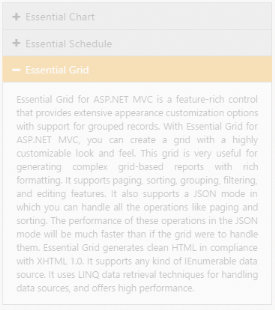
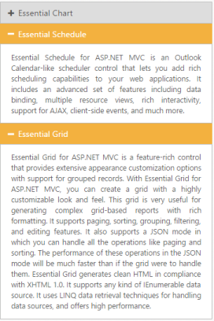

## Accordion Panel enabler

Enable or Disable control

You can enable or disable the Accordion widget on initial rendering using the Enabled property. By default Enabled property is set to true and the Accordion panels are active always. 

The following code explains you on how to enable or disable the Accordion widget

[CSHTML]

// In the View page, render Accordion with corresponding data and disable the control actions.

&lt;div style="width: 400px"&gt;

@{Html.EJ().Accordion("accordion").Items(data =>

            {

                data.Add().Text("Essential Chart").ContentTemplate(@&lt;div&gt;

                    Essential Chart for ASP.NET MVC is a visually stunning, high-performance charting component that is easy to use. It includes 35 chart types ranging from simple column charts to specialized financial charts. The charts are highly customizable and have a powerful data model that makes data binding simple.

                &lt;/div&gt;);

                data.Add().Text("Essential Schedule").ContentTemplate(@&lt;div&gt;

                    Essential Schedule for ASP.NET MVC is an Outlook Calendar-like scheduler control that lets you add rich scheduling capabilities to your web applications. It includes an advanced set of features including data binding, multiple resource views, rich interactivity, support for AJAX, client-side events, and much more.

                &lt;/div&gt;);

                data.Add().Text("Essential Grid").ContentTemplate(@&lt;div&gt;

                    Essential Grid for ASP.NET MVC is a feature-rich control that provides extensive appearance customization options with support for grouped records. With Essential Grid for ASP.NET MVC, you can create a grid with a highly customizable look and feel. This grid is very useful for generating complex grid-based reports with rich formatting. It supports paging, sorting, grouping, filtering, and editing features. It also supports a JSON mode in which you can handle all the operations like paging and sorting. The performance of these operations in the JSON mode will be much faster than if the grid were to handle them. Essential Grid generates clean HTML in compliance with XHTML 1.0. It supports any kind of IEnumerable data source. It uses LINQ data retrieval techniques for handling data sources, and offers high performance.&lt;/div&gt;);

            }).Enabled(false).Render();}

&lt;/div&gt;

Output for disabled Accordion control is as follows.

{  | markdownify }
{:.image }

Enable panel items

You can enable the Accordion widget items on initial loading using EnabledItems property. This property takes array of indices whose panel needs to be enabled in Accordion widget. 

The DisabledItems property disables the Accordion items based on the index. This takes array of indices whose panel is to be disabled. 

Enabling accordion panel items

The following code explains you on how to enable the panel items in Accordion widget.

[CSHTML]

// In the View page, configure Accordion with the corresponding data, and to enable and disable Accordion panel items set the values for EnabledItems and DisabledItems.

@{      //List of integer array with index values.

    List<int> enableditem = new List<int>() { 1, 2 };

    List<int> disableditem = new List<int>() { 0 };

}

&lt;div style="width: 400px"&gt;

@{Html.EJ().Accordion("accordion").Items(data =>

            {

                data.Add().Text("Essential Chart").ContentTemplate(@&lt;div&gt;

                    Essential Chart for ASP.NET MVC is a visually stunning, high-performance charting component that is easy to use. It includes 35 chart types ranging from simple column charts to specialized financial charts. The charts are highly customizable and have a powerful data model that makes data binding simple.

                &lt;/div&gt;);

                data.Add().Text("Essential Schedule").ContentTemplate(@&lt;div&gt;

                    Essential Schedule for ASP.NET MVC is an Outlook Calendar-like scheduler control that lets you add rich scheduling capabilities to your web applications. It includes an advanced set of features including data binding, multiple resource views, rich interactivity, support for AJAX, client-side events, and much more.

                &lt;/div&gt;);

                data.Add().Text("Essential Grid").ContentTemplate(@&lt;div&gt;

                    Essential Grid for ASP.NET MVC is a feature-rich control that provides extensive appearance customization options with support for grouped records. With Essential Grid for ASP.NET MVC, you can create a grid with a highly customizable look and feel. This grid is very useful for generating complex grid-based reports with rich formatting. It supports paging, sorting, grouping, filtering, and editing features. It also supports a JSON mode in which you can handle all the operations like paging and sorting. The performance of these operations in the JSON mode will be much faster than if the grid were to handle them. Essential Grid generates clean HTML in compliance with XHTML 1.0. It supports any kind of IEnumerable data source. It uses LINQ data retrieval techniques for handling data sources, and offers high performance.&lt;/div&gt;);

            }).SelectedItemIndex(1).EnabledItems(enableditem).DisableItems(disableditem).EnableMultipleOpen(true).Render();}

&lt;/div&gt;

Output for Accordion control with some enabled and disabled items, where first panel is disabled and it can’t be expanded or collapsed is as follows.

{  | markdownify }
{:.image }

