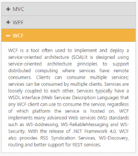

# AJAX settings

Accordion widgets allow you to load content for the Accordion panel using Ajax. This renders content from the specified URL location that is set to the anchor tag. You can set the destination file URL string by using AjaxUrl property Ajax contents enables you to load the content of the Accordion panel when it is expanded. This enhances the Accordion control efficiency when a large content is to be loaded into the panel.

## Populate accordion with AJAX content

The following code explains about loading accordion content using AjaxUrl property.



// In the View page, render Accordion with corresponding data and set AjaxUrl property for the corresponding headers.

@{Html.EJ().Accordion("accordion").Items(data =>

        {

            data.Add().Text("MVC").AjaxUrl("../../Content/mvccontent.html");

            data.Add().Text("WPF").AjaxUrl("../../Content/wpfcontent.html");

            data.Add().Text("WCF").ContentTemplate(@

               WCF is a tool often used to implement and deploy a service-oriented architecture (SOA).It is designed using service-oriented architecture principles to support distributed computing where services have remote consumers. Clients can consume multiple services; services can be consumed by multiple clients. Services are loosely coupled to each other. Services typically have a WSDL interface (Web Services Description Language) that any WCF client can use to consume the service, regardless of which platform the service is hosted on. WCF implements many advanced Web services (WS) standards such as WS-Addressing, WS-ReliableMessaging and WS-Security. With the release of .NET Framework 4.0, WCF also provides RSS Syndication Services, WS-Discovery, routing and better support for REST services.
);

       }).Render();}



Output for Accordion control with loaded AJAX content is as follows.

