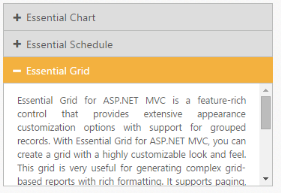
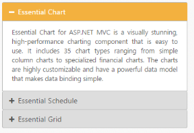
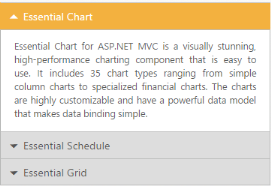

# Appearance and Styling

## Adjusting Accordion size

You can customize the Accordion panel height using HeightAdjustMode property. It can be set to enum values like content, fill or auto. By default HeightAdjustMode is set to content so the panel height is adjusted to the content size.

### Configure Height of Accordion panel

The following code explains to configure the height of ther Accordion content panel.



// In the View page, configure Accordion with corresponding data and define HeightAdjustMode.

@{Html.EJ().Accordion("accordionfill").Items(data =>

        {

            data.Add().Text("Essential Chart").ContentTemplate(@

                Essential Chart for ASP.NET MVC is a visually stunning, high-performance charting component that is easy to use. It includes 35 chart types ranging from simple column charts to specialized financial charts. The charts are highly customizable and have a powerful data model that makes data binding simple.

            
);

            data.Add().Text("Essential Schedule").ContentTemplate(@

                Essential Schedule for ASP.NET MVC is an Outlook Calendar-like scheduler control that lets you add rich scheduling capabilities to your web applications. It includes an advanced set of features including data binding, multiple resource views, rich interactivity, support for AJAX, client-side events, and much more.

            
);

            data.Add().Text("Essential Grid").ContentTemplate(@

                Essential Grid for ASP.NET MVC is a feature-rich control that provides extensive appearance customization options with support for grouped records. With Essential Grid for ASP.NET MVC, you can create a grid with a highly customizable look and feel. This grid is very useful for generating complex grid-based reports with rich formatting. It supports paging, sorting, grouping, filtering, and editing features. It also supports a JSON mode in which you can handle all the operations like paging and sorting. The performance of these operations in the JSON mode will be much faster than if the grid were to handle them. Essential Grid generates clean HTML in compliance with XHTML 1.0. It supports any kind of IEnumerable data source. It uses LINQ data retrieval techniques for handling data sources, and offers high performance.
);

        }).HeightAdjustMode(HeightAdjustMode.Fill).Render();}



Output for Accordion control when panel height is set to auto so that the maximum content height and Fill for minimum content height in all the panels is as follows.

## Rounded corner

You can customize the shape of the Accordion widget from regular rectangular shape to rounded rectangle shape enabling RoundedCorner property that is set to false by default.

### Enabling Rounded corner property

The following code explains you in enabling the ShowRoundedCorner property for an Accordion control.



// In the View page, configure Accordion with corresponding data and enable the ShowRoundedCorner property for it.

@{Html.EJ().Accordion("accordion").Items(data =>

        {

            data.Add().Text("Essential Chart").ContentTemplate(@

                Essential Chart for ASP.NET MVC is a visually stunning, high-performance charting component that is easy to use. It includes 35 chart types ranging from simple column charts to specialized financial charts. The charts are highly customizable and have a powerful data model that makes data binding simple.

            
);

            data.Add().Text("Essential Schedule").ContentTemplate(@

                Essential Schedule for ASP.NET MVC is an Outlook Calendar-like scheduler control that lets you add rich scheduling capabilities to your web applications. It includes an advanced set of features including data binding, multiple resource views, rich interactivity, support for AJAX, client-side events, and much more.

            
);

            data.Add().Text("Essential Grid").ContentTemplate(@

                Essential Grid for ASP.NET MVC is a feature-rich control that provides extensive appearance customization options with support for grouped records. With Essential Grid for ASP.NET MVC, you can create a grid with a highly customizable look and feel. This grid is very useful for generating complex grid-based reports with rich formatting. It supports paging, sorting, grouping, filtering, and editing features. It also supports a JSON mode in which you can handle all the operations like paging and sorting. The performance of these operations in the JSON mode will be much faster than if the grid were to handle them. Essential Grid generates clean HTML in compliance with XHTML 1.0. It supports any kind of IEnumerable data source. It uses LINQ data retrieval techniques for handling data sources, and offers high performance.
);

        }).ShowRoundedCorner(true).Render();}



Output for accordion widget when “ShowRoundedCorner” is set to “true” is as follows.

## Customize Accordion icon

Accordion widget allows you to customize the icons using CustomIcon option that has two properties header and SelectedHeader. By default, the classes of header and selectedHeader are e-collapse and e-expand respectively. By setting the desired CSS class names for these properties as required overrides the default icons with customized icons.

### Configuring custom icon for Accordion

The following code explains you the configuration of icon for an Accordion control.



// In the View page, configure Accordion with corresponding data and set the “e-arrowheaddown” and “e-arrowheadup” classes to Header and SelectedHeader properties.  “E-arrowheaddown” and “e-arrowheadup” are available in ej.widgets.core.min.css file.

@{Html.EJ().Accordion("accordion").Items(data =>

        {

            data.Add().Text("Essential Chart").ContentTemplate(@

                Essential Chart for ASP.NET MVC is a visually stunning, high-performance charting component that is easy to use. It includes 35 chart types ranging from simple column charts to specialized financial charts. The charts are highly customizable and have a powerful data model that makes data binding simple.

            
);

            data.Add().Text("Essential Schedule").ContentTemplate(@

                Essential Schedule for ASP.NET MVC is an Outlook Calendar-like scheduler control that lets you add rich scheduling capabilities to your web applications. It includes an advanced set of features including data binding, multiple resource views, rich interactivity, support for AJAX, client-side events, and much more.

            
);

            data.Add().Text("Essential Grid").ContentTemplate(@

                Essential Grid for ASP.NET MVC is a feature-rich control that provides extensive appearance customization options with support for grouped records. With Essential Grid for ASP.NET MVC, you can create a grid with a highly customizable look and feel. This grid is very useful for generating complex grid-based reports with rich formatting. It supports paging, sorting, grouping, filtering, and editing features. It also supports a JSON mode in which you can handle all the operations like paging and sorting. The performance of these operations in the JSON mode will be much faster than if the grid were to handle them. Essential Grid generates clean HTML in compliance with XHTML 1.0. It supports any kind of IEnumerable data source. It uses LINQ data retrieval techniques for handling data sources, and offers high performance.
);

        }).CustomIcon(icon =>icon.SelectedHeader("e-arrowheadup").Header("e-arrowheaddown")).Render();}



Output for Accordion widget with customized icons is as follows.

## Animation Options

### Set animation

By default the Animation for expanding and collapsing is enabled. To remove the Animation you can set the EnableAnimation property to false. This restricts customizing animations as well. By default EnableAnimation is set to true.

Following code disables Animation for Accordion.



@{Html.EJ().Accordion("accordion").Items(data =>

        {

            data.Add().Text("Essential Chart").ContentTemplate(@

                Essential Chart for ASP.NET MVC is a visually stunning, high-performance charting component that is easy to use. It includes 35 chart types ranging from simple column charts to specialized financial charts. The charts are highly customizable and have a powerful data model that makes data binding simple.

            
);

            data.Add().Text("Essential Schedule").ContentTemplate(@

                Essential Schedule for ASP.NET MVC is an Outlook Calendar-like scheduler control that lets you add rich scheduling capabilities to your web applications. It includes an advanced set of features including data binding, multiple resource views, rich interactivity, support for AJAX, client-side events, and much more.

            
);

            data.Add().Text("Essential Grid").ContentTemplate(@

                Essential Grid for ASP.NET MVC is a feature-rich control that provides extensive appearance customization options with support for grouped records. With Essential Grid for ASP.NET MVC, you can create a grid with a highly customizable look and feel. This grid is very useful for generating complex grid-based reports with rich formatting. It supports paging, sorting, grouping, filtering, and editing features. It also supports a JSON mode in which you can handle all the operations like paging and sorting. The performance of these operations in the JSON mode will be much faster than if the grid were to handle them. Essential Grid generates clean HTML in compliance with XHTML 1.0. It supports any kind of IEnumerable data source. It uses LINQ data retrieval techniques for handling data sources, and offers high performance.
);

        }).EnableAnimation(false).Render();}


### Expand and collapse speed

This feature allows you to set the speed for expanding and collapsing the Accordion panels. By default it is set to 300 in milliseconds. By configuring the animation speed you can optimize the delay in loading the panel content.

The following code sample sets value for ExpandSpeed and CollapseSpeed properties,


// The following code example sets values for ExpandSpeed and CollapseSpeed properties.

@{Html.EJ().Accordion("accordion").Items(data =>

        {

            data.Add().Text("Essential Chart").ContentTemplate(@

                Essential Chart for ASP.NET MVC is a visually stunning, high-performance charting component that is easy to use. It includes 35 chart types ranging from simple column charts to specialized financial charts. The charts are highly customizable and have a powerful data model that makes data binding simple.

            
);

            data.Add().Text("Essential Schedule").ContentTemplate(@

                Essential Schedule for ASP.NET MVC is an Outlook Calendar-like scheduler control that lets you add rich scheduling capabilities to your web applications. It includes an advanced set of features including data binding, multiple resource views, rich interactivity, support for AJAX, client-side events, and much more.

            
);

            data.Add().Text("Essential Grid").ContentTemplate(@

                Essential Grid for ASP.NET MVC is a feature-rich control that provides extensive appearance customization options with support for grouped records. With Essential Grid for ASP.NET MVC, you can create a grid with a highly customizable look and feel. This grid is very useful for generating complex grid-based reports with rich formatting. It supports paging, sorting, grouping, filtering, and editing features. It also supports a JSON mode in which you can handle all the operations like paging and sorting. The performance of these operations in the JSON mode will be much faster than if the grid were to handle them. Essential Grid generates clean HTML in compliance with XHTML 1.0. It supports any kind of IEnumerable data source. It uses LINQ data retrieval techniques for handling data sources, and offers high performance.
);

        }).CollapseSpeed("1000").ExpandSpeed("600").Render();}



## Theme

You can control the style and appearance of Accordion control based on CSS classes. In order to apply styles to the Accordion control, you can refer two files, ej.widgets.core.min.css and ej.theme.min.css. When you refer ej.widgets.all.min.css file, then it is not necessary to include the files ej.widgets.core.min.css and ej.theme.min.css in your project, as ej.widgets.all.min.css is the combination of these two. 

By default, there are 13 themes support available for Accordion control namely

* default-theme
* flat-azure-dark
* fat-lime
* flat-lime-dark
* flat-saffron
* flat-saffron-dark
* gradient-azure
* gradient-azure-dark
* gradient-lime
* gradient-lime-dark
* gradient-saffron
* gradient-saffron-dark
* bootstrap-theme

## CSS class

CSS class can be used to customize the Accordion control appearance. Define a CSS class as you’re your requirement and assign the class name to CssClass property. The custom CSS class must override the predefined CSS styles applied in the Accordion control.

<table>
<tr>
<th>
Class or Element name</th><th>
Description</th></tr>
<tr>
<td>
.e-acrdn</td><td>
Base class that is added to the Accordion wrapper div element where the custom CSS class will also be added</td></tr>
<tr>
<td>
h3</td><td>
Header element for the Accordion panel</td></tr>
<tr>
<td>
span .e-icon</td><td>
Accordion icon in the header that change on expand and collapse panels</td></tr>
<tr>
<td>
.e-content</td><td>
Class for the div element that holds the Accordion panel’s content.</td></tr>
</table>

### Configure Accordion using CSS class

The following code allows you to configure CSS class for an Accordion widget.



// In the View page, configure Accordion with corresponding data and set the CssClass property with corresponding CSS class name.

@{Html.EJ().Accordion("accordion").Items(data =>

        {

            data.Add().Text("Essential Chart").ContentTemplate(@

                Essential Chart for ASP.NET MVC is a visually stunning, high-performance charting component that is easy to use. It includes 35 chart types ranging from simple column charts to specialized financial charts. The charts are highly customizable and have a powerful data model that makes data binding simple.

            
);

            data.Add().Text("Essential Schedule").ContentTemplate(@

                Essential Schedule for ASP.NET MVC is an Outlook Calendar-like scheduler control that lets you add rich scheduling capabilities to your web applications. It includes an advanced set of features including data binding, multiple resource views, rich interactivity, support for AJAX, client-side events, and much more.

            
);

            data.Add().Text("Essential Grid").ContentTemplate(@

                Essential Grid for ASP.NET MVC is a feature-rich control that provides extensive appearance customization options with support for grouped records. With Essential Grid for ASP.NET MVC, you can create a grid with a highly customizable look and feel. This grid is very useful for generating complex grid-based reports with rich formatting. It supports paging, sorting, grouping, filtering, and editing features. It also supports a JSON mode in which you can handle all the operations like paging and sorting. The performance of these operations in the JSON mode will be much faster than if the grid were to handle them. Essential Grid generates clean HTML in compliance with XHTML 1.0. It supports any kind of IEnumerable data source. It uses LINQ data retrieval techniques for handling data sources, and offers high performance.
);

        }).CssClass("customCss").Render();}



Define CSS class for customizing the Accordion.





Output for Accordion with customized CSS property to hide the Accordion icon and format its content is as follows.

