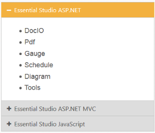
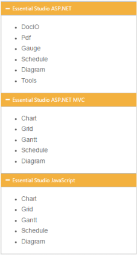
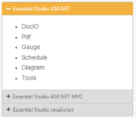
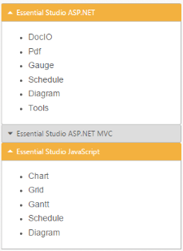

# Getting Started

This section explains briefly about how to create an Accordion in your application with ASP.NET MVC.

## Create your first Accordion in ASP.NET

The ASP.NET MVC Accordion control allows you to provide multiple panes and display them one/more at a time. In this section, you can learn how the Accordion control is configured and how to use it in your application.

## Configure Accordion

This section explains you the details on how to configure the Accordion control in your application and how to customize it with various properties such as multiple open, rounded corner and icons for the Accordion header according to your requirement.

The following screenshot illustrates you the usage of Accordion control in listing the controls under the Essential Studio products. 

In the above screenshot , the Accordion contains a template for its Header and its content. In this Accordion application, you can list the controls under Essential Studio.

## Create a Simple Accordion

ASP.NET MVC Accordion basically renders using a div element. The following step describes the creation of Accordion control.

* You can create a MVC Project and add necessary Dll’s with the help of the given [MVC-Getting Started](http://help.syncfusion.com/aspnetmvc/accordion/getting-started) Documentation.
* Please add the below code in layout._cshtml file head section to add the necessary script and CSS files to render the Accordion control.



<head>

<link href="http://cdn.syncfusion.com/13.1.0.21/js/web/flat-azure/ej.web.all.min.css" rel="stylesheet" />

    <!--Scripts-->

    

    

    

</head>



* Add the following code example to the corresponding view page for Accordion rendering.


@{Html.EJ().Accordion("basicAccordion").Width("400px").EnableMultipleOpen(true).Items(data =>

		   {

			   data.Add().Text("Essential Studio ASP.NET").ContentTemplate(@

    <ul>
        <li>
            <h4>DocIO</h4>
        </li>
        <li>
            <h4>Pdf  </h4>
        </li>
        <li>
            <h4>Gauge  </h4>
        </li>
        <li>
            <h4>Schedule  </h4>
        </li>
        <li>
            <h4>Diagram  </h4>
        </li>
        <li>
            <h4>Tools </h4>
        </li>
    </ul>

);

			   data.Add().Text("Essential Studio ASP.NET MVC").ContentTemplate(@

    <ul>
        <li>
            <h4>Chart </h4>
        </li>
        <li>
            <h4>Grid  </h4>
        </li>
        <li>
            <h4>Gantt  </h4>
        </li>
        <li>
            <h4>Schedule  </h4>
        </li>
        <li>
            <h4>Diagram  </h4>
        </li>
    </ul>

);

			   data.Add().Text("Essential Studio JavaScript").ContentTemplate(@

    <ul>
        <li>
            <h4>Chart </h4>
        </li>
        <li>
            <h4>Grid  </h4>
        </li>
        <li>
            <h4>Gantt  </h4>
        </li>
        <li>
            <h4>Schedule  </h4>
        </li>
        <li>
            <h4>Diagram  </h4>
        </li>
    </ul>

);

		   }).Render();}


Execute the above code example to display the Accordion control with simple control list.

You can customize the Accordion control using various properties. The Accordion control properties and its default values are described in the following section.

## Configure Multiple Open

You can open multiple Accordion tabs to view all products at a time. To render this set the EnableMultipleOpen property of the Accordion control to true.

N> EnableMultipleOpen property is false by default. 

You can also open all the panels during initialization using the SelectedItems property of the Accordion control. The following code sample illustrates the opening of multiple tabs by passing the tab index values of tab.



    @{

    List
<int> selecteditem = new List
    <int>() { 0, 1, 2 };

}

@{Html.EJ().Accordion("basicAccordion").EnableMultipleOpen(true).SelectedItems(selecteditem).Items(data =>

{

    data.Add().Text("Essential Studio ASP.NET").ContentTemplate(@
	

		<ul>
			<li>
				<h4>DocIO</h4>
			</li>
			<li>
				<h4>Pdf  </h4>
			</li>
			<li>
				<h4>Gauge  </h4>
			</li>
			<li>
				<h4>Schedule  </h4>
			</li>
			<li>
				<h4>Diagram  </h4>
			</li>
			<li>
				<h4>Tools </h4>
			</li>
		</ul>
	
);

			   data.Add().Text("Essential Studio ASP.NET MVC").ContentTemplate(@
	

		<ul>
			<li>
				<h4>Chart </h4>
			</li>
			<li>
				<h4>Grid  </h4>
			</li>
			<li>
				<h4>Gantt  </h4>
			</li>
			<li>
				<h4>Schedule  </h4>
			</li>
			<li>
				<h4>Diagram  </h4>
			</li>
		</ul>
	
);

			   data.Add().Text("Essential Studio JavaScript").ContentTemplate(@
	

		<ul>
			<li>
				<h4>Chart </h4>
			</li>
			<li>
				<h4>Grid  </h4>
			</li>
			<li>
				<h4>Gantt  </h4>
			</li>
			<li>
				<h4>Schedule  </h4>
			</li>
			<li>
				<h4>Diagram  </h4>
			</li>
		</ul>
	
);

		   }).Render();

}  


Accordion control with EnableMultipleOpen property is illustrated in the following screenshot.

## Set Rounded corner

Accordion control by default is rendered in a regular rectangle. You can modify the regular rectangles with rounded corners by setting the ShowRoundedCorner property to true.

N> ShowRoundedCorner property is false by default.



    @{

    List<int> selecteditem = new List<int>() { 0, 1, 2 };

}

@{Html.EJ().Accordion("basicAccordion").EnableMultipleOpen(true).SelectedItems(selecteditem).ShowRoundedCorner(true).Items(data =>

   {

	   data.Add().Text("Essential Studio ASP.NET").ContentTemplate(@

		<ul>

			<li>

				<h4>DocIO</h4>

			</li>

			<li>

				<h4>Pdf  </h4>

			</li>

			<li>

				<h4>Gauge  </h4>

			</li>

			<li>

				<h4>Schedule  </h4>

			</li>

			<li>

				<h4>Diagram  </h4>

			</li>

			<li>

				<h4>Tools </h4>

			</li>

		</ul>

	
);

	   data.Add().Text("Essential Studio ASP.NET MVC").ContentTemplate(@

		<ul>

			<li>

				<h4>Chart </h4>

			</li>

			<li>

				<h4>Grid  </h4>

			</li>

			<li>

				<h4>Gantt  </h4>

			</li>

			<li>

				<h4>Schedule  </h4>

			</li>

			<li>

				<h4>Diagram  </h4>

			</li>

		</ul>

	
);

	   data.Add().Text("Essential Studio JavaScript").ContentTemplate(@

		<ul>

			<li>

				<h4>Chart </h4>

			</li>

			<li>

				<h4>Grid  </h4>

			</li>

			<li>

				<h4>Gantt  </h4>

			</li>

			<li>

				<h4>Schedule  </h4>

			</li>

			<li>

				<h4>Diagram  </h4>

			</li>

		</ul>

	
);

   }).Render();
   
   }  



The following screenshot illustrates the Accordion control with rounded corners.

## Customize Icon

You can customize the Header icon using Custom Icon property. This property is having two features such as Header and SelectedHeader. By default, the classes of Header and SelectedHeader are e-collapse and e-expand respectively.

You can change the + and - symbols in the Accordion header, that are default icons with Up and Down arrow icons. 

Up and Down arrow icons are available in e-arrowheadup and e-arrowheaddown classes respectively in the ej.widgets.core.min.css stylesheets from the sample. 

You can set the Up/Down arrow icon to Accordion header, by adding e-arrowheadup and e-arrowheaddown class to SelectedHeader and Header properties respectively.



@{Html.EJ().Accordion("basicAccordion").EnableMultipleOpen(true).ShowRoundedCorner(true).CustomIcon(icon => icon.SelectedHeader("e-arrowheadup").Header("e-arrowheaddown")).Items(data =>

   {

	   data.Add().Text("Essential Studio ASP.NET").ContentTemplate(@

		<ul>

			<li>

				<h4>DocIO</h4>

			</li>

			<li>

				<h4>Pdf  </h4>

			</li>

			<li>

				<h4>Gauge  </h4>

			</li>

			<li>

				<h4>Schedule  </h4>

			</li>

			<li>

				<h4>Diagram  </h4>

			</li>

			<li>

				<h4>Tools </h4>

			</li>

		</ul>

	
);

	   data.Add().Text("Essential Studio ASP.NET MVC").ContentTemplate(@

		<ul>

			<li>

				<h4>Chart </h4>

			</li>

			<li>

				<h4>Grid  </h4>

			</li>

			<li>

				<h4>Gantt  </h4>

			</li>

			<li>

				<h4>Schedule  </h4>

			</li>

			<li>

				<h4>Diagram  </h4>

			</li>

		</ul>

	
);

	   data.Add().Text("Essential Studio JavaScript").ContentTemplate(@

		<ul>

			<li>

				<h4>Chart </h4>

			</li>

			<li>

				<h4>Grid  </h4>

			</li>

			<li>

				<h4>Gantt  </h4>

			</li>

			<li>

				<h4>Schedule  </h4>

			</li>

			<li>

				<h4>Diagram  </h4>

			</li>

		</ul>

	
);

   }).Render();
 
}  
			   


The following screenshot illustrates the customization of SelectedHeader and Header of the Accordion control.

