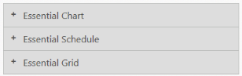
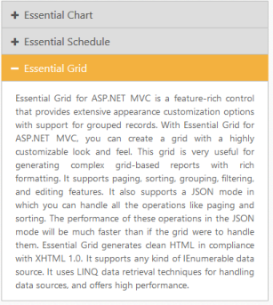
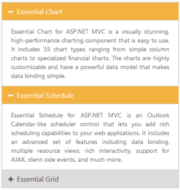

## Header customization

Collapsible

Accordion widget allows you to set Collapsible state for an Accordion header. Thus you can expand and collapse accordion contents. By default Collapsible is set to false.

Enable Collapsible settings

The following code explains to enable Collapsible state for Accordion using mvc helper.



[CSHTML]

// In the View page, render Accordion with corresponding data and enable Collapsible property.

    @{Html.EJ().Accordion("accordion").Items(data =>

               {

                   data.Add().Text("Essential Chart").ContentTemplate(@

                       Essential Chart for ASP.NET MVC is a visually stunning, high-performance charting component that is easy to use. It includes 35 chart types ranging from simple column charts to specialized financial charts. The charts are highly customizable and have a powerful data model that makes data binding simple.

                   
);

                   data.Add().Text("Essential Schedule").ContentTemplate(@

                       Essential Schedule for ASP.NET MVC is an Outlook Calendar-like scheduler control that lets you add rich scheduling capabilities to your web applications. It includes an advanced set of features including data binding, multiple resource views, rich interactivity, support for AJAX, client-side events, and much more.

                   
);

                   data.Add().Text("Essential Grid").ContentTemplate(@

                       Essential Grid for ASP.NET MVC is a feature-rich control that provides extensive appearance customization options with support for grouped records. With Essential Grid for ASP.NET MVC, you can create a grid with a highly customizable look and feel. This grid is very useful for generating complex grid-based reports with rich formatting. It supports paging, sorting, grouping, filtering, and editing features. It also supports a JSON mode in which you can handle all the operations like paging and sorting. The performance of these operations in the JSON mode will be much faster than if the grid were to handle them. Essential Grid generates clean HTML in compliance with XHTML 1.0. It supports any kind of IEnumerable data source. It uses LINQ data retrieval techniques for handling data sources, and offers high performance.
);

               }).Collapsible(true).Render();}



 Output for Accordion control with collapsible headers.

{  | markdownify }
{:.image }

{  | markdownify }
{:.image }

Enable Header expand

Accordion widget provides you support to set the event, where the headers should expand and collapse. The events properties takes default events like mouseout, mouseover, and click.

Configure header expand event

The following code explains you to configure header expand event for Accordion.

[CSHTML]

// In the View page, render Accordion with corresponding data and configure the Events property.

&lt;div style="width: 400px"&gt;

    @{Html.EJ().Accordion("accordion").Items(data =>

               {

                   data.Add().Text("Essential Chart").ContentTemplate(@&lt;div&gt;

                       Essential Chart for ASP.NET MVC is a visually stunning, high-performance charting component that is easy to use. It includes 35 chart types ranging from simple column charts to specialized financial charts. The charts are highly customizable and have a powerful data model that makes data binding simple.

                   &lt;/div&gt;);

                   data.Add().Text("Essential Schedule").ContentTemplate(@&lt;div&gt;

                       Essential Schedule for ASP.NET MVC is an Outlook Calendar-like scheduler control that lets you add rich scheduling capabilities to your web applications. It includes an advanced set of features including data binding, multiple resource views, rich interactivity, support for AJAX, client-side events, and much more.

                   &lt;/div&gt;);

                   data.Add().Text("Essential Grid").ContentTemplate(@&lt;div&gt;

                       Essential Grid for ASP.NET MVC is a feature-rich control that provides extensive appearance customization options with support for grouped records. With Essential Grid for ASP.NET MVC, you can create a grid with a highly customizable look and feel. This grid is very useful for generating complex grid-based reports with rich formatting. It supports paging, sorting, grouping, filtering, and editing features. It also supports a JSON mode in which you can handle all the operations like paging and sorting. The performance of these operations in the JSON mode will be much faster than if the grid were to handle them. Essential Grid generates clean HTML in compliance with XHTML 1.0. It supports any kind of IEnumerable data source. It uses LINQ data retrieval techniques for handling data sources, and offers high performance.&lt;/div&gt;);

               }).Events("mouseout").Render();}

&lt;/div&gt;

Output for Accordion control that expands header on mouseout event is as follows.

{  | markdownify }
{:.image }

Set selected header

Single selection

BY using SelectedItemIndex property you can modify the expanded panel when the control is rendered. By default SelectedItemIndex is ‘0’ that always activate the first Accordion panel.

Specify the selected item in Accordion panel

Using SelectedItemIndex property you can modify the expanded panel when the control is rendered. By default SelectedItemIndex is ‘0’ that always activate the first Accordion panel.

Specify the selected item in Accordion panel

The following code explains you to configure selected item for Accordion.

[CSHTML]

// In the View page, render Accordion with corresponding data and configure selected item for Accordion based on the index.

&lt;div style="width: 400px"&gt;

    @{Html.EJ().Accordion("accordion").Items(data =>

               {

                   data.Add().Text("Essential Chart").ContentTemplate(@&lt;div&gt;

                       Essential Chart for ASP.NET MVC is a visually stunning, high-performance charting component that is easy to use. It includes 35 chart types ranging from simple column charts to specialized financial charts. The charts are highly customizable and have a powerful data model that makes data binding simple.

                   &lt;/div&gt;);

                   data.Add().Text("Essential Schedule").ContentTemplate(@&lt;div&gt;

                       Essential Schedule for ASP.NET MVC is an Outlook Calendar-like scheduler control that lets you add rich scheduling capabilities to your web applications. It includes an advanced set of features including data binding, multiple resource views, rich interactivity, support for AJAX, client-side events, and much more.

                   &lt;/div&gt;);

                   data.Add().Text("Essential Grid").ContentTemplate(@&lt;div&gt;

                       Essential Grid for ASP.NET MVC is a feature-rich control that provides extensive appearance customization options with support for grouped records. With Essential Grid for ASP.NET MVC, you can create a grid with a highly customizable look and feel. This grid is very useful for generating complex grid-based reports with rich formatting. It supports paging, sorting, grouping, filtering, and editing features. It also supports a JSON mode in which you can handle all the operations like paging and sorting. The performance of these operations in the JSON mode will be much faster than if the grid were to handle them. Essential Grid generates clean HTML in compliance with XHTML 1.0. It supports any kind of IEnumerable data source. It uses LINQ data retrieval techniques for handling data sources, and offers high performance.&lt;/div&gt;);

               }).SelectedItemIndex(2).Render();}

&lt;/div&gt;

Output for Accordion control with the selected item by index is as follows.

{  | markdownify }
{:.image }

Multiple selection

In Accordion widget you can select multiple panel items using SelectedItems property. It takes array of indices that needs to be selected on rendering the control. As you need to select multiple items, you can set EnableMultipleOpen to true.

Configure multiple selection in Accordion panel

The following code explains to configure selected items for Accordion.

[CSHTML]

// In the View page, render Accordion with corresponding data and configure multiple items selection for Accordion.

&lt;div style="width: 400px"&gt;

    @{      //List of integer array with index values.

        List<int> selecteditem = new List<int>() { 0, 1, 2 };

    }

    @{Html.EJ().Accordion("accordion").Items(data =>

               {

                   data.Add().Text("Essential Chart").ContentTemplate(@&lt;div&gt;

                       Essential Chart for ASP.NET MVC is a visually stunning, high-performance charting component that is easy to use. It includes 35 chart types ranging from simple column charts to specialized financial charts. The charts are highly customizable and have a powerful data model that makes data binding simple.

                   &lt;/div&gt;);

                   data.Add().Text("Essential Schedule").ContentTemplate(@&lt;div&gt;

                       Essential Schedule for ASP.NET MVC is an Outlook Calendar-like scheduler control that lets you add rich scheduling capabilities to your web applications. It includes an advanced set of features including data binding, multiple resource views, rich interactivity, support for AJAX, client-side events, and much more.

                   &lt;/div&gt;);

                   data.Add().Text("Essential Grid").ContentTemplate(@&lt;div&gt;

                       Essential Grid for ASP.NET MVC is a feature-rich control that provides extensive appearance customization options with support for grouped records. With Essential Grid for ASP.NET MVC, you can create a grid with a highly customizable look and feel. This grid is very useful for generating complex grid-based reports with rich formatting. It supports paging, sorting, grouping, filtering, and editing features. It also supports a JSON mode in which you can handle all the operations like paging and sorting. The performance of these operations in the JSON mode will be much faster than if the grid were to handle them. Essential Grid generates clean HTML in compliance with XHTML 1.0. It supports any kind of IEnumerable data source. It uses LINQ data retrieval techniques for handling data sources, and offers high performance.&lt;/div&gt;);

               }).SelectedItems(selecteditem).EnableMultipleOpen(true).Render();}

&lt;/div&gt;

Output for Accordion control with the multiple selected items is as follows.

{  | markdownify }
{:.image }

