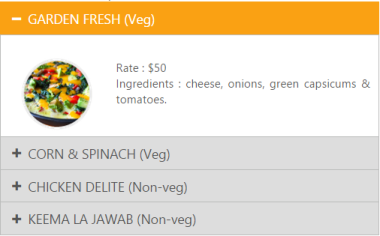

# Template Support

## Content Template

The Content template option provided in MVC is used to specify the HTML elements inside the Accordion control. You can use this option to load any HTML elements and display it in the Accordion panels as per your requirement.

The following code example explains how to use content template option in the Accordion control.



    @{Html.EJ().Accordion("pizzaMenu").Items(data =>

               {

                   data.Add().Text("GARDEN FRESH (Veg)").ContentTemplate(@

                    

                                        

                        Rate    : $50

                         

                        Ingredients : cheese, onions, green capsicums & tomatoes.

                    

                
);

                   data.Add().Text("CORN & SPINACH (Veg)").ContentTemplate(@

                    

                    

                        Rate    : $70

                         

                        Ingredients : cheese, sweet corn & green capsicums.

                    

                
);

                   data.Add().Text("CHICKEN DELITE (Non-veg)").ContentTemplate(@

                    

                    

                        Rate    : $100

                         

                        Ingredients : cheese, chicken chunks, onions & pineapple chunks.

                    

                
);

                     data.Add().Text("KEEMA LA JAWAB (Non-veg)").ContentTemplate(@

                    

                    

                        Rate    : $95

                         

                        Ingredients : lamb keema, onions, garlic & tandoori seasoning.

                    

                
);

               }).EnableMultipleOpen(true).Render();}



Output:

## Header Template

The Header template option provided in MVC is used to specify the HTML elements inside the Accordion control.

The following code example explains how to use header template option in the Accordion control.



@{
    ViewBag.Title = "Accordion";
    Layout = "~/Views/Shared/_Layout.cshtml";
}
@model AccordionIcons.AccordionController.SI_MODULO
<h2>Accordion</h2>
 
 

    

        @{Html.EJ().Accordion("iconAccordion").Items(data =>
        {
            foreach (var m in Model.image)
            {
                var node = data.Add().Text(m.text).HeaderTemplate(@

                <image class='logos' src='http://js.syncfusion.com/demos/web/content/images/Employees/@m.imageID' />
                
).ContentTemplate(@
 This is just a sample text.
);
            }
        }).Render();}
    





List<ImagesID> list = new List<ImagesID>();
public ActionResult AccordionFeatures()
 {
   SI_MODULO model = new SI_MODULO();
   list.Add(new ImagesID { imageID = "6.png", text = "Volkswagen" });
   list.Add(new ImagesID { imageID = "7.png", text = "Mitsubishi" });
   list.Add(new ImagesID { imageID = "8.png", text = "Mercedes-Benz" });
   model.image = list;
   return View(model);
 }
public class ImagesID {
    public string imageID { get; set; }
    public string text { get; set; }
}
public class SI_MODULO {
public List<ImagesID> image { get; set; }
}


