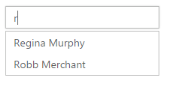

# Data-Binding

In order to render the AutoComplete control, the data needs to be bound to it in a proper way. The following sub-properties provide a way to bind either the local or remote data to the AutoComplete widget by binding the appropriate data fields to the corresponding options.

## Fields

### DataSource 

This property assigns the List of objects to the AutoComplete control. Either local data or remote data can be specified.  

### Query 

It accepts the data of object type, usually the query string to fetch the required data from a specific table based on certain condition. This property is optional hence when it is not specified the entire records that are initially assigned through DataSource are taken into consideration.

### Key

It maps the corresponding key field name from the data table or the List of objects that is assigned to the DataSource with the Key property of the AutoComplete control. The Key value that is fetched from the table is unique for each records.

### Text

It maps the corresponding Text field name from the data table or the List of Objects that is assigned to the DataSource with the Text property of the AutoComplete control. The text value that is fetched from the table represents the value to be displayed in the AutoComplete textbox.

### GroupBy

It maps the groupBy field name from the data table or JSON data that is assigned to the dataSource. The groupBy value that is fetched from the table is made to group the values in the datasource.

### HtmlAttributes

This allows you to map the CSS styles or classes to the corresponding data from table or the List of Objects data with the AutoComplete items. The HtmlAttributes value customizes the AutoComplete items based on HTML styling or class assigned to it. 

## Local data

AutoComplete provides extensive data binding support to populate AutoComplete items, so that the values are mapped to the AutoComplete fields, namely Key and Text. DataBinding helps you bind a key value pair to AutoComplete textbox. Key field takes the unique id of the dataSource elements. Text field gets the value to be displayed in the AutoComplete textbox.

### Defining the Local data for AutoComplete

The following steps explain local data binding to an AutoComplete textbox.

1. In the Controller page, define the Class with key and text field. Then create a List of that class and add the data.

   ~~~ csharp
			
			public class CarsList

			{

			  public int UniqueKey { get; set; }

			  public string Text { get; set; }

			}

			public partial class AutocompleteController : Controller

			{

				List<CarsList> cars = new List<CarsList>();

				public ActionResult AutocompleteFeatures()

				{

					cars.Add(new CarsList { UniqueKey = 1, Text = "Audi S6" });

					cars.Add(new CarsList { UniqueKey = 2, Text = "Austin-Healey" });

					cars.Add(new CarsList { UniqueKey = 3, Text = "Alfa Romeo" });

					cars.Add(new CarsList { UniqueKey = 4, Text = "Aston Martin" });

					cars.Add(new CarsList { UniqueKey = 5, Text = "BMW 7" });

					cars.Add(new CarsList { UniqueKey = 6, Text = "Bentley Mulsanne" });

					cars.Add(new CarsList { UniqueKey = 7, Text = "Bugatti Veyron" });

					cars.Add(new CarsList { UniqueKey = 8, Text = "Chevrolet Camaro" });

					cars.Add(new CarsList { UniqueKey = 9, Text = "Cadillac" });

					cars.Add(new CarsList { UniqueKey = 10, Text = "Duesenberg J " });

					cars.Add(new CarsList { UniqueKey = 11, Text = "Dodge Sprinter" });

					cars.Add(new CarsList { UniqueKey = 12, Text = "Elantra" });

					cars.Add(new CarsList { UniqueKey = 13, Text = "Excavator" });

					cars.Add(new CarsList { UniqueKey = 14, Text = "Ford Boss 302" });

					cars.Add(new CarsList { UniqueKey = 15, Text = "Ferrari 360" });

					cars.Add(new CarsList { UniqueKey = 16, Text = "Ford Thunderbird" });

					cars.Add(new CarsList { UniqueKey = 17, Text = "GAZ Siber" });

					cars.Add(new CarsList { UniqueKey = 18, Text = "Honda S2000" });

					cars.Add(new CarsList { UniqueKey = 19, Text = "Hyundai Santro" });

					cars.Add(new CarsList { UniqueKey = 20, Text = "Isuzu Swift" });

					cars.Add(new CarsList { UniqueKey = 21, Text = "Infiniti Skyline" });

					cars.Add(new CarsList { UniqueKey = 22, Text = "Infiniti Skyline" });

					cars.Add(new CarsList { UniqueKey = 23, Text = "Kia Sedona EX" });

					cars.Add(new CarsList { UniqueKey = 24, Text = "Koenigsegg Agera" });

					cars.Add(new CarsList { UniqueKey = 25, Text = "Lotus Esprit" });

					cars.Add(new CarsList { UniqueKey = 26, Text = "Lamborghini Diablo" });

					cars.Add(new CarsList { UniqueKey = 27, Text = "Mercedes-Benz" });

					cars.Add(new CarsList { UniqueKey = 28, Text = "Mercury Coupe" });

					cars.Add(new CarsList { UniqueKey = 29, Text = "Maruti Alto 800" });

					cars.Add(new CarsList { UniqueKey = 30, Text = "Nissan Qashqai" });

					cars.Add(new CarsList { UniqueKey = 31, Text = "Oldsmobile S98" });

					cars.Add(new CarsList { UniqueKey = 32, Text = "Opel Superboss" });

					cars.Add(new CarsList { UniqueKey = 33, Text = "Porsche 356" });

					cars.Add(new CarsList { UniqueKey = 34, Text = "Pontiac Sunbird" });

					cars.Add(new CarsList { UniqueKey = 35, Text = "Scion SRS/SC/SD" });

					cars.Add(new CarsList { UniqueKey = 36, Text = "Saab Sportcombi" });

					cars.Add(new CarsList { UniqueKey = 37, Text = "Subaru Sambar" });

					cars.Add(new CarsList { UniqueKey = 38, Text = "Suzuki Swift" });

					cars.Add(new CarsList { UniqueKey = 39, Text = "Triumph Spitfire" });

					cars.Add(new CarsList { UniqueKey = 40, Text = "Toyota 2000GT" });

					cars.Add(new CarsList { UniqueKey = 41, Text = "Volvo P1800" });

					cars.Add(new CarsList { UniqueKey = 42, Text = "Volkswagen Shirako" });

					cars.Add(new CarsList { UniqueKey = 43, Text = "Ford Boss 302" });

					cars.Add(new CarsList { UniqueKey = 44, Text = "Ferrari 360" });

					cars.Add(new CarsList { UniqueKey = 45, Text = "Ford Thunderbird" });

					ViewBag.datasource = cars;

					return View(); 

				 } 

			}
   ~~~
   

2. In the View page, add Autocomplete helper and map the Local   data list to corresponding DataSource and AutoCompleteFields.

   ~~~ cshtml

	@Html.EJ().Autocomplete("autocomplete")

	.Datasource((IEnumerable<CarsList>)ViewBag.datasource)

	.AutocompleteFields(field => field.Key("UniqueKey").Text("Text"))
   
   ~~~
   

The following image is the output for AutoComplete control with local data binding.

AutoComplete with local data-binding
{:.caption}

## Remote data

AutoComplete provides remote data binding support to populate AutoComplete items, so that the values are mapped to the AutoComplete fields from a remote web service using DataManager and Query. 

DataManager is used to manage relational data. It supports CRUD that is Create, Read, Update, and Destroy, in individual requests and batches. DataManager uses two different classes, ej.DataManager, for processing and ej.Query, for serving data. ej.DataManager communicates with dataSource and ej.Query generates data queries that are read by the DataManager.

### Configuring remote data for AutoComplete

The following steps explain the remote data binding to an AutoComplete textbox.

1. In the View page, map the Local data list to the corresponding DataSource and AutoCompleteFields.



@Html.EJ().Autocomplete("autocomplete")

.Datasource(d => d.URL("http://mvc.syncfusion.com/UGOdataServices/Northwnd.svc/"))

.Query("ej.Query().from('ComponentLists').select('ComponentId', 'ComponentName')")

.AutocompleteFields(f => f.Text("ComponentName").Key("ComponentId"))



The following image is the output for AutoComplete control with remote data binding.

AutoComplete with remote data binding
{:.caption}
