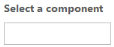

# Getting Started

This section explains briefly about how to create an AutoComplete in your ASP.NET MVC application.

## Create your first AutoComplete in MVC

This section helps you to configure the AutoComplete control in your application and also helps you to learn how to pass the required data to it and to customize its various options according to your requirements. 

In this section,  the flat-saffron theme (default) for the Autocomplete is explained.

The following screen shot illustrates the AutoComplete control that searches the list of components available in the database. 

AutoComplete controlwith search
{:.caption}

### Create an AutoComplete

ASP.NET MVC AutoComplete Textbox widget basically renders with built-in features like keyboard navigation with animations and flexible API’s. You can easily create the AutoCompleteTextbox widget by the following steps.

1. You can create a MVC Project and add necessary Dll’s and Scripts with the help of the given [MVC-Getting Started](http://do.syncfusion.com/aspnetmvc/autocomplete/getting-started) Documentation.
2. Initialize the corresponding AutoComplete widget in the view page.

   ~~~ cshtml

	

		Select Component/s: 

	@Html.EJ().Autocomplete("ComponentList")

	

   ~~~
   

3.  Execute the code to render a AutoComplete widget as follows

Output
{:.caption}

### Populate Data to AutoComplete

You can provide either local data or remote data to the Autocomplete.

#### Remote Data Binding

You can assign the required Data from the remote URL by using the DataSource property. You can generate a query to get the required Data from the remote file using Query()property and define the query to get the remote Data. Use AutoCompleteFields property, to map the Data fields to the textbox as shown in the following code example.



	Select Component/s: 

	@Html.EJ().Autocomplete("ComponentList").Datasource(d=> 
	d.URL("http://mvc.syncfusion.com/UGOdataServices/Northwnd.svc/")).Query("ej.Query().from('ComponentLists').select('ComponentId', 
	'ComponentName')").AutocompleteFields(f=> f.Text("ComponentName").Key("ComponentId")).Width("500")



Run this code to render the AutoComplete with components list.

AutoComplete with Component list
{:.caption}

You can also set some common customization changes to the AutoComplete textbox like enabling multiple-selection, highlight search and add dropdown icon based on your requirement. 

#### Configure Visual Mode with filter option

By default, the AutoComplete is rendered with single-value selection. For multiple-value selection using the property MultiSelectModethatallows you to select multiple Data. There are two types of multiple selection one is ‘delimiter’ and another one is ‘visual mode’. In ‘Delimiter’ mode, the multiple values chosen are separated by using the delimiter character specified. In ‘visual mode’, the values choosen are displayed as box model. Here, the ‘visual mode’ is shown. You can set the FilterType option as StartsWith to sort the suggestion list based on the starting character.



	Select Component/s: 

	@Html.EJ().Autocomplete("ComponentList").Datasource(d=> 
	d.URL("http://mvc.syncfusion.com/UGOdataServices/Northwnd.svc/")).Query("ej.Query().from('ComponentLists').select('ComponentId',
	 'ComponentName')").AutocompleteFields(f=> f.Text("ComponentName").Key("ComponentId")).MultiSelectMode(MultiSelectModeTypes.VisualMode).FilterType(FilterOperatorType.StartsWith).Width("500")



The following screen shot displays the AutoCompletetextbox with selection visual mode.

AutoComplete textbox with selection visual mode
{:.caption}

#### Configure Highlight Search and Rounded corners



    Select Component/s: 

@Html.EJ().Autocomplete("ComponentList").Datasource(d=> 
d.URL("http://mvc.syncfusion.com/UGOdataServices/Northwnd.svc/")).Query("ej.Query().from('ComponentLists').select('ComponentId',
'ComponentName')").AutocompleteFields(f=> f.Text("ComponentName").Key("ComponentId")).MultiSelectMode(MultiSelectModeTypes.VisualMode).FilterType(FilterOperatorType.StartsWith).HighlightSearch(true).ShowRoundedCorner(true).Width("500")



When you set the HighlightSearch property to ‘true’, the characters typed in textbox gets highlighted in the suggestion list. To display textbox reforms from sharp ends to rounded ends, you can enable the ShowRoundedCorner property.

The following screen shot displays the AutoCompletetextbox with highlight search enabled.

AutoComplete text box with highlight search enabled
{:.caption}

#### Configure Popup button

To enable the DropDown button, you can set ShowPopupButton property to ‘true’ that displays the DropDown icon at the end of textbox. By default, search icon replaces other icons and so you need to override the CSS classes and replace the content to DropDown arrow icon available in core CSS file as follows.


 






    Select Component/s: 
@Html.EJ().Autocomplete("ComponentList").Datasource(d=>
d.URL("http://mvc.syncfusion.com/UGOdataServices/Northwnd.svc/")).Query("ej.Query().from('ComponentLists').select('ComponentId', 'ComponentName')").AutocompleteFields(f=>
f.Text("ComponentName").Key("ComponentId")).MultiSelectMode(MultiSelectModeTypes.VisualMode).FilterType(FilterOperatorType.StartsWith).HighlightSearch(true).ShowRoundedCorner(true).Width("500").ShowPopupButton(true)


 

The following screen shot displays the AutoCompletetextbox with dropdown icon.

AutoComplete textbox with dropdown icon
{:.caption}
