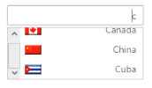

## RTL support

This feature allows you to change the alignment of the AutoComplete textbox widget from left-to-right to right-to-left (RTL). The custom template AutoComplete textbox also supports RTL. 

Enabling RTL Support

The following steps explain how you can enable the right-to-left property for an AutoComplete textbox.

1. In the View page, define the AutoComplete control and enable the RTL property.

[CSHTML]

@*Refer to the DataSource defined in Local Databinding Step 1 *@

@Html.EJ().Autocomplete("autocomplete")

    .Datasource((IEnumerable<CarsList>)ViewBag.datasource)

    .AutocompleteFields(field => field.Key("UniqueKey").Text("Text").Category("Category"))

    .Width("250px").EnableRTL(true)

The following image is the output for AutoComplete when EnableRTL is set to “True”.

{  | markdownify }
{:.image }

_AutoComplete template with RTL support_

