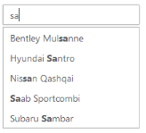
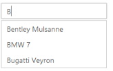

# Search Customization

## HighlightSearch

AutoComplete widget allows you to highlight the search text in the AutoComplete suggestions list using the HighlightSearch property. When this property is set to ‘True’, the suggestions list appear with the search text it contains is highlighted.

### Enabling highlightSearch option

The following steps explain how you can enable the HighlightSearch property for an AutoComplete textbox.

1. In the View page, define the AutoComplete control and enable the HighlightSearch property.



@*Refer to the DataSource defined in Local Databinding Step 1 *@

@Html.EJ().Autocomplete("autocomplete")

    .Datasource((IEnumerable<CarsList>)ViewBag.datasource)

    .AutocompleteFields(field => field.Key("UniqueKey").Text("Text"))

    .HighlightSearch(true).FilterType(FilterOperatorType.Contains)

    .MinCharacter(2)



The following image is the output for AutoComplete when HighlightSearch is set to ‘True’.

_AutoComplete with highlightSearch enabled_

## Case-sensitive Search

AutoComplete allows you to enable case sensitivity to filter the suggest list items based on the entered text casing. This property enables strict filtering of list items based on entered text. To enable it, set CaseSensitiveSearch value to ‘True’. It is False, by default.

### Configure case sensitivity for AutoComplete

The following steps explain you how to enable the CaseSensitiveSearch property for an AutoComplete textbox.

1. In the View page, define the AutoComplete control and enable the CaseSensitiveSearch property.



@*Refer to the DataSource defined in Local Databinding Step 1 *@

@Html.EJ().Autocomplete("autocomplete")

    .Datasource((IEnumerable<CarsList>)ViewBag.datasource)

    .AutocompleteFields(field => field.Key("UniqueKey").Text("Text"))

.CaseSensitiveSearch(true)



The following image is the output for AutoComplete when CaseSensitiveSearch is set to ‘True’.

_AutoComplete textbox with caseSensitiveSearch_

