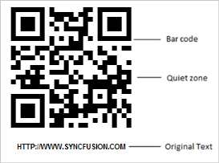

# Getting Started

This section explains you briefly on how to create a Barcode in your application with ASP.NET MVC.

## Control Structure

Control structure
{:.caption}

## Create your first Barcode in MVC

The ASP.NET MVC Barcode provides you support to encode data and display it in your web page; it takes text and symbology as input and renders the encoded text as Barcode.

The following guideline explains you on how to create a QR Barcode for a real time scenario of encoding a URL. The following screenshot demonstrates a two dimensional barcode encoding the value “HTTP://WWW.SYNCFUSION.COM”.

QR Barcode for the URL “HTTP://WWW.SYNCFUSION.COM”
{:.caption}

By default, ASP.NET MVC Barcode renders gray scale colors with predefined Quiet zone. Quiet zone is the blank margin on the side(s) that denotes the reader with the start and stop of the Barcode. It also provides flexible API’s to customize the appearance of the Barcode. 

### Refer Assemblies

You can create a MVC Project, add necessary assemblies and Scripts. Refer [MVC-Getting Started Documentation.](http://help.syncfusion.com/aspnetmvc/barcode/getting-started)

Add the following assemblies in your MVC application for using Barcode control:

* Syncfusion.Core.dll
* Syncfusion.EJ.dll
* Syncfusion.EJ.MVCdll

These Syncfusion assemblies can either be referenced from Global Assembly Cache (GAC) or from the installed folder.

[Installed Drive]:\Program Files (x86)\Syncfusion\Essential Studio\X.X.X.X\precompiledassemblies\X.X.X.X

### Configure Web.Config

Web.config file is configured according to the referenced assemblies. The steps to configure the file are as follows.

* On the Solution Explorer, double-click the Web.config file in the root folder. The Web.config page appears.
* Add the following assemblies in the Web.config page under the <compilation> tag:
* Syncfusion.Core
* Syncfusion.EJ
* Syncfusion.EJ.MVC



<system.web>

    <compilation>

      <assemblies>

         <add assembly="Syncfusion.Core, Version=x.x.x.x, Culture=neutral, PublicKeyToken=632609b4d040f6b4"/>

        <add assembly="Syncfusion.EJ, Version=x.x.x.x, Culture=neutral, PublicKeyToken=3d67ed1f87d44c89"/>

        <add assembly="Syncfusion.EJ.Mvc, Version=x.x.x.x, Culture=neutral, PublicKeyToken=3d67ed1f87d44c89"/>

      </assemblies>

    </compilation>

</system.web>



N> X.X.X.X in the above code corresponds to the correct version number of the Essential Studio version that you are currently using.

* Add the following namespaces under the <namespaces> tag.
* Syncfusion.JavaScript
* Syncfusion.JavaScript.DataVisualization
* Syncfusion.Mvc.EJ



<system.web>

<pages>

      <namespaces>

        <add namespace="Syncfusion.JavaScript"/>

        <add namespace="Syncfusion.JavaScript.DataVisualization"/>

        <add namespace="Syncfusion.MVC.EJ"/>

      </namespaces>

   </pages>

</system.web>



* Open the Index.cshtml file under Views->Home folder. Add the following code in the cshtml file for Barcode rendering.


@Html.EJ().Barcode("barcode")

          .Text("HTTP://WWW.SYNCFUSION.COM")

.SymbologyType(BarcodeSymbolType.QRBarcode)

          .Render()



* Run the project. Refer the following screenshot for output.

QR Barcode generated in ASP.NET
{:.caption}