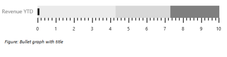
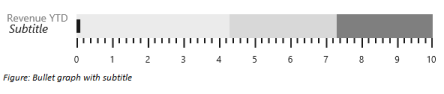
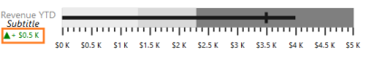
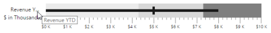
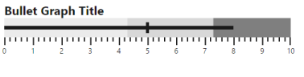
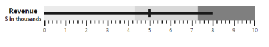
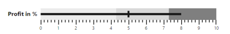

# Bullet Graph Caption

Bullet Graph supports title and subtitle to convey what is represented in Bullet Graph. They are customized using CaptionSettings property.

## Title

Title is set to Bullet Graph using Text property in CaptionSettings. Caption settings also include properties like Location, Font, and TextAngle for customizing the caption of Bullet Graph.



@(Html.EJ().BulletGraph("Bullets").QuantitativeScaleSettings( qs=>

                                            qs.Location( loc=> loc.x(110).y(200))

                                            .Minimum(0)

                                            .Maximum(5)

                                            .Interval(1)

                                            .FeatureMeasure(fm=>fm.Value(4).ComparativeMeasureValue(3.5)))

                                      .Height(700)

                                      .Width(600)

                                      .CaptionSettings(cs=>

                                          cs.Text("Revenue YTD")

                                          .Location(loc=>loc.y(220))

                                          .Font(font=>font.FontStyle("bold").FontColor(System.Drawing.Color.Gray).FontSize("14px")))

                                      )



The following screenshot displays a Bullet Graph with customized caption using the above code

## Subtitle

Subtitle is added to Bullet Braph using Text property of Subtitle in CaptionSettings. Subtitle also provides properties like Location, TextAngle and Font to customize subtitle similar to caption.



@(Html.EJ().BulletGraph("Bullets").QuantitativeScaleSettings( qs=>

                                            qs.Location( loc=> loc.x(110).y(200))

                                            .Minimum(0)

                                            .Maximum(5)

                                            .Interval(1)

                                            .FeatureMeasure(fm=>fm.Value(4).ComparativeMeasureValue(3.5)))

                                      .Height(700)

                                      .Width(600)

                                      .CaptionSettings(cs=>

                                          cs.SubTitle(subtitle=>

                                              subtitle.Text("Subtitle")

                                              .Location(loc=>loc.x(20).y(225))

                                              .Font(font=>font.FontStyle("italic").FontSize("16px")))

                                          .Text("Revenue YTD")

                                          .Location(loc=>loc.y(210))

                                          .Font(font=>font.FontStyle("bold").FontColor(System.Drawing.Color.Gray).FontSize("14px")))

                                      )


The following screenshot displays Bullet Graph with a subtitle

## Indicator

You can add Indicator to bullet graph by enabling Visible and setting Text properties of Indicator in CaptionSettings. Indicator is used to represent whether target is achieved or not with text and symbol by comparing current and target values in bullet graph. 

Indicator displays a symbol along with text which is different from caption and subtitle. Images like logos can be used in indicator instead of symbols. Indicator has properties such as Symbol, Text, TextSpacing, TextAngle, Location and Font. 


@(Html.EJ().BulletGraph("Bullets").QuantitativeScaleSettings( qs=>

                                            qs.Location( loc=> loc.x(110).y(200))

                                            .Minimum(0)

                                            .Maximum(5)

                                            .Interval(1)

                                            .LabelSettings(ls=>ls.LabelPrefix("$").LabelSuffix("K"))

                                            .FeatureMeasure(fm=>fm.Value(4).ComparativeMeasureValue(3.5)))

                                      .Height(700)

                                      .Width(600)

                                      .CaptionSettings(cs=>

                                          cs.Indicator(indicator=>

                                              indicator.Visible(true)

                                              .Text("+ $0.5 K")

                                              .Location(loc=>loc.x(15).y(240))

                                              .Symbol(symbol=>

                                                  symbol.Shape(SymbolShape.Triangle)

                                                  .Color("green")

                                                  .Border(border=>border.Width(1).Color("green")

                                                  )))

                                          .SubTitle(subtitle=>

                                              subtitle.Text("Subtitle")

                                              .Location(loc=>loc.x(20).y(225))

                                              .Font(font=>font.FontStyle("italic").FontSize("16px")))

                                          .Text("Revenue YTD")

                                          .Location(loc=>loc.y(210))

                                          .Font(font=>font.FontStyle("bold").FontColor(System.Drawing.Color.Gray).FontSize("14px")))

                                      )


The following screenshot displays a bullet graph with indicator.

## Trim

The title, subtitle and indicator text can be overlapped to the scale group. You can avoid the overlapped text by using the EnableTrim property of the CaptionSettings. The default value of the EnableTrim is true. 


@(Html.EJ().BulletGraph("BulletGraph1")

.CaptionSettings(title=>title.Text("Bullet Graph Title").EnableTrim (true))

)



The following screenshot displays the BulletGraph with Trim.

## Text Placement

All the caption group elements (caption, subtitle, and indicator) in the Bullet Graph support text positioning by using the property TextPosition available in all caption group elements. The properties, TextAlignment and TextAnchor are used to customize text placement further.

### Text Position

The property TextPosition, is used to position the text at the top, bottom, left, and right side of the quantitative scale. The default value of this property is Float. By default, text can be placed at any desired location by using the Location property. 


@(Html.EJ().BulletGraph("BulletGraph1").Width(650).Height(150).Value(8).ComparativeMeasureValue(5)

    .CaptionSettings(title=>title.Text("Bullet Graph Title")

                            .TextPosition(BulletTextPosition.Top)

                            .Font(font=>

                                font.FontSize("20px")

                                .FontWeight("bold")

                            ))

    .QuantitativeScaleSettings(scale=>scale.Location(loc=>loc.x(120).y(40)))

)



The following screenshot displays the Bullet Graph with the title positioned above.

### Text Alignment

Alignment of text at different positions with respect to scale can be customized by using the TextAlignment property. Text can be aligned in the near, center, and far locations of the scale. Text alignment depends upon TextPosition property and is not applicable when the value of the TextPosition property is Float. The default value of the TextAlignment property is Near. 


@(Html.EJ().BulletGraph("BulletGraph1").Width(650).Height(150).Value(8).ComparativeMeasureValue(5)

    .CaptionSettings(title=>title.Text("Revenue")

                            .TextPosition(BulletTextPosition.Left)

                            .TextAnchor(BulletTextAnchor.Middle)

                            .Font(font=>

                                font.FontSize("16px")

                                .FontWeight("bold")

                            )

                     .SubTitle(subtitle=>subtitle.Text("$ in thousands")

                            .TextPosition(BulletTextPosition.Left)

                            .TextAlignment(BulletTextAlignment.Center)

                            .Font(font=>

                                font.FontSize("12px")

                                .FontWeight("bold")

                            )))

    .QuantitativeScaleSettings(scale=>scale.Location(loc=>loc.x(120).y(40)))

)



The following screenshot displays the Bullet Graph with the title and subtitle at different alignments.

### Text Anchor

Text elements aligned at the same position are anchored by using the TextAnchor property. These can be anchored at the Start, Middle, and End. The default value of this property is Start and applicable only when two or more text elements are aligned at the same position. 



@(Html.EJ().BulletGraph("BulletGraph1").Width(650).Height(150).Value(8).ComparativeMeasureValue(5)

    .CaptionSettings(title=>title.Text("Revenue")

                            .TextPosition(BulletTextPosition.Left)

                            .TextAnchor(BulletTextAnchor.Middle)

                            .Font(font=>

                                font.FontSize("16px")

                                .FontWeight("bold")

                            )

                     .SubTitle(subtitle=>subtitle.Text("$ in thousands")

                            .TextPosition(BulletTextPosition.Left)

                            .TextAlignment(BulletTextAlignment.Center)

                            .Font(font=>

                                font.FontSize("12px")

                                .FontWeight("bold")

                            )))

    .QuantitativeScaleSettings(scale=>scale.Location(loc=>loc.x(120).y(40)))

)



### Padding

The space required between text and quantitative scale is customized by using the Padding property. The default value of this property is 5 and not applicable when the value of the TextPosition property is Float. 


@(Html.EJ().BulletGraph("BulletGraph1").Width(650).Height(150).Value(8).ComparativeMeasureValue(5)

    .CaptionSettings(title=>title.Text("Profit in %")

                            .TextPosition(BulletTextPosition.Left)

                            .TextAlignment(BulletTextAlignment.Center)

                            .Padding(10)

                            .Font(font=>

                                font.FontSize("16px")

                                .FontWeight("bold")

                            ))

    .QuantitativeScaleSettings(scale=>scale.Location(loc=>loc.x(120).y(40)))

)



