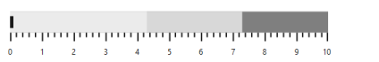
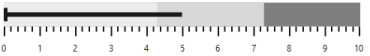
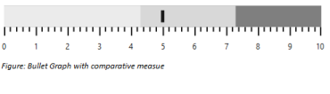
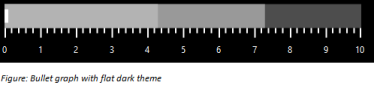
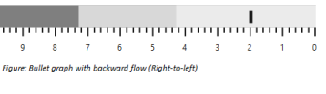
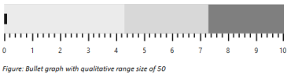
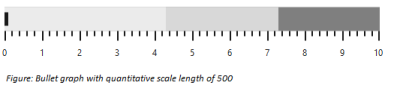

# Bullet Graph Dimensions

This section explains you on how to change the dimensions of the Bullet Graph. You can change various dimensions and properties of Bullet Graph like width, height, quantitative scale length, qualitative range size etc. By default, Bullet Graph uses 595 pixel width and 90 pixel height. You can customize width and height of a Bullet Graph using Width and Height properties of Bullet Graph respectively.

## Size


@(Html.EJ().BulletGraph("Bullets").Width(500).Height(100))



In the above code example, width is set as 500 pixel and height is set as 100 pixel. The output of the above code example with dimension 500 * 100 is as follows.

Bullet Graph
{:.caption}

## Value for performance bar

The feature measure bar value is customized using the Value property. Default value of this property is 0. 


@(Html.EJ().BulletGraph("Bullets").Value(5))



The following screenshot displays Bullet Graph with a performance measure value of 5

Bullet Graph with performance measure
{:.caption}

## Comparative measure value

The Comparative measure value is set using ComparativeMeasureValue property. The default value of this property is 0. 


@(Html.EJ().BulletGraph("Bullets").ComparativeMeasureValue(5))



The following screenshot displays Bullet Graph with comparative measure value of 5

Bullet Graph with comparative symbol
{:.caption}

## Theme

Bullet Graph Theme is customized using Theme property. Default value is flatlight. Bullet Graph supports flatlight and flatdark themes. Flatdark theme improves Bullet Graph appearance when background of Bullet Graph container uses dark color like black. 


@(Html.EJ().BulletGraph("Bullets").Theme("flatdark”))



The following screenshot displays Bullet Graph with flatdark theme

Bullet Graph with theme
{:.caption}
 

## Orientation

Bullet Graph is oriented either horizontally or vertically using Orientation property. Default value of this property is Horizontal. 



@(Html.EJ().BulletGraph("Bullets").Orientation(Orientation.Vertical)

                                      .Width(100)

                                      .Height(550).FlowDirection(FlowDirection.Backward))



## Flow direction

The Flow direction of Bullet Graph is customized using FlowDirection property. Default value of this property is Forward. Setting Forward renders Bullet Graph left to right and Backward renders from right to left.



@(Html.EJ().BulletGraph("Bullets").ComparativeMeasureValue(2).FlowDirection(FlowDirection.Backward))



The following screenshot displays Bullet Graph in a backward direction.

Bullet Graph in backward flow
{:.caption}

## Qualitative range size

Size of the qualitative range is customized using QualitativeRangeSize property. Default value of this property is 32. 


@(Html.EJ().BulletGraph("Bullets").QualitativeRangeSize(50))



The following screenshot displays Bullet Graph with Qualitative range of size 50

Bullet Graph with customized qualitative range height
{:.caption}

## Quantitative scale length

Length of the quantitative scale is customized using QuantitativeScaleLength property. Default value of this property is 475. 


@(Html.EJ().BulletGraph("Bullets").QuantitativeScaleLength(500))



The following screenshot displays Bullet Graph with Quantitative scale length of 500

Bullet Graph with quantitative scale of length 500 pixels
{:.caption}

