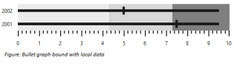
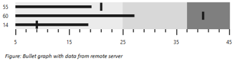

# Data Binding

Bullet Graph supports binding JSON data from a remote server or data created in client-side. You can use the Fields property to customize the data bound with Bullet Graph.

## Local Data

Data available in client-side (local data) can be bound with Bullet Graph using Fields property. This property provides option to specify data source, fields representing progress measure bar value, comparative measure value and category value. 


    public class BulletData

    {

        public double BulletValue

        { get; set; }

        public double ComparisonValue

        { get; set; }

        public string Category

        { get; set; }

    }

            List<BulletData> data = new List<BulletData>();

            data.Add(new BulletData() { BulletValue=9.5, ComparisonValue=7.5, Category="2001"  });

            data.Add(new BulletData() { BulletValue = 9.5, ComparisonValue = 5, Category = "2002" });

            ViewBag.DataSource = data;
			




@(Html.EJ().BulletGraph("Bullets").QualitativeRangeSize(60).QuantitativeScaleSettings( qs=>

                                            qs.Location( loc=> loc.x(50).y(20))

                                            .Interval(1))

                                      .Height(120)

                                      .Fields(field=>field.Category("Category").ComparativeMeasure("ComparisonValue")

                                         .FeatureMeasure("BulletValue").Datasource(ViewBag.DataSource))

                                      )


The following screenshot displays Bullet Graph with local data generated using Javascript

## Remote Data

Bullet Graph provides option to bind data from a remote server using ejDataManager as data source in fields property. A query object should also be passed to query property when using data manager as data source.



    @(Html.EJ().BulletGraph("Bullets").QualitativeRangeSize(60)

                                      .QuantitativeScaleSettings(qs=>

                                          qs.Location(loc=>loc.x(50).y(20))

                                          .Minimum(5)

                                          .Maximum(45)

                                          .Interval(10))

                                      .QualitativeRanges( qr=>

                                          {

                                              qr.RangeEnd(25).Add();

                                              qr.RangeEnd(37).Add();

                                              qr.RangeEnd(45).Add();

                                          })

                                       .Fields(fields=>

                                              fields.Category("ProductID")

                                              .ComparativeMeasure("Quantity")

                                              .FeatureMeasure("UnitPrice"))

    )

    



The following screenshot displays a Bullet Graph bounded with data from a remote server

