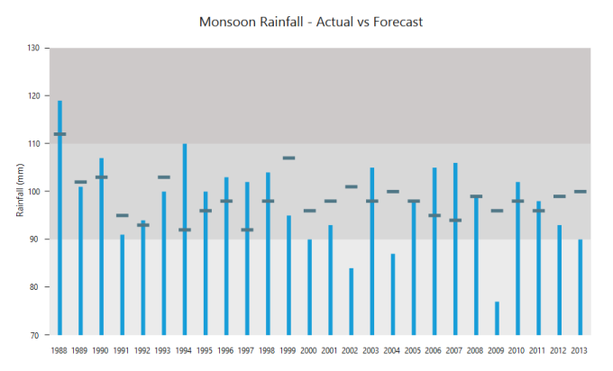
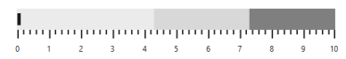
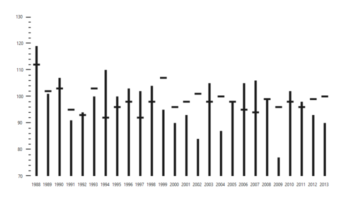
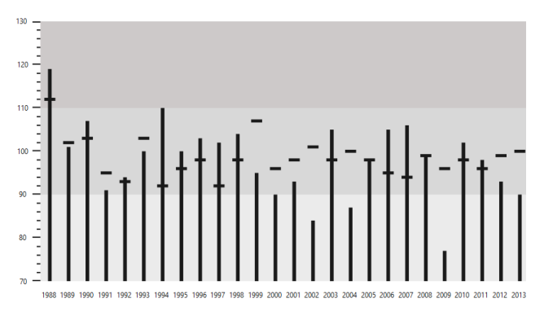
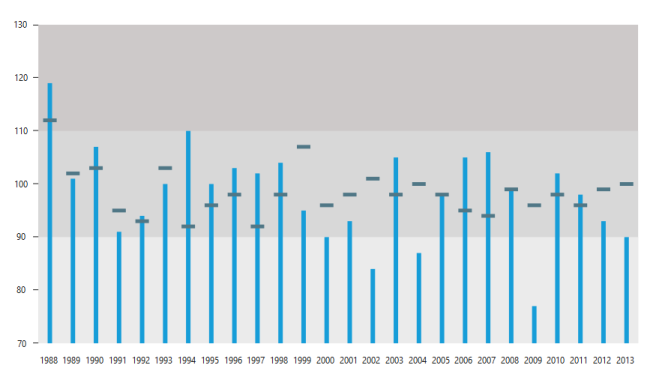
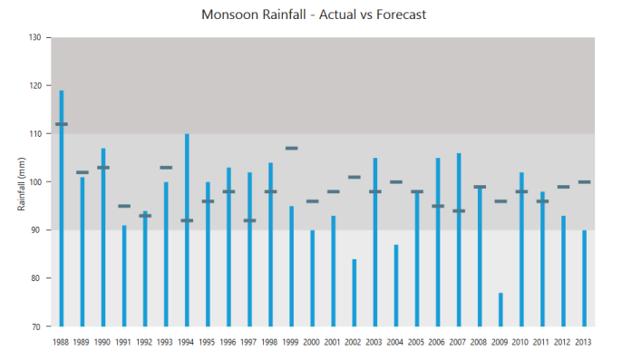
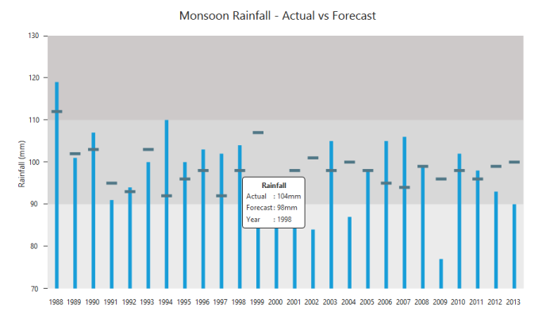

# Getting Started

This section explains briefly about how to create a BulletGraph in your ASP.NET MVC application.

## Create your first BulletGraph in MVC

This section encompasses the details on how to configure the BulletGraph control in your application. It also allows you to learn how to pass the required data to it and customize its various options according to your requirements.

In the following screenshot, a BulletGraph is used to compare the actual monsoon rainfall received in a state versus its forecasted values for the years ranging from 1988 to 2013.

Bullet Graph
{:.caption}

1. Create a 
 tag.
	
   ~~~ html
	
	

	
	

	
   ~~~
   

2. Add the following code in the index.cshtml file to create the BulletGraph control in the View page.

   ~~~ javascript

	

	@(Html.EJ().BulletGraph("Bullet").Render())

	

   ~~~
   

3. Execute the above code to display the BulletGraph. To customize the measure bars in the BulletGraph, you can pass the data either locally or remotely.

BulletGraph
{:.caption}

### Provide Required Data

You can customize the values of feature and comparative measure bars in a BulletGraph, either locally or remotely. The category data is optional, and it is used to display label values parallel to the measure bars. 

Assign the data in BulletLocalDataBind variable to the DataSource property of BulletGraph as illustrated in the following code example. 



publicActionResult LocalDataBinding()

{

	lclbnd.Add(newBulletLocalDataBind { category = "2013", value = "90", comparativeMeasureValue = "100" });

	lclbnd.Add(newBulletLocalDataBind { category = "2012", value = "93", comparativeMeasureValue = "99" });

	lclbnd.Add(newBulletLocalDataBind { category = "2011", value = "98", comparativeMeasureValue = "96" });

	lclbnd.Add(newBulletLocalDataBind { category = "2010", value = "102", comparativeMeasureValue = "98" });

	lclbnd.Add(newBulletLocalDataBind { category = "2009", value = "77", comparativeMeasureValue = "96" });

	lclbnd.Add(newBulletLocalDataBind { category = "2008", value = "99", comparativeMeasureValue = "99" });

	lclbnd.Add(newBulletLocalDataBind { category = "2007", value = "106", comparativeMeasureValue = "94" });

	lclbnd.Add(newBulletLocalDataBind { category = "2006", value = "105", comparativeMeasureValue = "95" });

	lclbnd.Add(newBulletLocalDataBind { category = "2005", value = "98", comparativeMeasureValue = "98" });

	lclbnd.Add(newBulletLocalDataBind { category = "2004", value = "87", comparativeMeasureValue = "100" });

	lclbnd.Add(newBulletLocalDataBind { category = "2003", value = "105", comparativeMeasureValue = "98" });

	lclbnd.Add(newBulletLocalDataBind { category = "2002", value = "84", comparativeMeasureValue = "100" });

	lclbnd.Add(newBulletLocalDataBind { category = "2001", value = "93", comparativeMeasureValue = "98" });

	lclbnd.Add(newBulletLocalDataBind { category = "2000", value = "96", comparativeMeasureValue = "101" });

	lclbnd.Add(newBulletLocalDataBind { category = "1999", value = "107", comparativeMeasureValue = "98" });

	lclbnd.Add(newBulletLocalDataBind { category = "1998", value = "98", comparativeMeasureValue = "101" });

	lclbnd.Add(newBulletLocalDataBind { category = "1997", value = "92", comparativeMeasureValue = "98" });

	lclbnd.Add(newBulletLocalDataBind { category = "1996", value = "98", comparativeMeasureValue = "96" });

	lclbnd.Add(newBulletLocalDataBind { category = "1995", value = "96", comparativeMeasureValue = "107" });

	lclbnd.Add(newBulletLocalDataBind { category = "1994", value = "92", comparativeMeasureValue = "98" });

	lclbnd.Add(newBulletLocalDataBind { category = "1993", value = "103", comparativeMeasureValue = "92" });

	lclbnd.Add(newBulletLocalDataBind { category = "1993", value = "93", comparativeMeasureValue = "98" });

	lclbnd.Add(newBulletLocalDataBind { category = "1991", value = "95", comparativeMeasureValue = "96" });

	lclbnd.Add(newBulletLocalDataBind { category = "1990", value = "103", comparativeMeasureValue = "92" });

	lclbnd.Add(newBulletLocalDataBind { category = "1989", value = "102", comparativeMeasureValue = "103" });

	lclbnd.Add(newBulletLocalDataBind { category = "1988", value = "112", comparativeMeasureValue = "93" });

	ViewBag.datasource = lclbnd;

	return View();

}



Once the DataSource property is assigned with the required values, you can bind the variable names used in the JSON data to the corresponding fields of the BulletGraph as shown in the following code example.



@(Html.EJ().BulletGraph("Bullet")

    .Fields(fie =>

     {                          

       fie.Datasource((IEnumerable<BulletLocalDataBind>)ViewBag.datasource)

          .Category("category").ComparativeMeasure("comparativeMeasureValue")

          .FeatureMeasure("value");

     })

  .Render())



### Set Default and Scale Values

You can plot any number of measure bars within the BulletGraph by increasing the height and width of the control to locate all the measure bars within the graph. Set the QualitativeRangeSize and QuantitativeScaleLength properties according to the following code example.

By default, the BulletGraph is rendered in the horizontal orientation with its flow direction set to Forward. In this example, to achieve the desired output, change the horizontal orientation to vertical orientation with the flow direction set to Backward.

Minimum, Maximum and Interval values for the QuantitativeScale of the BulletGraph are set, as illustrated in the following code example. The ticks and labels within the scale are also positioned.



@(Html.EJ().BulletGraph("Bullet").Width(850).Height(540)

    .QualitativeRangeSize(800).QuantitativeScaleLength(425)

    .Orientation(Orientation.Vertical).FlowDirection(FlowDirection.Backward)

   .QuantitativeScaleSettings(qs=>qs.Minimum(70).Maximum(130).Interval(10)

    .TickPosition(TickPosition.Above)

    .LabelSettings(lb=>lb.Position(LabelPosition.Above)))

    .Fields(fie =>

       {                  

         fie.Datasource((IEnumerable<BulletLocalDataBind>)ViewBag.datasource)

            .Category("category").ComparativeMeasure("comparativeMeasureValue")

            .FeatureMeasure("value");

       })

    .Render())



BulletGraph
{:.caption}

The above image illustrates the BulletGraph without any ranges displayed in the background.

### Add Qualitative Ranges

By default, 3 ranges are displayed in the BulletGraph control during the initial rendering of the control with its default values. To customize it, you can set appropriate values for the RangeEnd and RangeStroke properties.  Any number of QualitativeRanges can be added to the control.



@(Html.EJ().BulletGraph("Bullet").Width(850).Height(540)

     .QualitativeRangeSize(800).QuantitativeScaleLength(425)

     .Orientation(Orientation.Vertical).FlowDirection(FlowDirection.Backward)

    .QuantitativeScaleSettings(qs=>qs.Minimum(70).Maximum(130).Interval(10)             

     .TickPosition(TickPosition.Above)

     .LabelSetting(lb=>lb.LabelPosition(LabelPosition.Above)))

     .Fields(fie =>

     {                    

       fie.Datasource((IEnumerable<BulletLocalDataBind>)ViewBag.datasource)

          .Category("category").ComparativeMeasure("comparativeMeasureValue")

          .FeatureMeasure("value");

      })

      .QualitativeRanges(qur =>

       {

         qur.RangeEnd(90).Add();

         qur.RangeEnd(110).Add();

         qur.RangeEnd(130).RangeStroke(System.Drawing.Color.DarkBlue).Add();

        })

      .Render())



After adding QualitativeRanges to the BulletGraph, the control appears as follows.

BulletGraph
{:.caption}

### Ticks and Measure Bars Customization

You can do the following code changes in the quantitative scale to customize the tick size, the color of the feature bar and the comparative measure symbols.



@(Html.EJ().BulletGraph("Bullet").Width(850).Height(540)

     .QualitativeRangeSize(800).QuantitativeScaleLength(425)

     .Orientation(Orientation.Vertical).FlowDirection(FlowDirection.Backward)

   .QuantitativeScaleSettings(qs=>qs.Minimum(70).Maximum(130).Interval(10)

     .TickPosition(TickPosition.Above)

     .LabelSettings(lb=>lb.Position(LabelPosition.Above))

    .MinorTickSettings(mit => mit. Width(1))

.MajorTickSettings(mat=> mat.Size(7).Width(1)) 

    .ComparativeMeasureSettings(cm=>cm.Color(System.Drawing.Color.Blue))

    .FeaturedMeasureSettings(fm=>fm.Color(System.Drawing.Color.CadetBlue)))

     .Fields(fie =>

        {                   

         fie.Datasource((IEnumerable<BulletLocalDataBind>)ViewBag.datasource)

           .Category("category").ComparativeMeasure("comparativeMeasureValue")

           .FeatureMeasure("value");

         })

      .QualitativeRanges(qur =>

        {

          qur.RangeEnd(90).Add();

          qur.RangeEnd(110).Add();

          qur.RangeEnd(130).RangeStroke(System.Drawing.Color.DarkBlue).Add();

        })

   .Render())



When you customize the ticks and measure bar, the BulletGraph appears as follows.

BulletGraph
{:.caption}

### Add Caption and Subtitle

You can add the following code example to display an appropriate Caption and Subtitle to the BulletGraph.



@(Html.EJ().BulletGraph("Bullet").Width(850).Height(540)

     .QualitativeRangeSize(800).QuantitativeScaleLength(425)

     .Orientation(Orientation.Vertical).FlowDirection(FlowDirection.Backward)

     .QuantitativeScaleSettings(qs=>qs.Minimum(70).Maximum(130).Interval(10)

     .TickPosition(TickPosition.Above)

     .LabelSettings(lb=>lb.Position(LabelPosition.Above))

     .MinorTickSettings(mit => mit. Width(1))

	 .MajorTickSettings(mat=> mat.Size(7).Width(1)) 

     .ComparativeMeasureSettings(cm=>cm.Color(System.Drawing.Color.Blue))

     .FeaturedMeasureSettings(fm=>fm.Color(System.Drawing.Color.CadetBlue)))

     .Fields(fie =>

        {                   

         fie.Datasource((IEnumerable<BulletLocalDataBind>)ViewBag.datasource)

           .Category("category").ComparativeMeasure("comparativeMeasureValue")

           .FeatureMeasure("value");

         })

        .QualitativeRanges(qur =>
 
        {

          qur.RangeEnd(90).Add();

          qur.RangeEnd(110).Add();

          qur.RangeEnd(130).RangeStroke(System.Drawing.Color.DarkBlue).Add();

        })   

        .CaptionSettings(ca=>ca.TextAngle(90).Location(lc=>lc.x(470).y(270))

           .Text("Monsoon Rainfall - Actual vs Forecast")

           .Font(fn=>fn.FontFamily("Segoe UI")

             .FontSize("20px").FontWeight("regular").Opacity(1))

           .SubTitle(sb=>sb.TextAngle(0).Text("Rainfall (mm)")

           .Location(lc=>lc.x(180).y(4))

           .Font(fn=>fn.FontFamily("Segoe UI")

           .FontSize("14px").FontWeight("regular").Opacity(1))))

        .Render())



The following screenshot displays a BulletGraph with a Caption and Subtitle.

BulletGraph with Caption and Subtitle
{:.caption}

### Show Tooltip

You can use a Tooltip in your application to display the values of forecasted rainfall, actual rainfall received in millimeter and also the appropriate year. The Tooltip Visible property is set to True to enable the Tooltip option. To set the template Tooltip, you can pass the template id to it as illustrated in the following code example.



@(Html.EJ().BulletGraph("Bullet").Width(850).Height(540)

     .TooltipSettings(t=>t.Visible(true).template("Tooltip"))

     .QualitativeRangeSize(800).QuantitativeScaleLength(425)

     .Orientation(Orientation.Vertical).FlowDirection(FlowDirection.Backward)

     .QuantitativeScaleSettings(qs=>qs.Minimum(70).Maximum(130).Interval(10)

     .TickPosition(TickPosition.Above)

     .LabelSettings(lb=>lb.Position(LabelPosition.Above))

     .MinorTickSettings(mit => mit. Width(1))

	 .MajorTickSettings(mat=> mat.Size(7).Width(1)) 

     .ComparativeMeasureSettings(cm=>cm.Color(System.Drawing.Color.Blue))

    .FeaturedMeasureSettings(fm=>fm.Color(System.Drawing.Color.CadetBlue)))

     .Fields(fie =>

        {                   

         fie.Datasource((IEnumerable<BulletLocalDataBind>)ViewBag.datasource)

           .Category("category").ComparativeMeasure("comparativeMeasureValue")

           .FeatureMeasure("value");

         })

      .QualitativeRanges(qur =>

        {

          qur.RangeEnd(90).Add();

          qur.RangeEnd(110).Add();

          qur.RangeEnd(130).RangeStroke(System.Drawing.Color.DarkBlue).Add();

        })   

      .CaptionSettings(ca=>ca.TextAngle(90).Location(lc=>lc.x(470).y(270))

           .Text("Monsoon Rainfall - Actual vs Forecast")

           .Font(fn=>fn.FontFamily("Segoe UI")

             .FontSize("20px").FontWeight("regular").Opacity(1))

           .SubTitle(sb=>sb.TextAngle(0).Text("Rainfall (mm)")

           .Location(lc=>lc.x(180).y(4))

           .Font(fn=>fn.FontFamily("Segoe UI")

           .FontSize("14px").FontWeight("regular").Opacity(1))))

     .Render())





<divid="Tooltip"style="display:none; width:125px;padding-top: 10px;padding-bottom:10px">

<divalign="center"style="font-weight:bold">

           Rainfall 

<table>

<tr><td>Actual</td>

<td>: {{:currentValue}}mm</td></tr>

<tr><td>Forecast</td>

<td>: {{:targetValue}}mm</td></tr>

<tr><td>Year</td>

<td>: {{:category}}</td></tr>

</table>



The following screenshot displays a customized BulletGraph.

Customized BulletGraph
{:.caption}

