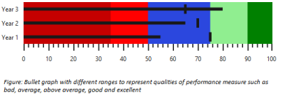

## Qualitative Range

Qualitative Range represents the quality of a specific range in quantitative scale like good, bad and satisfactory. Color for each qualitative range is customized using RangeStroke property. The RangeEnd property specifies the ending point of the qualitative range. Minimum value of quantitative scale is considered as the starting point of first qualitative range and previous end points are considered as starting point for other qualitative ranges. 

[MVC]

@(Html.EJ().BulletGraph("Bullets").QualitativeRanges(qr =>

                                        {

                                            qr.RangeEnd(35).RangeStroke(System.Drawing.Color.DarkRed).RangeOpacity(0.5).Add();

                                            qr.RangeEnd(50).RangeStroke(System.Drawing.Color.Red).RangeOpacity(1).Add();

                                            qr.RangeEnd(75).RangeStroke(System.Drawing.Color.Blue).RangeOpacity(0.7).Add();

                                            qr.RangeEnd(90).RangeStroke(System.Drawing.Color.LightGreen).RangeOpacity(1).Add();

                                            qr.RangeEnd(100).RangeStroke(System.Drawing.Color.Green).RangeOpacity(1).Add();

                                        }).QualitativeRangeSize(80)

                                      .QuantitativeScaleSettings(qs =>

                                            qs.FeatureMeasure(fm =>

                                                {

                                                    fm.Value(55).ComparativeMeasureValue(75).Category("Year 1").Add();

                                                    fm.Value(65).ComparativeMeasureValue(70).Category("Year 2").Add();

                                                    fm.Value(80).ComparativeMeasureValue(65).Category("Year 3").Add();

                                                })

                                                .Location(loc =>

                                                    loc.x(50).y(20))

                                                .Minimum(0)

                                                .Maximum(100)

                                                .Interval(10)    

                                            ).QualitativeRangeSize(60).Height(120)

     )

The following screenshot displays Bullet Graph with different qualitative ranges in different colors. In this image, range 0 to 35 represents bad performance, 35 to 50 represents average performance, 50 to 75 represents that the performance is above average, 75 to 90 represents good performance and above 90 represents excellent performance.

{  | markdownify }
{:.image }

