# Quantitative Scale

The **Quantitative Scale** appearance is customized using `QuantitativeScaleSettings` property. It has properties to customize `labels`, `major ticks`, `minor ticks`, `comparative measure` and performance measure of the bullet graph

## Range for Quantitative Scale

**Quantitative Scale** range is set using the properties `Minimum`, `Maximum` and `Interval` of **QuantitativeScaleSettings** property. **Minimum** specifies the start range of the scale, **Maximum** specifies the end range of scale and interval specifies the number of intervals between start and end range. Default values of `Minimum`, `Maximum` and `Interval` are 0, 10 and 1 respectively. The number of minor ticks (ticks between intervals) are specified using `MinorTicksPerInterval` property.



@(Html.EJ().BulletGraph("Bullets").QuantitativeScaleSettings( scale=>

                                            scale.Minimum(0)

                                            .Maximum(10))                                      

     )



The following screenshot displays a **Bullet Graph** with start range 0, end range 10 and interval 1 with 4 minor ticks per interval

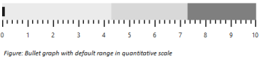

Bullet Graph quantitative scale with customized range
{:.caption}

## Quantitative scale location

Bullet Graph does not position quantitative scale automatically based on its size or space required for caption text, etc. By default Quantitative scale is positioned at 10 pixels from left and 10 pixels from top. Quantitative scale `location` is customized as per the requirement using the Location property available in QuantitativeScaleSettings.



@(Html.EJ().BulletGraph("Bullets").QuantitativeScaleSettings( scale=>

                                            scale.Location(loc=>loc.x(20).y(20))

                                            )                                      

     )


The following screenshot displays Bullet Graph with Quantitative scale at 20 pixels from left and 20 pixels from top

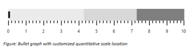

Bullet Graph quantitative scale in a specified location
{:.caption}

## Major ticks

Color, size and width of **Major tick** lines are customized using `MajorTickSettings` property in **QuantitativeScaleSettings**. Default value of `Size` and `Width` properties are 13 and 2 respectively. Ticks are drawn in black color by default. The property Size represents the height of tick lines and Width represents the width of tick lines and ticks color are customized using `Stroke` property.



@(Html.EJ().BulletGraph("Bullets").QuantitativeScaleSettings( scale=>

                                            scale.MajorTickSettings(mt=>

                                                mt.Size(15).Width(3).Stroke(System.Drawing.Color.Gray))

                                            )                                     

     )



The following screenshot displays **Major ticks** in **gray** color with a width of 3 pixels and height 15 pixels

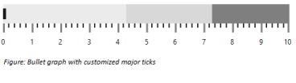

Bullet Graph quantitative scale with customized major ticks
{:.caption}

## Minor ticks

**Minor ticks** can also be customized similar to major ticks. The properties `Stroke`, `Width` and `Size` of MinorTickSettings are used to customize Minor ticks in quantitative scale. Stroke specifies the color of ticks, Width specifies the width of ticks and Size specifies the height of the ticks. 


@(Html.EJ().BulletGraph("Bullets").QuantitativeScaleSettings( scale=>

                                            scale.MinorTickSettings(tick=>

                                                tick.Size(7).Width(3).Stroke(System.Drawing.Color.Gray))

                                            )                                     

     )



The following screenshot displays **Bullet Graph** with customized **Minor ticks** in quantitative scale

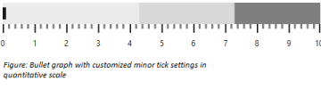

Bullet Graph quantitative scale with customized minor ticks
{:.caption}

## Tick position

**Ticks** are positioned below, above or inside the quantitative scale. By default ticks are positioned below the quantitative scale. The **TickPosition** property is used to customize the position of ticks in quantitative scale. Ticks can be placed inside the quantitative scale by setting **TickPosition** to **Cross**. 


@(Html.EJ().BulletGraph("Bullets").QuantitativeScaleSettings( scale=>

                                            scale.TickPosition(TickPosition.Above)

                                            )                                     

     )



The following screenshot displays **Bullet Graph** with ticks positioned above quantitative scale

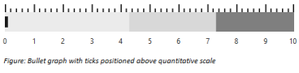

Bullet Graph quantitative scale with ticks positioned above
{:.caption}

## Tick Placement

**Quantitative scale** ticks can be placed either inside or outside the scale using “TickPlacement” property. By default ticks are placed outside the scale.



@(Html.EJ().BulletGraph("Bullets") .QualitativeRangeSize(50)

                  .QuantitativeScaleSettings(scale =>

                      {

                          scale.Location(location => location.x(108).y(10))

                            .LabelSettings(ls=> ls.Offset(0).Size(10))

                            .TickPlacement(Syncfusion.JavaScript.DataVisualization.BulletTickPlacement.Inside)

                            .FeatureMeasure(measure => {measure.ComparativeMeasureValue(6).Value(8).Add();});                            

                      })

                  .CaptionSettings(cs => cs.TextAngle(0).Text("Revenue YTD").Location(ls => ls.x(17).y(28))

                    .SubTitle(so => so.TextAngle(0).Text("$ in Thousands").Location(l => l.x(10).y(42))))

     )


The following screenshot displays **Bullet Graph** ticks inside Quantitative Scale

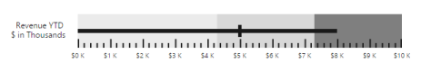

Bullet Graph with ticks inside quantitative scale
{:.caption}

## Quantitative scale labels

**Quantitative scale** labels are customized with `prefix`, `suffix`, `font`, `color` and `size` using **LabelSettings** property. By default, label text is displayed in black color with 12 pixel ‘Segoe UI’ font and there is a padding of 20 pixels space between quantitative scale and labels.



@(Html.EJ().BulletGraph("Bullets").QuantitativeScaleSettings(scale=>

                                            scale.LabelSettings(label=>

                                                label.Stroke(System.Drawing.Color.Blue)

                                                .LabelPrefix("$")

                                                .LabelSuffix("K")

                                                .Size(12)

                                                .Offset(15)

                                                .Font(font=>

                                                    font.FontFamily("Segoe UI")

                                                    .FontStyle("bold")

                                                    .FontWeight("regular")

                                                    .Opacity(0.8)

                                                    )

                                                )                                                    

                                            )                                     

     )



The following screenshot displays **Bullet Graph** labels in blue color

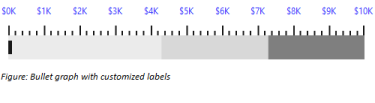

Bullet Graph quantitative scale with customized labels
{:.caption}

## Label Placement

**Quantitative scale** labels can be placed either inside or outside the scale using “LabelPlacement” property. By default labels are placed 15 pixels outside the scale. 


@(Html.EJ().BulletGraph("Bullets").QualitativeRangeSize(50)

                  .QuantitativeScaleSettings(scale =>

                      {

                          scale.Location(loc => loc.x(108).y(10))

                            .LabelSettings(ls=> ls.Offset(0).Size(10)

                            .LabelPlacement(Syncfusion.JavaScript.DataVisualization.BulletLabelPlacement.Inside))

                            .FeatureMeasure(measure => {measure.ComparativeMeasureValue(6).Value(8).Add();});                            

                      })

                  .CaptionSettings(cs => cs.TextAngle(0).Text("Revenue YTD").Location(ls => ls.x(17).y(28))

                    .SubTitle(so => so.TextAngle(0).Text("$ in Thousands").Location(l => l.x(10).y(42))))                                   

     )



The following screenshot displays **Bullet Graph** labels inside **Quantitative Scale**

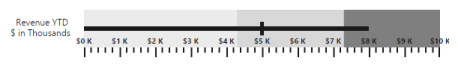

Bullet Graph with labels inside quantitative scale
{:.caption}

## Performance measure bar

Performance measure bar is customized using `FeaturedMeasureSettings` in QuantitativeScaleSettings property. Color of the bar is customized using `Stroke` property and width using `Width` property. By default bar is drawn in black color with 6 pixels of width. 


@(Html.EJ().BulletGraph("Bullets").QuantitativeScaleSettings( scale=>

                                            scale.FeaturedMeasureSettings(measure=>

                                                measure.Stroke(System.Drawing.Color.Blue).Width(4))                                                 

                                            ).Value(5))


The following screenshot displays **Bullet Graph** with customized **Performance measure bar**.

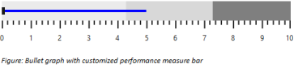

Bullet Graph quantitative scale with customized performance measure bar
{:.caption}

## Comparative measure symbol

**Comparative symbol** color and width are customized using `ComparativeMeasureSettings` through QuantitativeScaleSettings property. Color of the symbol is customized using `Stroke` property and width using `Width` property. By default Comparative measure symbol is displayed in black color with a width of 5 pixels. 


@(Html.EJ().BulletGraph("Bullets").QuantitativeScaleSettings( scale=>

                                            scale.ComparativeMeasureSettings(measure=>

                                                measure.Stroke(System.Drawing.Color.Blue).Width(4))                                                 

                                            ).ComparativeMeasureValue(5)                                   

     )



The following screenshot displays **Bullet Graph** with customized **Comparative measure value**.

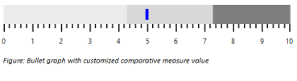

Bullet Graph with customized comparative symbol
{:.caption}

## Multiple performance measures comparison

**Bullet Graph** supports comparing more than one performance at a time, given that all the comparisons are related using `FeatureMeasure` in **QuantitativeScaleSettings** property. 


@(Html.EJ().BulletGraph("Bullets").QuantitativeScaleSettings( scale=>

                                            scale.FeatureMeasure(measure=>

                                                {

                                                    measure.Value(6).ComparativeMeasureValue(3).Category("2010").Add();

                                                    measure.Value(9).ComparativeMeasureValue(6).Category("2011").Add();

                                                    measure.Value(5).ComparativeMeasureValue(5).Category("2012").Add();

                                                })

                                                .Location(loc=>

                                                    loc.x(50).y(10))

                                            ).QualitativeRangeSize(60).Height(120)                                 

     )


The following screenshot displays **Bullet Graph** that compares 3 related performance measures.

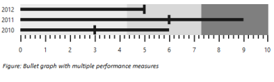

Bullet Graph with multiple performance measures
{:.caption}