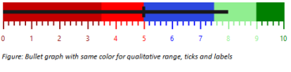
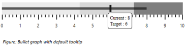
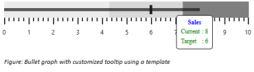

# User Interaction

## Animation

**Bullet Graph** supports animation that makes the performance measure bar to animate when rendering the **Bullet Graph**. **Animation** is enabled or disabled using `EnableAnimation` property. By default, **Animation** is `enabled` in **Bullet Graph**. 


@(Html.EJ().BulletGraph("Bullets").EnableAnimation(true).Value(8).ComparativeMeasureValue(5))



## Responsiveness during browser resize

**Bullet Graph** is made responsive when resizing the browser by using `IsResponsive` property. By default the value of this property is **true** in **Bullet Graph**. 


@(Html.EJ().BulletGraph("Bullets").IsResponsive(true).Value(8).ComparativeMeasureValue(5))



## Applying same color to all ticks and labels in a range

Background color for qualitative range is applied to major ticks and minor ticks of the **Bullet Graph** using `ApplyRangeStrokeToTicks` property. The range colors are applied to labels using `ApplyRangeStrokeToLabels` property. By default same colors are not applied to a qualitative range and its corresponding ticks or labels. 



@(Html.EJ().BulletGraph("Bullets").ApplyRangeStrokeToLabels(true).ApplyRangeStrokeToTicks(true)

                                      .QualitativeRanges(qr =>

                                        {

                                            qr.RangeEnd(3.5).RangeStroke(System.Drawing.Color.DarkRed).RangeOpacity(0.5).Add();

                                            qr.RangeEnd(5.0).RangeStroke(System.Drawing.Color.Red).RangeOpacity(1).Add();

                                            qr.RangeEnd(7.5).RangeStroke(System.Drawing.Color.Blue).RangeOpacity(0.7).Add();

                                            qr.RangeEnd(9.0).RangeStroke(System.Drawing.Color.LightGreen).RangeOpacity(1).Add();

                                            qr.RangeEnd(10.0).RangeStroke(System.Drawing.Color.Green).RangeOpacity(1).Add();

                                        })

    .Value(8).ComparativeMeasureValue(5))


## Tooltip

By default **Bullet Graph** displays **Tooltip** when mouse is hovered over feature measure bar. **Tooltip** is enabled or disabled using `Visible` property in `TooltipSettings`.

Bullet Graph with tooltip
{:.caption}

Bullet Graph supports Tooltip template instead of defaultTooltip to customize the appearance and contents of Tooltip. The Tooltip template should be a 
 element with display set to ‘none’, so it is displayed only when mouse is placed on feature measure bar. The id value of the 
 element should be provided as value to the Template property in TooltipSettings of Bullet Graph to display the customized 
 element as Tooltip instead of default Tooltip. The values displayed in default Tooltip such as current value, target value and category are accessed in `template` 
 element by using {{currentValue}}, {{targetValue}} and {{category}} respectively. 


@(Html.EJ().BulletGraph("Bullets").Value(8).ComparativeMeasureValue(6).Height(150)

                                       .TooltipSettings(ts=>

                                       ts.Template("BulletGraphTooltip"))

    )


The following screenshot displays Bullet Graph with a customized Tooltip including a header and contents such as current value and target value in different colors.

Bullet Graph using a tooltip template
{:.caption}
