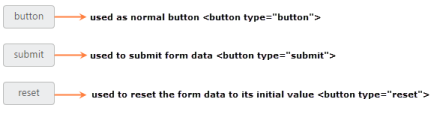

## Button Type

Button is used as normal clickable button, submitting form data, resetting the form data to its initial value. According to the usage of button, you can render the button in three types. Using the Type property, you can easily render the button in following types.

_Table_ _4__: List of Button types_

<table>
<tr>
<td>
Button</td><td>
The button is a clickable button </td></tr>
<tr>
<td>
Submit</td><td>
The button is a submit button (submits form-data) </td></tr>
<tr>
<td>
Reset    </td><td>
The button is a reset button (resets the form-data to its initial values)</td></tr>
</table>

The following steps explains you the details about rendering the Button with above mentioned button types.

1. In the CSHTML page, configure the Button widget as follows.

[CSHTML]

@*Add the code in CSHTML page to configure and initialize the control*@

  @* Set the different types for button control as follows.*@

&lt;div class="control"&gt;

        @Html.EJ().Button("button_button").Text("button").ShowRoundedCorner(true).Size(ButtonSize.Mini).Type(ButtonType.Button)

        &lt;br /&gt;

        &lt;br /&gt;

        @Html.EJ().Button("button_submit").Text("submit").ShowRoundedCorner(true).Size(ButtonSize.Mini).Type(ButtonType.Submit)

        &lt;br /&gt;

        &lt;br /&gt;

        @Html.EJ().Button("button_reset").Text("reset").ShowRoundedCorner(true).Size(ButtonSize.Mini).Type(ButtonType.Reset)

    &lt;/div&gt;

Execute the above code to render the following output.

{  | markdownify }
{:.image }

_Figure 9: Different button types_

