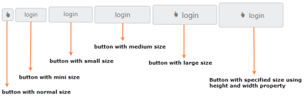
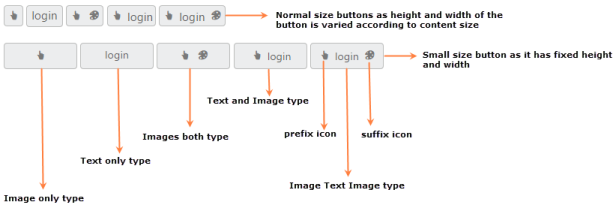
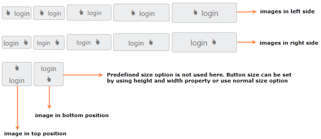
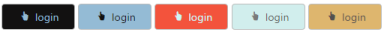

# Easy Customization

Button is used in all applications. Button size, content and content location is varied according to each application. Here you can see some customizable option for button that can perform easily. 

## Button Size

You can render the button in different sizes. Here, you have some predefined size options for rendering a button with different sizes in easiest way. Each size option has different height and width. Mainly it avoids the complexity in rendering button with complex CSS class. 

_Table1: List of predefined button size_

<table>
<tr>
<td>
Normal</td><td>
Creates button with content size.</td></tr>
<tr>
<td>
Mini</td><td>
Creates button with inbuilt mini size height, width specified.</td></tr>
<tr>
<td>
Small</td><td>
Creates button with inbuilt small size height, width specified.</td></tr>
<tr>
<td>
Medium</td><td>
Creates button with inbuilt medium size height, with specified.</td></tr>
<tr>
<td>
Large</td><td>
Creates button with inbuilt large size height, width specified.</td></tr>
</table>
Apart from the above mentioned predefined size option, you can set your own width and height for button using Height and Width property.

The following steps explains you the details about rendering the button with different size options.

1. In the CSHTML page, configure the button widget as follows.



@*Add the code in CSHTML page to configure and initialize the control*@

 @*Set the different size types for button control as follows.*@

    
        @Html.EJ().Button("button_normal").Text("login").Size(ButtonSize.Normal).ShowRoundedCorner(true).ContentType(ContentType.ImageOnly).PrefixIcon("e-handup")

        @Html.EJ().Button("button_mini").Text("login").ShowRoundedCorner(true).Size(ButtonSize.Mini)

        @Html.EJ().Button("button_small").Text("login").ShowRoundedCorner(true).Size(ButtonSize.Small)

        @Html.EJ().Button("button_medium").Text("login").ShowRoundedCorner(true).Size(ButtonSize.Medium)

        @Html.EJ().Button("button_large").Text("login").ShowRoundedCorner(true).Size(ButtonSize.Large).ContentType(ContentType.TextAndImage).PrefixIcon("e-handup")

        @Html.EJ().Button("button_customSize").Text("login").ShowRoundedCorner(true).ContentType(ContentType.TextAndImage).PrefixIcon("e-handup").Height("50").Width("150")

    



Execute the above code to render the following output.

_Figure 5: Button with different sizes_

### Content Type

The content of the Button is mainly text and images. Instead of using complex CSS classes to render Button with different content types, you can use some predefined content type options provided for button control. Using this content types you can easily add different types of content for button. Button supports the following content types.

_Table2: List of content types for button_

<table>
<tr>
<td>
TextOnly</td><td>
Supports only for text content only.</td></tr>
<tr>
<td>
ImageOnly</td><td>
Supports only for image content only</td></tr>
<tr>
<td>
ImageBoth</td><td>
Supports image for both ends of the button.</td></tr>
<tr>
<td>
TextAndImage</td><td>
Supports image with the text content.</td></tr>
<tr>
<td>
ImageTextImage</td><td>
Supports image with both ends and middle in text.</td></tr>
</table>

### Prefix and Suffix icons

Icons inside the Button is added easily using PrefixIcon and SuffixIcon property. Location of the icon in button is a necessary thing and you can easily customize it using the following mentioned options.

Button control also supports the build-in icon libraries. The ej.widgets.core.minCSS contains definitions for important icons that can be used in buttons. Simply you can use these build-in icons by mentioning the icon class name as value in PrefixIcon and SuffixIcon property. You can use any font icons that are defined in ej.widgets.core.minCSS. It avoids the complexity in specifying icon using sprite image and CSS.

For example the following mentioned build-in CSS class are used to show the font icons that is used by media player.

e-mediaback

e-mediaforward

e-medianext

e-mediaprev

e-mediaeject

e-mediaclose

e-mediapause

e-mediaplay

### Prefix Icon

It inserts the icon at the starting position of button. After this prefix icon, you can use text or suffix icon.

### Suffix Icon

It inserts the icon at the ending position of button. Before this suffix icon, you can use text or prefix icon.

The following steps explains you the details about rendering the Button with above mentioned content type, prefix and suffix icon options

1. In the CSHTML page, configure the Button widget as follows.

   ~~~ html

		@*Add the code in CSHTML page to configure and initialize the control*@

		  @* Set the different content types and use the necessary build-in icons for button control as follows.*@

		  
           

								@Html.EJ().Button("button_imageOnly").Text("login").ShowRoundedCorner(true).ContentType(ContentType.ImageOnly).PrefixIcon("e-handup")

								@Html.EJ().Button("button_textOnly").Text("login").ShowRoundedCorner(true).ContentType(ContentType.TextOnly)

								@Html.EJ().Button("button_imageBoth").Text("login").ShowRoundedCorner(true).ContentType(ContentType.ImageBoth).PrefixIcon("e-handup").SuffixIcon("e-palette")

								@Html.EJ().Button("button_textAndImage").Text("login").ShowRoundedCorner(true).ContentType(ContentType.TextAndImage).PrefixIcon("e-handup")

								@Html.EJ().Button("button_imageTextImage").Text("login").ShowRoundedCorner(true).ContentType(ContentType.ImageTextImage).PrefixIcon("e-handup").SuffixIcon("e-palette")

					 

					 

								@Html.EJ().Button("button_small_imageOnly").Text("login").Size(ButtonSize.Small).ShowRoundedCorner(true).ContentType(ContentType.ImageOnly).PrefixIcon("e-handup")

								@Html.EJ().Button("button_small_textOnly").Text("login").ShowRoundedCorner(true).Size(ButtonSize.Small).ContentType(ContentType.TextOnly)

								@Html.EJ().Button("button_small_imageBoth").Text("login").ShowRoundedCorner(true).Size(ButtonSize.Small).ContentType(ContentType.ImageBoth).PrefixIcon("e-handup").SuffixIcon("e-palette")

								@Html.EJ().Button("button_small_textAndImage").Text("login").ShowRoundedCorner(true).Size(ButtonSize.Small).ContentType(ContentType.TextAndImage).PrefixIcon("e-handup")

								@Html.EJ().Button("button_small_imageTextImage").Text("login").ShowRoundedCorner(true).Size(ButtonSize.Small).ContentType(ContentType.ImageTextImage).PrefixIcon("e-handup").SuffixIcon("e-palette")

				

   ~~~
   {:.prettyprint }

	 Execute the above code to render the following output.

	 

	 _Figure 6: Button with different content types_

   ### Image Position

	To provide the best look and feel for Button, position of button images is an important customizable option. With ImagePosition property you can easily customize the position of images inside button without using any complex CSS. ImagePosition property is applicable only with the TextAndImageContentType property. This property supports the following values.

	_Table3: List of values supported by ContentType property_

	<table>
	<tr>
	<td>
	ImageLeft</td><td>
	Support for aligning text in right and image in left.</td></tr>
	<tr>
	<td>
	ImageRight</td><td>
	Support for aligning text in left and image in right.</td></tr>
	<tr>
	<td>
	ImageTop</td><td>
	Support for aligning text in bottom and image in top.</td></tr>
	<tr>
	<td>
	ImageBottom</td><td>
	Support for aligning text in top and image in bottom.</td></tr>
	</table>

	The following steps explains you the details about rendering the Button with the above mentioned image Position options.

2. In the CSHTML page, configure the Button widget as follows.

   ~~~ javascript

	@*Add the code in CSHTML page to configure and initialize the control*@

	@* Set the different image position for button control as follows.*@

		

			@Html.EJ().Button("button_normal_imageLeft").Text("login").ShowRoundedCorner(true).Size(ButtonSize.Normal).ContentType(ContentType.TextAndImage).PrefixIcon("e-handup").ImagePosition(ImagePosition.ImageLeft)

			@Html.EJ().Button("button_mini_imageLeft").Text("login").ShowRoundedCorner(true).Size(ButtonSize.Mini).ContentType(ContentType.TextAndImage).PrefixIcon("e-handup").ImagePosition(ImagePosition.ImageLeft)

			@Html.EJ().Button("button_small_imageLeft").Text("login").ShowRoundedCorner(true).Size(ButtonSize.Small).ContentType(ContentType.TextAndImage).PrefixIcon("e-handup").ImagePosition(ImagePosition.ImageLeft)

			@Html.EJ().Button("button_medium_imageLeft").Text("login").ShowRoundedCorner(true).Size(ButtonSize.Medium).ContentType(ContentType.TextAndImage).PrefixIcon("e-handup").ImagePosition(ImagePosition.ImageLeft)

			@Html.EJ().Button("button_large_imageLeft").Text("login").ShowRoundedCorner(true).Size(ButtonSize.Large).ContentType(ContentType.TextAndImage).PrefixIcon("e-handup").ImagePosition(ImagePosition.ImageLeft)

			 

			 

			@Html.EJ().Button("button_normal_imageRight").Text("login").ShowRoundedCorner(true).Size(ButtonSize.Normal).ContentType(ContentType.TextAndImage).PrefixIcon("e-handup").ImagePosition(ImagePosition.ImageRight)

			@Html.EJ().Button("button_mini_imageRight").Text("login").ShowRoundedCorner(true).Size(ButtonSize.Mini).ContentType(ContentType.TextAndImage).PrefixIcon("e-handup").ImagePosition(ImagePosition.ImageRight)

			@Html.EJ().Button("button_small_imageRight").Text("login").ShowRoundedCorner(true).Size(ButtonSize.Small).ContentType(ContentType.TextAndImage).PrefixIcon("e-handup").ImagePosition(ImagePosition.ImageRight)

			@Html.EJ().Button("button_medium_imageRight").Text("login").ShowRoundedCorner(true).Size(ButtonSize.Medium).ContentType(ContentType.TextAndImage).PrefixIcon("e-handup").ImagePosition(ImagePosition.ImageRight)

			@Html.EJ().Button("button_large_imageRight").Text("login").ShowRoundedCorner(true).Size(ButtonSize.Large).ContentType(ContentType.TextAndImage).PrefixIcon("e-handup").ImagePosition(ImagePosition.ImageRight)

			 

			 

			@Html.EJ().Button("button_imageTop").Text("login").ShowRoundedCorner(true).ContentType(ContentType.TextAndImage).PrefixIcon("e-handup").ImagePosition(ImagePosition.ImageTop).Width("60")

			@Html.EJ().Button("button_imageBottom").Text("login").ShowRoundedCorner(true).ContentType(ContentType.TextAndImage).PrefixIcon("e-handup").ImagePosition(ImagePosition.ImageBottom).Width("60")

		

   ~~~
   {:.prettyprint }

	Execute the above code to render the following output.

	

	_Figure 7: Button with different image positions_

   ### Theme support

	You can control the style and appearance of Button control based on CSS classes. In order to apply styles to the Button control, you can refer two files namely, ej.widgets.core.min.css and ej.theme.min.css. When you refer the ej.widgets.all.min.css file, then it is not necessary to include the files ej.widgets.core.min.css and ej.theme.min.css in your project, as ej.widgets.all.min.css is the combination of these two. 

	By default, there are 12 themes support available for Button control.

	* default-theme
	* flat-azure-dark
	* fat-lime
	* flat-lime-dark
	* flat-saffron
	* flat-saffron-dark
	* gradient-azure
	* gradient-azure-dark
	* gradient-lime
	* gradient-lime-dark
	* gradient-saffron
	* gradient-saffron-dark

   ### Custom CSS

	You can customize the appearance of Button control using CSS class. Define a CSS class as per requirement and assign the class name to CssClass property.

	The following steps explains you the details about rendering the Button with custom CSS.

3. In the CSHTML page, configure the Button widget as follows.

   ~~~ html

		@*Add the code in CSHTML page to configure and initialize the control*@

		  @* Set Custom CSS class for button control as follows.*@

		

				@Html.EJ().Button("button_customCss1").Text("login").ShowRoundedCorner(true).Size(ButtonSize.Small).ContentType(ContentType.TextAndImage).PrefixIcon("e-handup").ImagePosition(ImagePosition.ImageLeft).CssClass("customCss1")

				@Html.EJ().Button("button_customCss2").Text("login").ShowRoundedCorner(true).Size(ButtonSize.Small).ContentType(ContentType.TextAndImage).PrefixIcon("e-handup").ImagePosition(ImagePosition.ImageLeft).CssClass("customCss2")

				@Html.EJ().Button("button_customCss3").Text("login").ShowRoundedCorner(true).Size(ButtonSize.Small).ContentType(ContentType.TextAndImage).PrefixIcon("e-handup").ImagePosition(ImagePosition.ImageLeft).CssClass("customCss3")

				@Html.EJ().Button("button_customCss4").Text("login").ShowRoundedCorner(true).Size(ButtonSize.Small).ContentType(ContentType.TextAndImage).PrefixIcon("e-handup").ImagePosition(ImagePosition.ImageLeft).CssClass("customCss4")

				@Html.EJ().Button("button_customCss5").Text("login").ShowRoundedCorner(true).Size(ButtonSize.Small).ContentType(ContentType.TextAndImage).PrefixIcon("e-handup").ImagePosition(ImagePosition.ImageLeft).CssClass("customCss5")

			

   ~~~
   {:.prettyprint }

4. Configure the CSS styles to apply on buttons.

   ~~~ css 

 

		

   ~~~
   {:.prettyprint }

Execute the above code to render the following output.

_Figure 8: Button with Custom CSS_

