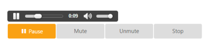
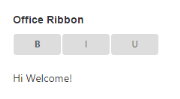
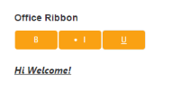

# Getting Started

This section explains you briefly on how to create a Button in your application with ASP.NET MVC.

## Create your first Button in MVC

Essential ASP.NET MVC Button provides support to display a Button control within your web page and allows you to Click, Toggle Click, Reset, and Submit. Using the following guidelines, you can customize Button for a real-time Multimedia player scenario. This allows you to Play, Pause, Stop, Mute, Un-mute a music player. 

The following screenshot illustrates the functionality of Button in Multimedia player control.

Multimedia Player
{:.caption}

## Create Button Control in MVC

Essential ASP.NET MVC Button control contains built-in features like Click and different display option. You can easily create the Button control by using HTML helper as follows.

1. You can create an MVC Project and add necessary assemblies, styles and scripts to it.  Refer [MVC-Getting Started.](https://help.syncfusion.com/aspnetmvc/getting-started)
2. Add the following code example to the corresponding view page to render Button.



  <table>

      <tr>                

        <td>                   
			@Html.EJ().ToggleButton("playPause").Size(ButtonSize.Large).ShowRoundedCorner(true)
			.ContentType(ContentType.TextAndImage).ToggleState(true).DefaultPrefixIcon("e-icon e-mediaplay")
			.ActivePrefixIcon("e-icon e-mediapause").DefaultText("Play").ActiveText("Pause")

           </td>

           <td>                    @Html.EJ().Button("mute").Size(ButtonSize.Large).ShowRoundedCorner(true).Text("Mute")

           </td>

           <td>                   @Html.EJ().Button("unmute").Size(ButtonSize.Large).ShowRoundedCorner(true).Text("unmute")

           </td>           

            <td>                    @Html.EJ().Button("stop").Size(ButtonSize.Large).ShowRoundedCorner(true).Text("top")

            </td>            

         </tr>

</table>



### Create Multimedia Player

1. Add the Action Result for Audio control in HomeController.cs file.

   ~~~ csharp

	public ActionResult MyAudio()

	{

		var file = Server.MapPath("../song.mp3");

		return File(file, "audio/mp3");

	}

   ~~~
  

2. Add the following code example to your view page to display Audio control and render the Button.

   ~~~ html
   
		  

			<audio controls>

				<source src="@Url.Action("MyAudio","Home")" type="audio/mp3" />

				
Your browser does not support HTML 5 audio element

			</audio>

		   

		

		<table>

			  <tr>                

				<td>                   
					@Html.EJ().ToggleButton("playPause").Size(ButtonSize.Large).ShowRoundedCorner(true)
					.ContentType(ContentType.TextAndImage).ToggleState(true).ClientSideEvents(e => e.Create("play").Click("pause")
					.Change("play")).DefaultPrefixIcon("e-icon e-mediaplay").ActivePrefixIcon("e-icon e-mediapause").DefaultText("Play").ActiveText("Pause")

				   </td>

				   <td>                    @Html.EJ().Button("mute").Size(ButtonSize.Large).ShowRoundedCorner(true).ClientSideEvents(e => e.Click("mute")).Text("Mute")

				   </td>

				   <td>                   @Html.EJ().Button("unmute").Size(ButtonSize.Large).ShowRoundedCorner(true).ClientSideEvents(e => e.Click("unmute")).Text("unmute")

				   </td>           

					<td>                    @Html.EJ().Button("stop").Size(ButtonSize.Large).ShowRoundedCorner(true).ClientSideEvents(e => e.Click("stop")).Text("stop")

					</td>            

				 </tr>

		</table>

		

   ~~~
  

3. Add the following event function to script section in your view page to use Button control feature as the Multimedia player control.

   ~~~ js

	

   ~~~
  
   
4. The following screenshot displays Multimedia player control.

Multimedia Player Control
{:.caption}

### Create Office Ribbon

In this section, you can learn how to create a Microsoft Office Ribbon used to change the style of the selected text. You can achieve this by using ASP.NET MVC Toggle Button control. You can change the styles by toggling the Button. Add the following code example to your view page to display OfficeRibbon control and render the Button.


<table>
   <tr>
     <td>                 
                    @Html.EJ().ToggleButton("Bold").Size(ButtonSize.Mini).ShowRoundedCorner(true).DefaultText("<b>B</b>").ActiveText("B").ClientSideEvents(e => e.Click("bold"))
      </td>
       <td>

                    @Html.EJ().ToggleButton("italic").Size(ButtonSize.Mini).ShowRoundedCorner(true).DefaultText("I").ActiveText("<li>I</li>").ClientSideEvents(e => e.Click("italic"))
       </td>

        <td>
                    @Html.EJ().ToggleButton("underline").Size(ButtonSize.Mini).ShowRoundedCorner(true).DefaultText("U").ActiveText("<u>U</u>").ClientSideEvents(e => e.Click("underline"))

        </td>

      </tr>
 </table>



1. Add the following code example in your view page for sample text.

   ~~~ html 

		

			Hi Welcome!

		

   ~~~
  

2. Add the following event function to the script section in your view page to use Button control feature as the Multimedia player control.

   ~~~ javascript

		

   ~~~
  

3. The following screenshots display Office Ribbon control.

Office Ribbon before  applying the styles
{:.caption}

Office Ribbon after applying the styles
{:.caption}
