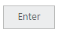
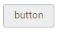

# Miscellaneous

## Text

You can display the user defined text for Button. Using Text property, you can easily set text content for button. This text property overwrites the text that is provided on input button element.

The following steps explains you the details about rendering the button with specified text.

1. In the CSHTML page, configure the Button widget as follows.

   ~~~ html

		@*Add the code in CSHTML page to configure and initialize the control*@

				@* Set the text for button control as follows.*@

					

						@Html.EJ().Button("button_text").Text("Enter").Size(ButtonSize.Mini)

					

   ~~~
   {:.prettyprint }
   
	In the above code, the content of button “button” is replaced by the text value “Enter” that is given using text property.

	Execute the above code to render the following output.

	

	_Figure13: Button with new text_

   ## Show Rounded Corner

      Specifies the corner of button in round shape. By default button doesn’t have rounded corner. To set rounded corner, you can enable ShowRoundedCorner property.

      The following steps explains you the details about rendering the button with rounded corner.

2. In the CSHTML page, configure the Button widget as follows.

   ~~~ html

		@*Add the code in CSHTML page to configure and initialize the control*@

		  @* Enable the rounded corner for button control as follows.*@

			

				@Html.EJ().Button("button_roundedCorner").Text("button").Size(ButtonSize.Mini).ShowRoundedCorner(true)

			

   ~~~
   {:.prettyprint }

Execute the above code to render the following output.

_Figure14: Button with rounded corner_

