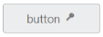

## RTL Support

In some cases you can use right to left alignment. Here, RTL support is provided using EnableRTL property. In RTL mode when you have more than one content (image/text, image/image) in button, then these content are aligned in right to left format. For example, when text is in left and image is in right position, after applying right to left alignment these position are interchanged.

The following steps explains the details about rendering the button with Right to left alignment support.

1. In the CSHTML page, configure the Button widget as follows.

[CSHTML]

@*Add the code in CSHTML page to configure and initialize the control*@

  @* Enable the alignment format for button control as follows.*@

        @Html.EJ().Button("button_rtl").Text("button").ShowRoundedCorner(true).Size(ButtonSize.Large).ContentType(ContentType.TextAndImage).PrefixIcon("e-login").EnableRTL(true)

    

In above mentioned code example PrefixIcon property is used and the icon that is to be on left side, (before text) is rendered on right side as EnableRTL property is used with PrefixIcon.  Consequently, the alignment is changed in right to left order.

Execute the above code to render the following output.

{{ '' | markdownify }}
{:.image }

_Figure_ _11__: Button in Right to left format_

