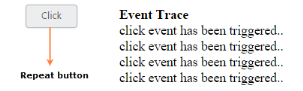

# Repeat Button

When you press button continuously, click event is raised at each specific time interval. This type of button is called Repeat Button. This functionality repeatedly raises the click event of button in both button click and from button in pressed state to the released state. TimeInterval property is used to specify the time Interval for triggering click event, when the button is in pressed state. RepeatButton property is used to set the button in repeat mode.

The following steps explains you the details about rendering the Repeat Button.

1. In the CSHTML page, configure the Button widget as follows.



<table>
<tr>
<td>
[CSHTML]@*Add the code in CSHTML page to configure and initialize the control*@  @* Enable the button in repeat action mode and specifies time interval.*@    
        
            @Html.EJ().Button("repeatButton").Text("click").ShowRoundedCorner(true).Size(ButtonSize.Mini).RepeatButton(true).TimeInterval("200").ClientSideEvents(e => e.Click("btnClick"))        
        
            
<b>Event Trace</b>
            

        
    
</td></tr>
<tr>
<td>
[JavaScript]//Add this script section that is used to handle the click event    </td></tr>
</table>



2. Configure the CSS styles to apply on button



[CSS]



Execute the above code to render the following output.

_Figure 10: Output for repeat button_

