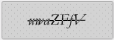
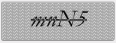
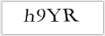
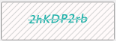
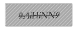
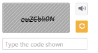
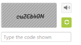

# Appearance and Styling

## Hatch Styles

You can customize the captcha background styles by HatchStyle property. 

The following code example is used to render the Captcha with customized Hatch style.

1. Add the following code example to the corresponding CSHTML page to render Captcha with customized Hatch style.

   ~~~ javascript

		@Html.EJ().Captcha("captcha").HatchStyle(HatchStyle.Cross)

   ~~~
   {:.prettyprint }

2. The following screenshot illustrates the Captcha with some of customized Hatch styles. 
<table>
<tr>
<td>
 HatchStyle(HatchStyle.Cross)</td><td>
{{ '' | markdownify }}
</td></tr>
<tr>
<td>
HatchStyle(HatchStyle.Percent90)</td><td>
{{ '' | markdownify }}
</td></tr>
<tr>
<td>
HatchStyle(HatchStyle.Wave)</td><td>
{{ '' | markdownify }}
</td></tr>
<tr>
<td>
HatchStyle(HatchStyle.WideDownwardDiagonal)</td><td>
{{ '' | markdownify }}
</td></tr>
<tr>
<td>
HatchStyle(HatchStyle.HorizontalBrick)</td><td>
{{ '' | markdownify }}
</td></tr>
</table>

_Figure_ _6_: Captcha with customized Hatch style

## Pattern

You can customize the patterns of the Captcha by enabling EnablePattern propertyto true. When the property is set to true, Captcha characters renders with strikeout. By default the property is set as true.

The following code example is used to render the Captcha with hard visibility mode.

1. Add the following code example to the corresponding CSHTML page to render Captcha with visibility mode.

   ~~~ javascript

		@Html.EJ().Captcha("captcha").EnablePattern(false)

   ~~~
   {:.prettyprint }

2. The following screenshot illustrates the Captcha with disabled pattern. 

## Background and Font color 

You can customize the appearance of Captcha controlby using the following property. PatternForeColor is used to set background pattern color. PatternBackColor is used to set background color for Captcha. ForeColor is used to set Captcha text color.

The following code example is used to render the Captcha with customized appearance.

1. Add the following code example to the corresponding CSHTML page to render Captcha with customized appearance.

   ~~~ javascript

		@Html.EJ().Captcha("captcha").PatternForeColor(System.Drawing.Color.LightGray).PatternBackColor(System.Drawing.Color.Snow).ForeColor(System.Drawing.Color.LightSeaGreen) 

   ~~~
   {:.prettyprint }

2. The following screenshot illustrates the Captcha with customized appearance. 

## Adjusting Captcha Size

### Height and width Customization

The height of the Captcha widget can be customized using “Height” property that accepts only integer values. The width of the Captcha widget can be customized using “Width” property that also accepts only integer values.

The following code example is used to render the Captcha with customized Height and Width.

1. Add the following code example to the corresponding CSHTML page to render Captcha with customized Height and Width.

   ~~~ javascript

		@Html.EJ().Captcha("captcha").Height(50).Width(150)

   ~~~
   {:.prettyprint }

2. The following screenshot illustrates the Captcha with customized Height and Width. 

## Theme

You can control the appearance of border color, refresh and audio button styles of the Captcha control based on CSS classes. In order to apply these styles, you can refer to the 2 files, ej.widgets.core.min.css and ej.theme.min.css. When ej.widgets.all.min.css file is referred, it is not necessary to include the files ej.widgets.core.min.css and ej.theme.min.css in your project, as ej.widgets.all.min.css is the combination of these two. 

By default, there are 12 themes support available for Captcha control.

* default-theme
* flat-azure-dark
* fat-lime
* flat-lime-dark
* flat-saffron
* flat-saffron-dark
* gradient-azure
* gradient-azure-dark
* gradient-lime
* gradient-lime-dark
* gradient-saffron
* gradient-saffron-dark

### Appearance for gradient-azure,

### Appearance for flat-lime,

