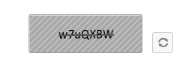
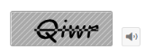

## Behavior Settings 

Regenerate Captcha

Captcha control supports regeneration of captcha image without full page refresh. You can achieve this by clicking refresh button. By default Captcha renders without refresh button. You can add the refresh button by setting EnableRefreshImage property to true. 

{  | markdownify }
{:.image }
_Note:  To refresh the Captcha image, include “RequestMapper”. It enables you to get or set name for the post action function._ 

The following code example is used to render the Captcha with Refresh support.

1. Add the following code example to the corresponding CSHTML page to render Captcha with Refresh button.
<table>
<tr>
<td>
 [CSHTML]@Html.EJ().Captcha("captcha").EnableRefreshImage(true).RequestMapper("Refresh")</td></tr>
<tr>
<td>
[CS]// Add the following code in controller page for Captcha with refresh imagepublic ActionResult Refresh(CaptchaParams parameters){    return parameters.CaptchaActions();}</td></tr>
</table>

2. The following screenshot illustrates the Captcha with Refresh button. 

{  | markdownify }
{:.image }

Audio Accessibility

Sometimes, Captcha characters are too hard to identify. In this case Captcha with audio helps to understand the Captcha character.  Captcha supports captcha with audio.  You can achieve this by enabling EnableAudio propertyto true. When this property is set true, captcha renders with audio button and when you click the audio button it readouts the captcha characters. By default Captcha renders without audio button.

The following code example is used to render the Captcha with Audio.

1. Add the following code example to the corresponding CSHTML page to render Captcha with audio button.

[CSHTML]

@Html.EJ().Captcha("captcha").EnableAudio(true)

2. The following screenshot illustrates the Captcha with audio button. 

{  | markdownify }
{:.image }

