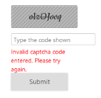
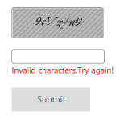
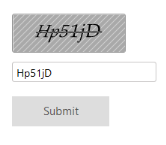

# Enabling Validation

## Auto Validation

You can validate the Captcha characters by default when you click the submit button without adding any validation code. You can achieve this by enabling EnableAutoValidation property to true. By default, this property is set as false. When this property is set as true Captcha renders with textbox.  Here, you can also customize the error message by using CustomErrorMessage property that accepts the string value. 

Next, define the target button that performs validation. You can achieve this by using TargetButton property. The button id that performs the click action should be assigned in TargetButton. 

N> To validate the Captcha by default, include RequestMapper. It enables to get or set name for the post action function. The post action function is used to process the captcha values internally such as get values from client side for regeneration of captcha image and validation of the captcha.

The following code example is used to render the Captcha with Auto-Validation support.

1. Add the following code example to the corresponding CSHTML page to render Captcha with Auto-Validation support.

   ~~~ cshtml
   
		@(Html.EJ().Captcha("captcha").EnableAutoValidation(true).RequestMapper("Refresh").CustomErrorMessage("Invalid captcha code entered. Please try again.").TargetButton ("submit"))       @Html.EJ().Button("submit").Size(ButtonSize.Large).Text("Submit").Type(ButtonType.Submit)

   ~~~
   
   
   ~~~ csharp
   
		// Add the following code in controller page for Captcha with Auto-Validation support
		public ActionResult Refresh(CaptchaParams parameters)
		{
			return parameters.CaptchaActions();
		}

   ~~~
   

2. The following screenshot illustrates the Captcha with Auto-Validation support. 

Captcha with auto validation support
{:.caption}

## Validation by Method

Validation by method is used when EnableAutoValidation is set as false. Here, you can include TargetButton to validate Captcha. CaptchaService.IsValid() method is used to validate the Captcha. It requires three arguments namely as captcha, textbox, case sensitivity.

The following code example is used to render the Captcha with manual validation.

1. Add the following code example to the corresponding CSHTML page to render Captcha with manual validation support.

   ~~~ cshtml
		
	 @using (Html.BeginForm("Default", "Captcha", FormMethod.Post)){
	 @Html.EJ().Captcha("captcha").TargetButton("submit")   
	 @Html.TextBox("validateText") 
	 @Html.ValidationMessage("myCaptcha")  
	 @(Html.EJ().Button("submit").Size(ButtonSize.Large).Text("Submit")
	 .Type(ButtonType.Submit))}

   ~~~
   
   
   ~~~ csharp
   
	 // Add the following code in Controller page for Captcha with manual validation support[HttpPost]
	 public ActionResult Default(FormCollection Values) 
	 {        
		if (!CaptchaService.IsValid(Values["captcha"], Values["validateText "], true))
		ModelState.AddModelError("myCaptcha", "Invalid characters. Try again!"); 
		return View();  
	 }

   ~~~
   

2. The following screenshot illustrates the Captcha with manual validation support. 

Captcha validation by method
{:.caption}

## Case Sensitive Validation 

Captcha supports to check case sensitivity (Upper case and lower case) of the Captcha characters at the time of validation. You can achieve this by enabling EnableCaseSensitivity property to true. By default this value is set as true.

The following code example is used to render the Captcha with Case sensitive validation support.

1. Add the following code example to the corresponding CSHTML page to render Captcha with Case sensitive validation support.

   ~~~ cshtml
   
		@(Html.EJ().Captcha("captcha").EnableAutoValidation(true).RequestMapper("Refresh").CustomErrorMessage("Invalid captcha code entered. Please try again.").TargetButton("submit ").EnableCaseSensitivity(true))   @Html.EJ().Button("submit").Size(ButtonSize.Large).Text("Submit").Type(ButtonType.Submit)

   ~~~
   
   
   ~~~ csharp
   
		// Add the following code in controller page for Captcha with case sensitive validation support
		public ActionResult Refresh(CaptchaParams parameters)
		{
			return parameters.CaptchaActions();
		}

   ~~~
   

2. The following screenshot illustrates the Captcha with Case sensitive validation support. 

Captcha with Case sensitive validation support
{:.caption}
