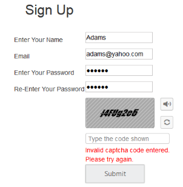

# Getting Started

## Create your first Captcha in ASP.NET MVC

This section enables you to configure the Captcha control in your ASP.NET MVC application and also in learning how to use captcha with auto validation in web forms.

## Create Captcha Control

The Captcha is one of the way to prevent dictionary attacks, it basically comes with the random text. The following steps are used to create Captcha control.  

1. You can create an MVC Project and add necessary Dll and script with the given [MVC-Getting Started](http://help.syncfusion.com/ug/js/default.htm) Documentation.
2. Add the following code to the corresponding view page for Captcha rendering.


[CSHTML]

    @Html.EJ().Captcha("SignUpCaptcha")



3. Add the following handler codes to the web.config file for Captcha image rendering.


[web.config]

<!--add the following code in <system.web>-->

 <system.web>

    <httpHandlers>

      <add verb="*" path="captimage.axd" type="Syncfusion.JavaScript.ImageHandler, Syncfusion.EJ, Version=XX.XXXX.X.XX, Culture=neutral, PublicKeyToken=3D67ED1F87D44C89" />

    </httpHandlers>

</system.web>

<!--add the following code in <system.webserver>-->

<system.webserver>    

-----------------------

-----------------------

    <handlers>      

      <add verb="*" path="captimage.axd" name="syncfusion_generatetools" type="Syncfusion.JavaScript.ImageHandler, Syncfusion.EJ, Version=XX.XXXX.X.XX, Culture=neutral, PublicKeyToken=3d67ed1f87d44c89" />      

    </handlers>

</system.webserver>



> Note: Version=XX.XXXX.X.X - It will vary depend up on .Net frame work version and Essential studio version you have using. If you are using Essential studio version as-12.3.0.36 and .Net frame work is 4.5 use like following Version=12.3450.0.36

The following screen shot displays the output of the above codes.

## Enable Audio and Refresh 

The Captcha controlsupports captcha in the form of audio and when you click the audio button it readouts the captcha characters. You can achieve this by setting “EnableAudio” property to true. Enable refresh is used to refresh or change the captcha image without full page refresh. This is achieved by adding “EnableRefreshImage” property to true. Also include RequestMapper for refresh support.

1. Add the following code example to view page to render captcha with Audio and Refresh.


[CSHTML]

   
        @Html.EJ().Captcha("SignUpCaptcha").EnableAudio(true).EnableRefreshImage(true).RequestMapper("Refresh")

   



2. Add the following code example to corresponding controller page to render captcha with Audio and Refresh.


[CONTROLLER]

        public ActionResult Refresh(CaptchaParams parameters)

        {

            return parameters.CaptchaActions();

        }



The following screenshot displays the output of the above codes.

## Auto Validation  

The Captcha supports automatic validation by enabling the property EnableAutoValidation. When you set this property to true, captcha validation is done automatically. When the validation fails, CustomErrorMessage property supports to display the customized error message.

1. Add the following code example to view page for auto validation.


[CSHTML]( CaptchaFeatures)

@using (Html.BeginForm("CaptchaFeatures", "Captcha", FormMethod.Post))

{  

        

            <table class="tableprop">

                <tr>

                    <td>

                        <h2 style="text-align:center">

                            Sign Up</h2>

                         

                    </td>

                </tr>

                <tr>

                    <td>

                        Enter Your Name

                    </td>

                    <td>

                        <input type="text" name="username" />

                        @if (!(bool)ViewBag.NameStatus)

                        {Invalid Value}

                    </td>

                </tr>

                <tr>

                    <td>

                        Email

                    </td>

                    <td>

                        <input type="text" name="email" />

                        @if (!(bool)ViewBag.EmailStatus)

                        {Invalid Value}

                    </td>

                </tr>

                <tr>

                    <td>

                        Enter Your Password

                    </td>

                    <td>

                        <input type="password" name="password" />

                        @if (!(bool)ViewBag.PasswordStatus)

                        {Invalid Password}

                    </td>

                </tr>

                <tr>

                    <td>

                        Re-Enter Your Password

                    </td>

                    <td>

                        <input type="password" name="repassword" />

                    </td>

                </tr>

                <tr>

                    <td>

                    </td>

                    <td>

                        

                            @Html.EJ().Captcha("myCaptcha").EnableRefreshImage(true).EnableAudio(true).EnableAutoValidation(true).RequestMapper("Refresh").CustomErrorMessage("Invalid captcha code entered. Please try again.").TargetButton("submit")

                        

                         

                         

                    </td>

                </tr>

                <tr>

                    <td>

                    </td>

                    <td>

                        @Html.EJ().Button("submit").Size(ButtonSize.Large).Text("Submit").Type(ButtonType.Submit)

                    </td>

                </tr>

            </table>           

        

    
       

}

[CSHTML]( CaptchaSuccess)

    

        <table>

            <tr>

                <td style="padding: 50px;">

                     

                     

                    <h2>

                        Thank you for registering.</h2>

                     

                </td>

            </tr>

        </table>

    

 



2. Add the following code example to corresponding controller page for captcha with Auto-Validation support.


[CONTROLLER]

        public ActionResult CaptchaFeatures()

        {

            ViewBag.NameStatus = true;

            ViewBag.PasswordStatus = true;

            ViewBag.EmailStatus = true;

            return View();

        }

        [HttpPost]

        public ActionResult CaptchaFeatures(FormCollection Values)

        {

            if (!string.IsNullOrEmpty(Values["username"].ToString()) && (Values["username"].ToString().Length > 3))

                ViewBag.NameStatus = true;

            else

                ViewBag.NameStatus = false;

            if (!string.IsNullOrEmpty(Values["email"].ToString()) && (Values["email"].ToString().Length > 3))

                ViewBag.EmailStatus = true;

            else

                ViewBag.EmailStatus = false;

            if ((!string.IsNullOrEmpty(Values["password"].ToString())) && (Values["password"].ToString().Length > 3) && (Values["password"].ToString().Equals(Values["repassword"].ToString())))

                ViewBag.PasswordStatus = true;

            else

                ViewBag.PasswordStatus = false;

            if ((bool)ViewBag.NameStatus && (bool)ViewBag.PasswordStatus && (bool)ViewBag.EmailStatus)

                return View("CaptchaSuccess");

            else

                return View();

        }

        public ActionResult Refresh(CaptchaParams parameters)

        {

            return parameters.CaptchaActions();

        }

        public ActionResult CaptchaSuccess()

        {

            return View();

        }


The following screenshot is the output for the above code example.

