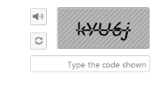

# RTL Support

Right to Left alignment of Captcha can be achieved by enabling EnableRTL property to true. When this property is set as true, refresh image and audio button are displayed in left side of captcha and also auto validation text box characters are entered from right to left. To achieve this, enable refresh, audio, and auto validation properties. By default RTL property value is set as false.

The following code example is used to render the Captcha with RTL support.

1. Add the following code example to the corresponding CSHTML page to render Captcha with RTL support.
 
   ~~~ cshtml
 
     @(Html.EJ().Captcha("captcha").EnableRTL(true).EnableRefreshImage(true).EnableAudio(true).EnableAutoValidation(true))

   ~~~
   

2. The following screenshot illustrates the Captcha with RTL support. 

Captcha with RTL support
{:.caption}