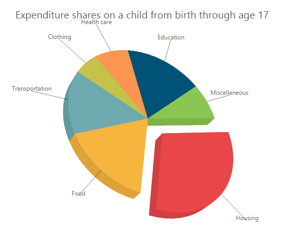

# 3D Chart

Now Essential Chart allows you to create stunning 3D Charts for Bar, Column, StackingBar, StackingColumn, Pie and Doughnut series. The representation of data in 3D Chart is very clear and easy to understand when compared to 2D charts. Three dimensions of the series are seen by rotating them. The following properties enhance the perception of 3D Charts.

## Enable3D:

The property Enable3D renders 3D Charts and accepts only the Boolean values.

## WallSize:

In 3D, Cartesian axes lines are represented as walls. The property WallSize defines the width of the wall. The WallSize property does not support for 3D Pie or Doughnut series because they do not have Cartesian axes lines. 

## Depth:

The Depth property defines the depth of the 3D Chart from front view of the series to wall.

## Tilt:

The Tilt property defines the angle of the slope of 3D Chart. The positive and negative values declare the side where the slope is present.

## Rotation:

The Rotation property is used to spin the 3D chart. The direction of the spin depends upon the positive and negative values of rotation property.

## EnableRotation:

The EnableRotation property allows rotation of the 3D Chart dynamically by dragging the mouse on 3D Chart. Accepting value of this property is Boolean.

## PerspectiveAngle:

The PerspectiveAngle declares the appearance of the height, width, depth and wall of the 3D Chart. When the PerspectiveAngle is decreased, the 3D object appears closer to viewer. But when it is increased, the 3D object appears far away from the viewer.

## SideBySideSeriesPlacement:

The SideBySideSeriesPlacement property defines the appearance of the different sets of data on 3D Chart. When it is set to true, the data is displayed side by side, otherwise it is displayed one by one.

## 3D Series Types

The following are 3D series types:

### 3D Column Chart

Column charts represent data in a vertical rectangular shape. The size of the shape depends upon the data. Different sets of data are compared by using column chart. The comparison is easy when it is set in 3 Dimensional view. Now Essential Chart gives its support for 3D by setting the property Enable3D to true. For clear perception, rotate the 3D column chart to 360 degrees by giving the value as true for EnableRotation property. The depth, wall size, tilt, and rotation of the 3D chart are customized by setting the property Depth, WallSize, Tilt, and Rotation respectively


@(Html.EJ().Chart("chartcontainer")

	                // ...   

        .Depth(100)

        .WallSize(2)

        .Tilt(0)

        .Rotation(34)

        .PerspectiveAngle(90)

        .EnableRotation(true)

        .Enable3D(true)

// ...

   )



3D Column Chart
{:.caption}

### 3D Bar Chart

3D Bar charts are similar to 3D Column charts, but it represents the data in horizontal rectangular shape. The size of the bar depends upon the data. You can customize the depth, wall size, tilt, and rotation of the 3D Bar chart by setting the property Depth, WallSize, Tilt, and Rotation respectively


@(Html.EJ().Chart("chartcontainer")

       .CommonSeriesOptions(cr => cr.Type(SeriesType.Bar))

	                // ...   

        .Depth(100)

        .WallSize(2)

        .Tilt(0)

        .Rotation(34)

        .PerspectiveAngle(90)

        .EnableRotation(true)

        .Enable3D(true)

// ...

   )



3D Bar Chart
{:.caption}

### 3D Stacking Column Chart

3D Stacking Column Charts are similar to 3D Column Charts, but here the Y values of different sets of data are represented in a single vertical bar. You can set different colors and borders for different y values in a single vertical bar by setting the Fill and Border properties. You can customize the depth, wall size, tilt, and rotation of the 3D Stacking Column Chart by setting the property Depth, WallSize, Tilt, and Rotation respectively. 


@(Html.EJ().Chart("chartcontainer")

	                // ...  

    .CommonSeriesOptions(cr => cr.Type(SeriesType.StackingColumn))

    .Series(sr =>

            {

                sr.Points(pt =>

                    {

                        pt.X("2006").Y(8).Add();

                        pt.X("2007").Y(5).Add();

                        pt.X("2008").Y(4).Add();

                        pt.X("2009").Y(12).Add();

                        pt.X("2010").Y(16).Add();

                        pt.X("2011").Y(6).Add();

                        pt.X("2012").Y(13).Add();

                    }).Name("Google").Add();

                sr.Points(pt =>

                {

                    pt.X("2006").Y(5).Add();

                    pt.X("2007").Y(6).Add();

                    pt.X("2008").Y(7).Add();

                    pt.X("2009").Y(10).Add();

                    pt.X("2010").Y(14).Add();

                    pt.X("2011").Y(14).Add();

                    pt.X("2012").Y(15).Add();

                }).Name("Bing").Add();

            })

        .Depth(100)

        .WallSize(2)

        .Tilt(0)

        .Rotation(34)

        .PerspectiveAngle(90)

        .EnableRotation(true)

        .Enable3D(true)

// ...

   )



3D Stacking Column Charts Chart
{:.caption}

### 3D Stacking Bar Chart

3D Stacking Bar Charts are similar to 3D Bar Charts, but here the Y values of different sets of data are represented in a single horizontal bar. So the comparison of different sets of data is easier than the normal bar chart. You can customize the depth, wall size, tilt, and rotation of the 3D Stacking Bar Chart by setting the property Depth, WallSize, Tilt, and Rotation respectively.      


@(Html.EJ().Chart("chartcontainer")

	                // ...   

.CommonSeriesOptions(cr =>cr.Type(SeriesType.StackingBar))

.Series(sr =>

            {

                sr.Points(pt =>

                    {

                        pt.X("2009").Y(2.9).Add();

                        pt.X("2010").Y(3.8).Add();

                        pt.X("2011").Y(4.9).Add();

                        pt.X("2012").Y(6.5).Add();

                        pt.X("2013").Y(7.1).Add();

                        pt.X("2014").Y(7.5).Add();

                    }).Name("Desktop Display").Add();

                sr.Points(pt =>

                {

                    pt.X("2009").Y(0.1).Add();

                    pt.X("2010").Y(0.5).Add();

                    pt.X("2011").Y(1.4).Add();

                    pt.X("2012").Y(2.9).Add();

                    pt.X("2013").Y(4.9).Add();

                    pt.X("2014").Y(6.8).Add();

                }).Name("Mobile").Add();

              })

        .Depth(100)

        .WallSize(2)

        .Tilt(0)

        .Rotation(34)

        .PerspectiveAngle(90)

        .EnableRotation(true)

        .Enable3D(true)

// ...

   )



3D Stacking Bar
{:.caption}

### 3D Pie Chart

Pie Charts are circular with several segments. The segments are calculated from the Y value of the series. Normally, in 2D only the front view of the pie chart can be seen. In 3D, there is an option to see the whole side of the pie chart by enabling the EnableRotation property. You can explode a particular segment of pie series by setting the ExplodeIndex property. You can customize the color of each segment by setting the Fill property, and can also customize the depth, perspective angle, rotation, tilt of the pie chart by setting the appropriate properties.   


@(Html.EJ().Chart("chartcontainer")

	                // ...   

.Series(sr =>

            {

                sr.Points(pt =>

                    {

                        pt.X("Housing").Y(31).Add();

                        pt.X("Food").Y(16).Add();

                        pt.X("Transportation").Y(14).Add();

                        pt.X("Clothing").Y(6).Add();

                        pt.X("Health care").Y(8).Add();

                        pt.X("Education").Y(17).Add();

                        pt.X("Miscellaneous").Y(8).Add();                             

                    }).Type(SeriesType.Pie).ExplodeIndex(1).StartAngle(145)

                      .Border(br=>br.Color("white").Width(2)).Add();

              })

        .Depth(30)

        .WallSize(10)

        .Tilt(-30)

        .Rotation(-30)

        .PerspectiveAngle(90)

        .EnableRotation(true)

        .Enable3D(true)

// ...

   )



3D Pie Chart
{:.caption}

### 3D Doughnut Chart

3D Doughnut charts are similar to 3D Pie Charts with the difference of having a hole in the center of the Doughnut chart. The size of the hole is customized by using the DoughnutCoefficient property. The size of the doughnut is customized by using the DoughnutSize property. You can rotate the 3D doughnut chart to 360 degrees by enabling the EnableRotation property. You can customize each segment’s color and border by setting Fill and Border property. 



@(Html.EJ().Chart("chartcontainer")

	                // ...   

.Series(sr =>

            {

                sr.Points(pt =>

                    {

                        pt.X("Watching TV").Y(56).Add();

                        pt.X("Socializing").Y(26).Add();

                        pt.X("Reading").Y(3).Add();

                        pt.X("Sports").Y(7).Add();

                        pt.X("Others").Y(8).Add();                                                                             

                     })

                     .Type(SeriesType.Doughnut).ExplodeIndex(4)

                     .Border(br=>br.Color("white").Width(2)).Add();

              })

        .Depth(30)

        .WallSize(10)

        .Tilt(-30)

        .Rotation(-30)

        .PerspectiveAngle(90)

        .EnableRotation(true)

        .Enable3D(true)

// ...

   )



3D Doughnut Chart
{:.caption}

## 100% 3D Stacking Column

100% 3D Stacking Column charts are similar to 3D stacking Column charts. But here, the combined contribution of Y values is the combined total of the vertical bar with 100 percent. You can customize the depth, wall size, tilt and rotate the 100% 3D Stacking Column by using the Depth, WallSize, Tilt and Rotation property respectively.



@(Html.EJ().Chart("chartcontainer")  

         .CommonSeriesOptions(cr => cr.Type(SeriesType.StackingColumn100))

         .Series(sr =>

             {

               sr.Points(pt =>

                 {

                    pt.X("2006").Y(80000).Add();

                    pt.X("2007").Y(22000).Add();

                    pt.X("2008").Y(60000).Add();

                    pt.X("2009").Y(39000).Add();

                    pt.X("2010").Y(62000).Add();

                    pt.X("2011").Y(90000).Add();

                 }).Name("Australia").Add();

               sr.Points(pt =>

                 {

                    pt.X("2006").Y(50000).Add();

                    pt.X("2007").Y(41000).Add();

                    pt.X("2008").Y(52000).Add();

                    pt.X("2009").Y(43000).Add();

                    pt.X("2010").Y(47000).Add();

                    pt.X("2011").Y(93000).Add();

                 }).Name("China").Add();

             })                         

         .Enable3D(true)

      )



The following screenshot displays the 100% 3D Stacking Column.

100% 3D Stacking Column
{:.caption}

## 100% 3D Stacking Bar

100% 3D Stacking Bar charts are similar to 3D stacking Bar charts. But here, the combined contribution of Y values is the combined total of the horizontal bar with 100 percent. You can customize the depth, wall size, tilt and rotate the 100% 3D Stacking Bar by using the Depth, WallSize, Tilt and Rotation properties respectively. 


@(Html.EJ().Chart("chartcontainer")

        .CommonSeriesOptions(cr => cr.Type(SeriesType.StackingBar100))

        .Series(sr =>

          {

             sr.Points(pt =>

               {

                  pt.X("2006").Y(8000).Add();

                  pt.X("2007").Y(12000).Add();

                  pt.X("2008").Y(20000).Add();

                  pt.X("2009").Y(21000).Add();

                  pt.X("2010").Y(28000).Add();

                  pt.X("2011").Y(29000).Add();

               }).Name("Brazil").Add();

             sr.Points(pt =>

               {

                  pt.X("2006").Y(5000).Add();

                  pt.X("2007").Y(15000).Add();

                  pt.X("2008").Y(19000).Add();

                  pt.X("2009").Y(25000).Add();

                  pt.X("2010").Y(26000).Add();

                  pt.X("2011").Y(30000).Add();

               }).Name("Nigeria").Add();

          })

        .Enable3D(true)

     )



The following screenshot displays the 100% 3D Stacking Bar.

100% 3D Stacking Bar.
{:.caption}

