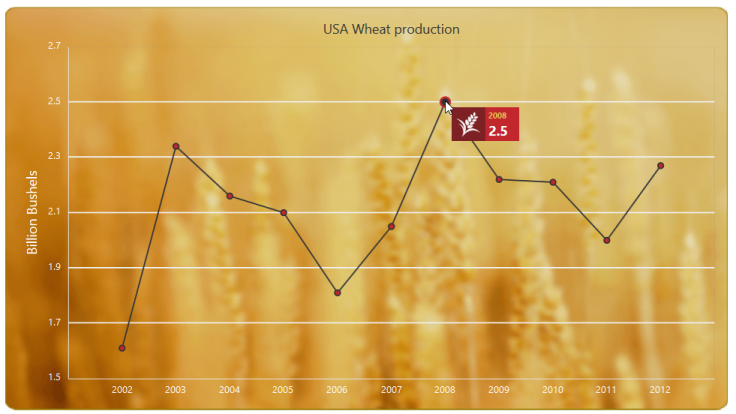
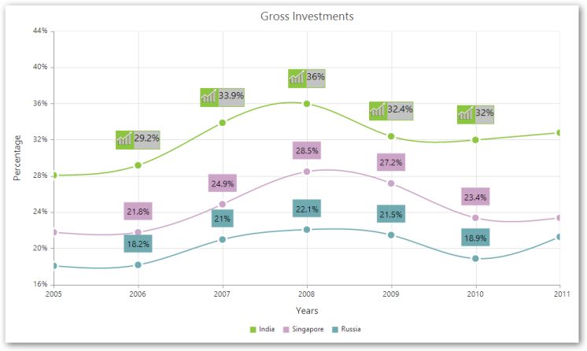
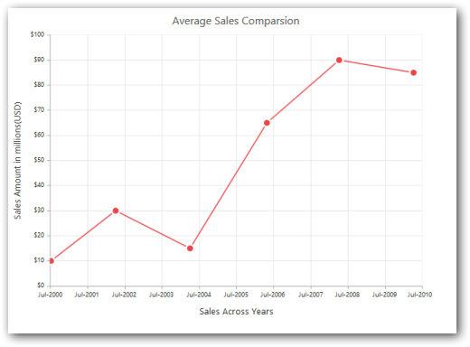
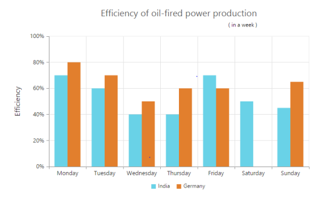
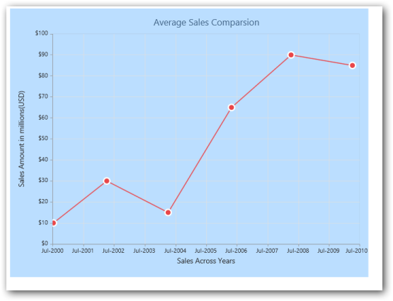
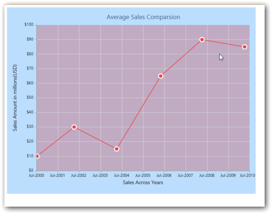
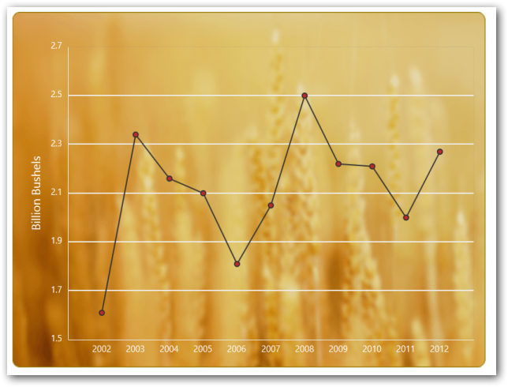
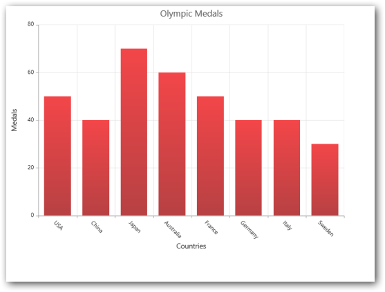
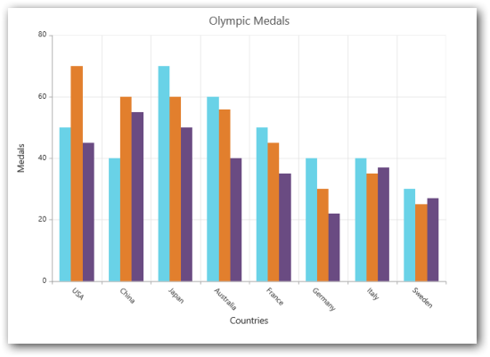

# Appearance and Styling

Essential Chart is enriched with lots of customization options to develop high quality graphic rich Charts.

## Tooltip Template

You can customize a tooltip with required template by adding a “div” element with an “id” to the web page and assigning the “id” to the property “Template” under “Tooltip” as illustrated in the following code example.


       

        

            

            
#point.x#

                
#point.y#

             

        

    







@(Html.EJ().Chart("chartcontainer")

// ...

     .Series(sr =>

{

sr.Points(pt =>

{

	     pt.X(2002).Y(1.61).Add(); 

            pt.X(2003).Y(2.34).Add(); 

            pt.X(2004).Y(2.16).Add(); 

            pt.X(2005).Y(2.10).Add(); 

            pt.X(2006).Y(1.81).Add(); 

            pt.X(2007).Y(2.05).Add(); 

            pt.X(2008).Y(2.50).Add();

            pt.X(2009).Y(2.22).Add();

            pt.X(2010).Y(2.21).Add();

            pt.X(2011).Y(2.00).Add();

            pt.X(2012).Y(2.27).Add(); 

           }).Name("India").Tooltip(tl=>tl.Visible(true).Template("Tooltip")).Add();

})

// ...

)


## Label Template

You customize a data label with required template by adding a “div” element with an “id” to the web page and assigning the “id” to the property “Template” under “DataLabel” as illustrated in the following code example.



        

            

        

        

            
#point.y#%

        

    




    




@(Html.EJ().Chart("chartcontainer")

     // ...

   .Series(sr =>

   {

     sr.Points(pt =>

     {

       pt.X(2005).Y(28.1).Add(); 

       pt.X(2006).Y(29.2).Add(); 

       pt.X(2007).Y(33.9).Add(); 

       pt.X(2008).Y(36).Add();

       pt.X(2009).Y(32.4).Add();

       pt.X(2010).Y(32).Add();

       pt.X(2011).Y(32.8).Add(); 

     }).Name("India").Marker(mr=>mr.DataLabel(db=>db.Visible(true)

       .Template("template").Fill("#8CC640"))).Add();

   })

      // ...

   )



## Label Formatting

### Numerical Axis:

By default, the label texts are automatically determined based on the axis data points and the generated intervals. You can make the Chart readable and understandable by formatting axes labels. For example, add "$" prefix when values are given in dollars and add "°F" postfix when values are given in Fahrenheit degrees. To achieve this “LabelFormat” property in axis is used. 


@(Html.EJ().Chart("chartcontainer")

// ...

    .PrimaryYAxis(pr=>pr.LabelFormat("{value}%"))

// ...

    )


### Date time Axis:

For datetime axis, all globalized date time formats are supported. By default, based on the interval type the LabelFormat is calculated. When the IntervalType is “year” then the LabelFormat is 'MMM, yyyy'.

### Some of the LabelFormat for datetime axis:

* 'MMM, yyyy'
* 'dd, MMM'
* 'dd/MM/yyyy'
* 'dd, hh:mm'
* 'hh:mm:ss'
* 'hh:mm:ss:tt'



@(Html.EJ().Chart("chartcontainer")

// ...

    .PrimaryXAxis(pr=>pr.LabelFormat("MMM-yyyy").ValueType(AxisValueType.Datetime))

// ...

    ) 


## Title and Subtitle

EJ Chart provides Title and Subtitle support that is used to give additional information about the chart data. It also has various options to customize the font alignment of the Title and Subtitle.


         @(Html.EJ().Chart("chartcontainer")

.Title(t=>t.Text("Efficiency of oil-fired power production").SubTitle(st=>st.Text("in a week").TextAlignment(TextAlignment.Far).Font(fn=>fn.Color("black").Size("12px"))))

   )



The following screenshot shows the Title and Subtitle in Chart control.

## Chart Background and Foreground

You can customize the background for different portion of Chart.

### To Chart:

Using the Background property you can customize the background color of the Chart.

### Code:


@(Html.EJ().Chart("chartcontainer")

// ...

    .Background("#1E90FF")

// ...

    )



### To Chart Area:

Using Background property in ChartArea you can customize the background color of the Chart area.

### Code: 


@(Html.EJ().Chart("chartcontainer")

// ...

    .ChartArea(ca=>ca.Background("#CC3333"))

// ...

    )



### BackGround Image:

Essential Chart allows you to add background image for your Chart using BackGroundImageUrl property.



@(Html.EJ().Chart("chartcontainer")

// ...

    .BackGroundImageUrl("../images/chart/wheat.png")

// ...

    )



## Theme

Chart has built-in theme support. The theme configures the colors of following Chart element.

1. Fonts
2. Axis lines
3. Series color
4. Legend
5. Tooltip
6. Background

### Code: 



@(Html.EJ().Chart("chartcontainer")

// ...

       .Theme(ChartTheme.GradientLight)

// ...

)



Following predefined themes are available in Essential Chart.

1. FlatLight 
2. FlatDark
3. GradientLight
4. GradientDark
5. Azure
6. AzureDark
7. Lime
8. LimeDark
9. Saffron
10. SaffronDark

## Custom Color palette 

Apart from the themes, to define custom set of color you can use “Palette” property. Palette customizes the color of series in the Chart. 


@(Html.EJ().Chart("chart").Palette(

        palette => { 

            palette.Add("#69D2E7"); 

            palette.Add("#E27F2D ");

            palette.Add("#6A4B82");

            . . . . . 

        })

. . . . . . 

. . . . . . 

}



