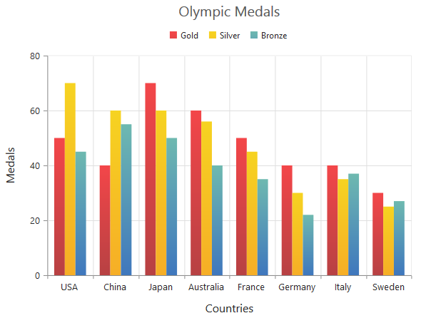
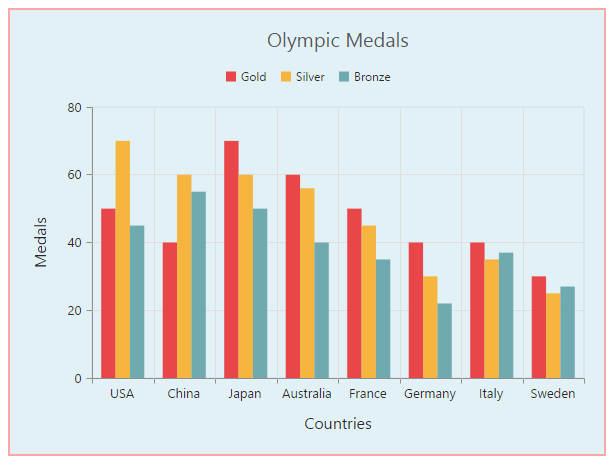

# Appearance

## Custom Color Palette

The Chart displays different series in different colors by default. You can customize the color of each series by providing a custom color palette of your choice by using the **Palette** property. 



  @(Html.EJ().Chart("chartContainer")

        //Providing a custom palette
        .Palette(pl => { pl.Add("grey"); pl.Add("skyblue"); pl.Add("orange"); })
        // ...
    )



N> The Color palette is applied to the points in accumulation type series

## Built-in Themes

Following are the built-in themes available in the Chart

* Azure
* Azuredark
* Flatdark
* Flatlight
* GradientDark
* GradientLight
* Lime
* LimeDark
* Saffron
* SaffronDark

You can set your desired theme by using the **Theme** property. FlatLight is the default theme used in the Chart.



  @(Html.EJ().Chart("chartContainer")

      //Using gradient theme
      .Theme(Syncfusion.JavaScript.DataVisualization.ChartTheme.GradientLight)
      // ...
    ) 



## Point level customization

Marker, DataLabel and Fill color of each point in a series can be customized individually by using the **Points** collection.



  @(Html.EJ().Chart("chartContainer")

      .Series(sr =>
      { 
        sr.Points(pts => {
            //Customizing marker and fill color of a point
            pts.X("0").Y(210).Fill("#E27F2D").Marker(mr => mr.Visible(true)).Add();
            //...
        })
       .Add();
          //...
      })
        // ...
    )



## Series border customization

To customize the series border color, width and dashArray, you can use **Series.Border** option. The series border styles can be applied only to the column, bar and area type of series.



 @(Html.EJ().Chart("chartContainer")

      .Series(sr =>
      { 
        sr.Border(br=>br.Color("blue").Widh(2).DashArray("5,3")).Add();
        //...
      })
        // ...
    )



## Chart area customization

### Customize chart background

The Chart background can be customized by using the **Background** property of the Chart. To customize the chart border, use **Border** option of the chart. 



 @(Html.EJ().Chart("chartContainer")

      //Customizing Chart background
      .Background("skyblue")
      //Customize the chart border and opacity
      .Border(br=>br.Color("#FF0000").Width(2).Opacity(0.35))
      // ...
    )

 

**Chart Margin**

The Chart **Margin** property is used to add the margin to the chart area at the Left, Right, Top and Bottom position.



  @(Html.EJ().Chart("chartContainer")

      //Change chart margin to left, right, top and bottom
      .Margin(mr=>mr.Left(40).Right(40).Bottom(40).Top(40)) 
      
      // ...
    )

 

**Setting background image**

Background image can be added to the chart by using the **BackGroundImageUrl** property.



 @(Html.EJ().Chart("chartContainer")

      // ...
            
      //Setting an image as Chart background 
      .BackGroundImageUrl("images/chart/wheat.png")
      
      // ...
    )

 

[Click](http://mvc.syncfusion.com/demos/web/chart/tooltiptemplate) here to view our online demo sample for setting Chart background image.

**Chart area background**

The Chart area background can be customized by using the **Background** property in the chart area. 



 @(Html.EJ().Chart("chartContainer")

      // ...
            
      .ChartArea(ca=>
          //Setting background for Chart area
          ca.Background("skyblue")
          )
      
      // ...
    )

 

### Customize chart area grid bands

You can provide different color for alternate grid rows and columns formed by the grid lines in the chart area by using the **AlternateGridBand** property of the axis. The properties **Odd** and **Even** are used to customize the grid bands at odd and even positions respectively. 



@(Html.EJ().Chart("chartContainer")

      // ...
            
      .PrimaryYAxis(py=>
          //Customizing horizontal grid bands at even position
          py.AlternateGridBand(ag=>ag.Even(en=>en.Fill("#A7A9AB").Opacity(0.1)))
          )
      
      // ...
    )

 

[Click](http://mvc.syncfusion.com/demos/web/chart/alternategridband) here to view the AlternateGridBand online demo sample.

### Animation

You can enable animation by using the **EnableAnimation** property of the series. This animates the chart series on two occasions – when the chart is loaded for the first time or whenever you change the series type by using the type property.



 @(Html.EJ().Chart("chartContainer")

      // ...

      .Series(
          //Enabling animation of series
          sr => { sr.EnableAnimation(true).Add(); 
      })
        // ...
    )



However, you can force the chart to animate series by calling the animate method as illustrated in the following code example,



 @(Html.EJ().Chart("chartContainer")

      // ...

      .Series(
          //Enabling animation of series
          sr => { sr.EnableAnimation(true).Add(); 
      })
        // ...
    )





     //Dynamically animating Chart
      function animateChart(){

           //Calling the animate method for dynamic animation
           $("#chartContainer").ejChart("animate");      
        
      }



### Control the Speed of animation

To control the speed of animation, you can use the [`animationDuration`](../api/ejchart#members:series-animationduration) property in the series. 



 @(Html.EJ().Chart("chartContainer")

      // ...

      .Series(
          //Enabling animation of series
          sr => { sr.EnableAnimation(true).AnimationDuration("2000").Add(); 
      })
        // ...
    )



