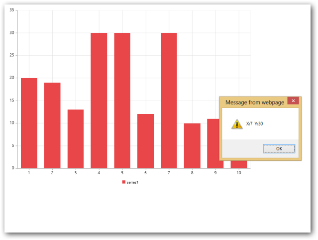

# Behaviour Customization

JS Chart allows you to customize the Chart through events. For example, you can add custom marker for highest and lowest data point using the events.

## Select a point

You can acquire the information related to a particular data point of series by moving mouse over the point or by clicking the point using PointRegionMouseMove or PointRegionClick event. PointRegionMouseMove event gets triggered when you move the mouse over the point and the PointRegionClick event gets triggered when you click the point. The following code example illustrates that x and y values of a point gets displayed when you move the mouse over the point or click the point.



 @(Html.EJ().Chart("chartcontainer")

       .CommonSeriesOptions(cs=>cs.Type(SeriesType.Column))

       .PointRegionMouseMove("pointDetails")                  

       .PointRegionClick("pointDetails")

       .Size(sz=>sz.Width(800).Height(600))

       ) 




  



## Handle Events

### Chart Events:

### Load: function

This event is handled when the Chart gets loaded; a parameter sender is passed to the handler. Using sender.model, you can access the Chart properties except series that were passed to the chart. 



@(Html.EJ().Chart("container")

	    // ...    

      .Load("onload")

// ...

         )



[JS]

              



### PreRender: function

This event is handled before the Chart gets rendered; a parameter sender is passed to the handler. Using sender.model, you can access the Chart properties that were passed to the chart. 


@(Html.EJ().Chart("container")

	  // ...      

   .PreRender("onprerender")

// ...

   )




               



### ChartAxis Events:

### AxesLabelsInitialize: function

This event is handled before the Chart axis gets rendered; a parameter sender is passed to the handler. Using sender.data.axes, you can change the axis related properties after the Chart is loaded.



@(Html.EJ().Chart("container")

           // ...

         .AxesLabelsInitialize ("onaxesLabelsInitialize")

           // ...

         )




                  



### AxesRangeCalculate: function

This event is handled after the Chart axis range gets calculated; a parameter sender is passed to the handler. Using sender.data.range, you can change the range calculated for the Chart axis.



  @(Html.EJ().Chart("container")

           // ...

         .AxesRangeCalculate("onaxesRangeCalculate")

           // ...

         )




       



### AxesTitleRendering: function

This event is handled before the Chart axis title gets rendered; a parameter sender is passed to the handler. Using sender.data.Title, you can change the axis title after the Chart is loaded.


@(Html.EJ().Chart("container")

           // ...

         .AxesTitleRendering("onaxesTitleRendering")

           // ...

         )




     



### AxesLabelRendering: function

This event is handled before the Chart axis label gets rendered; a parameter sender is passed to the handler. Using sender.data.label.Text, you can change the axis labels after the Chart is loaded.


@(Html.EJ().Chart("container")

           // ...

         .AxesLabelRendering("onaxesLabelRendering")

           // ...

         )



     


### Series Events:

### SeriesRendering: function

This event is handled before the Chart series gets rendered; a parameter sender is passed to the handler. Using sender.data.series, you can get access to the series properties.



 @(Html.EJ().Chart("container")

           // ...

         .SeriesRendering("onseriesRendering")

           // ...

         )




              



### SymbolRendering: function

This event is handled before the marker of each series point gets rendered; a parameter sender is passed to the handler. Using sender.data you can get access style and location of the symbol.



  @(Html.EJ().Chart("container")

           // ...

         .SymbolRendering("onsymbolRendering")

           // ...

         )




              



### DisplayTextRendering: function

This event is handled before the dataLabel of each series points gets rendered; a parameter sender is passed to the handler. Using sender.data.text you can change the dataLabel of each point in the series.



 @(Html.EJ().Chart("container")

           // ...

         .DisplayTextRendering("ondisplayTextRendering")

           // ...

         )




              



### AnimationComplete: function

This event is handled after the series animation is completed; a parameter sender is passed to the handler.  



@(Html.EJ().Chart("container")

           // ...

         .AnimationComplete("onanimationComplete")

           // ...

         )




              


### Legend Events:

### LegendItemRendering: function

This event is handled before the legend of each series points gets rendered; a parameter sender is passed to the handler. Using sender.data.legendItem.Text you can change the text of each legend text.


 @(Html.EJ().Chart("container")

           // ...

         .LegendItemRendering("onlegendItemRendering")

           // ...

         )




              



### LegendItemClick: function

This event is handled when you click the legend item; a parameter sender is passed to the handler.  


@(Html.EJ().Chart("container")

           // ...

         .LegendItemClick("onlegendItemClick")

           // ...

         )



              



### LegendItemMouseMove: function

This event is handled when you move the mouse over the legend item; a parameter sender is passed to the handler. Using sender.data.legendItem.Text you can change the text of each legend text.



 @(Html.EJ().Chart("container")

           // ...

         .LegendItemMouseMove("onlegendItemMouseMove")

           // ...

         )



     



### LengendBoundsCalculate: function

This event is handled after the bounds for legend is calculated.  A parameter sender is passed to the handler.  Using sender.data.legendBound, you can access the bounds of the Chartlegend.



 @(Html.EJ().Chart("container")

           // ...

         .LegendBoundsCalculate("onlegendBoundsCalculate")

           // ...

         )




     



### Tooltip Events:

#### ToolTipInitialize: function

This event is handled before the tooltip gets rendered.  A parameter sender is passed to the handler.  Using sender.data.currentText, you can change the tooltip text.



  @(Html.EJ().Chart("container")

           // ...

         .ToolTipInitialize("ontoolTipInitialize")

           // ...

         )




     



### TrackAxisToolTip: function

This event is handled before the tooltip for axis gets rendered when crosshair is enabled.  A parameter sender is passed to the handler.  Using sender.data.currentTrackText, you can change the tooltip text.



 @(Html.EJ().Chart("container")

           // ...

         .TrackAxisToolTip("ontrackAxisToolTip")

           // ...

         )




              



### TrackToolTip: function

This event is handled before the tooltip for trackball get rendered when trackball is enabled.  A parameter sender is passed to the handler.  Using sender.data.currentText, you can change the tooltip text.



 @(Html.EJ().Chart("container")

           // ...

         .TrackToolTip("ontrackToolTip")

           // ...

       )




               



