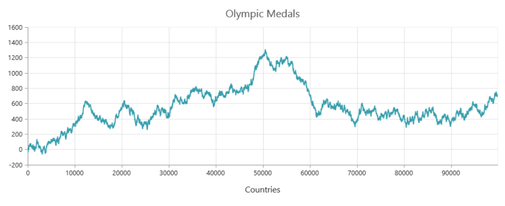

# Canvas Chart

EjChart provides canvas rendering support in Html5. By default, ejChart renders in SVG(Scalable Vector Graphics). When you enable the EnableCanvasRendering option in model, then the chart renders in canvas. Canvas chart is used for fast rendering when using large amount of data points. And also you can export the canvas chart as an image for further use. All user interaction provided by ejChart can be done in canvas rendering. Canvas chart does not support 3D and animation functionalities that can be done in SVG rendering. 


@(Html.EJ().Chart("chartcontainer")

// ...

        .EnableCanvasRendering(true)

// ...

   )



The following screenshot illustrates the canvas chart

_Figure25: Canvas Chart_

