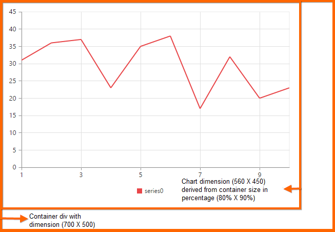

# Chart Dimensions

In this section you can learn how to change the Chartdimensions. You can change the Chart height and width in terms of pixels and percentage with the Size property. When size is specified, the Chart remains to that specific size irrespective of the size of the container. You can always resize the Chart when the browser or Chart container is resized by setting CanResize property to true, where the Chart adapts to the changes in size of the container. By default, Chart height will be 450px and Chart width takes the container width as default value.

## Setting dimension in pixel values:

You can specify the width and height in pixels to change the dimension of the Chart. 

## Setting size 

[MVC]

@(Html.EJ().Chart("chartcontainer")

         .Size(sz=>sz.Height("600").Width("800"))

         .CanResize(true)

         )



In the above code, the width is set as 800px and height as 600px that displays the following Chart with the dimension 800*600.

## Setting dimension in percentage values:

You can also set the width and height of the Chart in percentage. The Chart gets its dimension with respect to its container size.

Setting size in percentage[MVC]


@(Html.EJ().Chart("chartcontainer")

         .Size(sz=>sz.Height("80%").Width("90%"))

         )



