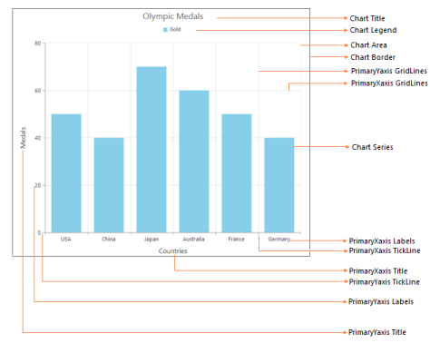

# Chart Elements

A Chart is composed of various sub elements such as legends, areas, series, and axis. The following screenshot illustrates the elements of the Chart control.

Chart elements
{:.caption}
