# ChartTypes

## Line Chart

To render a Line Chart, set the series **Type** as **Line** in the chart series. To change the line segment color, you can use the **Fill** property of the series.



@(Html.EJ().Chart("chartContainer")

      // ...
    
     .Series(sr =>
     {
         //Change type and color of the series.
         sr.Type(SeriesType.Line).Fill("#E94649").Add();
     })
     
     //...
 )



[Click](http://mvc.syncfusion.com/demos/web/chart/default) here to view the Line Chart online demo sample.

### Change the line width

To change the width of the line segment, you can use the **Width** property in the series.



 @(Html.EJ().Chart("chartContainer")

      // ...
    
     .Series(sr =>
     {
         //Change the width of line series
         sr.Width(3).Add();
     })
     
     //...
  )



### Dashed lines

To render the line series with dotted lines, you can use the **DashArray** option of the series.



 @(Html.EJ().Chart("chartContainer")

      // ...
    
     .Series(sr =>
     {
         //Change dash array to display dotted or dashed lines
         sr.DashArray("5,5").Add();
     })
     
     //...
 )



### Changing the line cap

For customizing the start and end caps of the line segment, you can use the **LineCap** property.  



 @(Html.EJ().Chart("chartContainer")

      // ...
    
     .Series(sr =>
     {
         //Change line cap
         sr.LineCap(ChartLineCap.Square).Add();
     })
     
     //...
 )



### Changing the line join

You can use the **LineJoin** property to specify how two intersecting line segments should be joined.



@(Html.EJ().Chart("chartContainer")

      // ...
    
     .Series(sr =>
     {
         //Change line join
         sr.LineJoin(ChartLineJoin.Round).Add();
     })
     
     //...
 )



### MultiColor Line

You can change the color of the line segments by using the *Fill* property of the each *Points* in the series.



     @(Html.EJ().Chart("chartContainer")
            //...
                .Series(sr =>
                {
                    //Adding Candle series
                    sr.Points(pts=>{
                        pts.Fill("red").Add();
                    }) .Add();
                })  
             //...              
     )



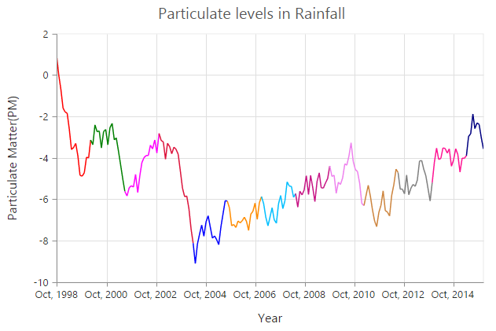

[Click](http://mvc.syncfusion.com/demos/web/chart/multicolor) here to view the MultiColor Line Chart online demo sample.

 
## Step Line Chart

To render a Step Line Chart, set the series Type as **StepLine"** in the chart series. To change the StepLine segment color, you can use the Fill property of the series.



 @(Html.EJ().Chart("chartContainer")

      // ...
    
     .Series(sr =>
     {
         //Change type and color of the series.
         sr.Type(SeriesType.StepLine).Fill("#E94649").Add();
     })
     
     //...
 )



[Click](http://mvc.syncfusion.com/demos/web/chart/stepline) here to view the Step Line Chart online demo sample.

### Changing the line width

To change the line width, you can use the **Width** property.  



@(Html.EJ().Chart("chartContainer")

      // ...
    
     .Series(sr =>
     {
         //Change the width of step line series
         sr.Width(3).Add();
     })
     
     //...
 )



### Dashed lines

To render the step line series with dotted lines, you can use the DashArray option of the series.



@(Html.EJ().Chart("chartContainer")

      // ...
    
     .Series(sr =>
     {
         //Change dash array to display dotted or dashed lines
         sr.DashArray("5,5").Add();
     })
     
     //...
 )



### Changing the line cap

For customizing the start and end caps of the line segment, you can use the LineCap property.  



@(Html.EJ().Chart("chartContainer")

      // ...
    
     .Series(sr =>
     {
         //Change line cap
         sr.LineCap(ChartLineCap.Square).Add();
     })
     
     //...
 )



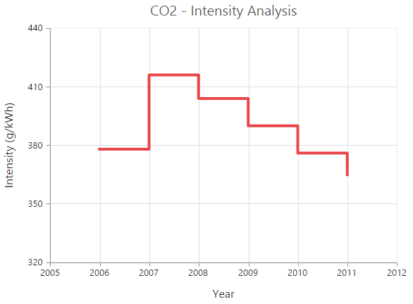

### Changing the line join

You can use the LineJoin property to specify how two intersecting line segments should be joined.



@(Html.EJ().Chart("chartContainer")

      // ...
    
     .Series(sr =>
     {
         //Change line join
         sr.LineJoin(ChartLineJoin.Round).Add();
     })
     
     //...
 )



## Area Chart

To render an Area chart, you can specify the series Type as **Area** in the chart series. To change the Area color, you can use the Fill property of the series.



 @(Html.EJ().Chart("chartContainer")

      // ...
    
     .Series(sr =>
     {
         //Change type and color of the series.
         sr.Type(SeriesType.Area).Fill("#69D2E7").Add();
     })
     
     //...
 )



[Click](http://mvc.syncfusion.com/demos/web/chart/area) here to view the Area Chart online demo.

## Range Area Chart

To render a Range Area Chart, set the Type as **RangeArea** in the chart series. To change the RangeArea color, you can use the Fill property of the series.

Since the RangeArea series requires two y values for a point, you have to add the **High** and **Low** value. High and Low value specifies the maximum and minimum range of the points.

* When you are using the Points option, specify the high and low values by using the High and Low option of the point.

* When you are using the DataSource option to assign the data, map the fields from the dataSource that contain High and Low values by using the Series.High and Series.Low options. 



 @(Html.EJ().Chart("chartContainer")

      // ...
    
     .Series(sr =>
     {
         //Change the series type and fill color
         sr.Type(SeriesType.RangeArea).Fill("Indigo")
             //Use High and Low values instead of Y
             .Points(pt=>{pt.X("1935").High(80).Low(70).Add();
                 //..
             })
             .Add();
     })
     
     //...
 )



[Click](http://mvc.syncfusion.com/demos/web/chart/rangearea) here to view Range Area Chart online demo.

## Step Area Chart

To render a Step Area Chart, set the Type as **StepArea** in the chart series. To change the StepArea color, you can use the Fill property of the series.



@(Html.EJ().Chart("chartContainer")

      // ...
    
     .Series(sr =>
     {
         //Change the series type and fill color
         sr.Type(SeriesType.StepArea).Fill("#69D2E7")
            //...
             .Add();
     })
     
     //...
 )  



[Click](http://mvc.syncfusion.com/demos/web/chart/steparea) here to view Step Area Chart online demo.

## Spline Area Chart

To render a Spline Area Chart, set the Type as **SplineArea** in the chart series. To change the SplineArea color, you can use the Fill property of the series.



 
@(Html.EJ().Chart("chartContainer")

      // ...
    
     .Series(sr =>
     {
         //Change the series type and fill color
         sr.Type(SeriesType.SplineArea).Fill("#C4C24A")
            //...
             .Add();
     })
     
     //...
 )



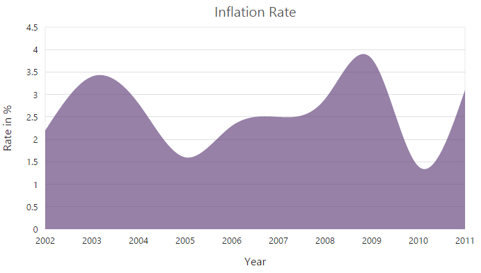

[Click](http://mvc.syncfusion.com/demos/web/chart/splinearea) here to view Spline Area Chart online demo.

## Stacked Area Chart

To render a Stacked Area Chart, set the Type as **StackingArea** in the chart series. To change the StackingArea color, you can use the Fill property of the series.



@(Html.EJ().Chart("chartContainer")

      // ...
    
     .Series(sr =>
     {
         //Change the series type and fill color
         sr.Type(SeriesType.StackingArea).Fill("#69D2E7")
            //...
             .Add();
     })
     
     //...
 )



[Click](http://mvc.syncfusion.com/demos/web/chart/stackingarea) here to view Stacked Area Chart online demo.

## 100% Stacked Area Chart  

To render a 100% Stacked Area Chart, set the Type as **StackingArea100** in the chart series. To change the StackingArea100 color, you can use the Fill property of the series.   



@(Html.EJ().Chart("chartContainer")

      // ...
    
     .Series(sr =>
     {
         //Change the series type and fill color
         sr.Type(SeriesType.StackingArea100).Fill("#C4C24A")
            //...
             .Add();
     })
     
     //...
 )



[Click](http://mvc.syncfusion.com/demos/web/chart/stackingarea100) here to view 100% Stacked Area Chart online demo.

## Column Chart

To render a Column Chart, set the Type as **Column** in the chart series. To change the color of the column series, you can use the Fill property.  



@(Html.EJ().Chart("chartContainer")

      // ...
    
     .Series(sr =>
     {
         //Change the series type and fill color
         sr.Type(SeriesType.Column).Fill("#E94649")
            //...
             .Add();
     })
     
     //...
 )



[Click](http://mvc.syncfusion.com/demos/web/chart/column) here to view Column Chart demo.

### Change a point color

You can change the color of a column by using the Fill property of the point.



  @(Html.EJ().Chart("chartContainer")

      // ...
    
     .Series(sr =>
     {
        sr.Points(pt=>{pt.Fill("skyblue").Add();})
            //...
             .Add();
     })
     
     //...
 )



### Column width customization

Width of any column type series can be customized by using the **ColumnWidth** property. Default value of *ColumnWidth* is 0.7. Value ranges from 0 to 1. Here 1 corresponds to 100% of available width and 0 corresponds to 0% of available width.

N> Width of a column also depends upon the *ColumnSpacing* property, because *ColumnSpacing* will reduce the space available for drawing a column. This is also applicable for StackingColumn, StackingColumn100, Bar, StackingBar, StackingBar100, RangeColumn, HiLo, HiLoOpenClose, Candle and Waterfall charts.



    @(Html.EJ().Chart("chartContainer")

      .Series(sr =>
      { 
	    //Customizing column width for a specific series
        sr.ColumnWidth(0.8).Add();
        //...
      })
        // ...
    )	



### Spacing between column series

Spacing between column type series can be customized using the **ColumnSpacing** property. Default value of *ColumnSpacing* is 0. Value ranges from 0 to 1. Here 1 corresponds to 100% available space and 0 corresponds to 0% available space.

N> Space between columns will also affect the width of the column. For example, setting 20% spacing and 100% width will render columns with 80% of total width. This is also applicable for StackingColumn, StackingColumn100, Bar, StackingBar, StackingBar100, RangeColumn, HiLo, HiLoOpenClose, Candle and Waterfall charts.



	@(Html.EJ().Chart("chartContainer")

      .Series(sr =>
      { 
	    //Customizing column spacing for a specific series
        sr.ColumnSpacing(0.2).Add();
        //...
      })
        // ...
    )



### Cylindrical Chart

To render a cylindrical chart, set the [`columnFacet`](../api/ejchart.html#members:series-columnfacet) property as "cylinder" in the chart series along with the series type. 

The following chart types can be rendered as cylinder in both 2D and in 3D view.

* Column Chart, Bar Chart, Stacked Column Chart, Stacked Bar Chart, 100% Stacked Column Chart, 100% Stacked Bar Chart.



    @(Html.EJ().Chart("chartContainer")

      // ...

     .Series(sr =>
     {
         // To change the shape of the series.
         sr.Type(SeriesType.Line).ColumnFacet(ColumnFacet.Cylinder).Add();
     })

     //...
)



## RangeColumn Chart

To render a Range Column Chart, set the Type as **RangeColumn** in the chart series. To change the RangeColumn color, use the Fill property of the series.

Since, the RangeColumn series requires two y values for a point, add the High and Low value. High and Low value specifies the maximum and minimum range of the points.

* When you are using the Points option, specify the high and low values by using the High and Low option of the point.

* When you are using the DataSource option to assign the data, you have to map the fields from the dataSource that contains high and low values by using the Series.High and Series.Low) options.  



 @(Html.EJ().Chart("chartContainer")

      // ...
    
     .Series(sr =>
     {
         //Set chart type to series
         sr.Type(SeriesType.RangeColumn).Fill("#E94649")
        //Use high and low values instead of y
        .Points(pt=>{pt.High("6.1").Low(0.7).Add();})
            //...
             .Add();
     })
     
     //...
 )



[Click](http://mvc.syncfusion.com/demos/web/chart/rangecolumn) here to view Range Column Chart online demo.

### Change a point color 

To change the color of a range column, you can use the Fill property of point. 



  @(Html.EJ().Chart("chartContainer")

      // ...
    
     .Series(sr =>
     {
        //change a point color of Range column
        sr.Points(pt=>{pt.Fill("skyblue").Add();})
            //...
             .Add();
     })
     
     //...
 )



## Stacked Column Chart

To render a Stacked Column Chart, set the Type as **StackingColumn** in the chart series. To change the StackingColumn color, you can use the Fill property of the series.



@(Html.EJ().Chart("chartContainer")

      // ...
    
     .Series(sr =>
     {
         //Set chart type to series
         sr.Type(SeriesType.StackingColumn).Fill("#E94649")
            //...
             .Add();
     })
     
     //...
 )



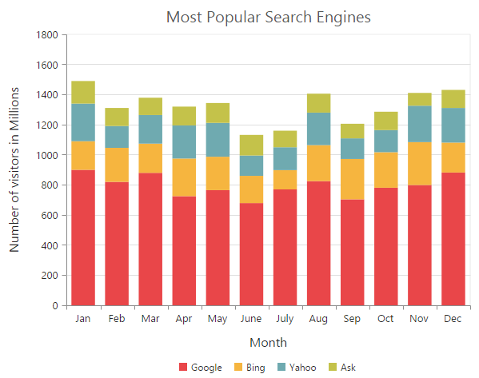

[Click](http://mvc.syncfusion.com/demos/web/chart/stackingcolumn) here to view Stacked Column Chart online demo.

### Group stacked columns

You can use the **StackingGroup** property to group the stacked columns. Columns with same group name are stacked on top of each other.



@(Html.EJ().Chart("chartContainer")

      // ...
    
     .Series(sr =>
     {
         // For grouping stacked columns
         sr.StackingGroup("GroupOne")
            //...
             .Add();
          // For grouping stacked columns
         sr.StackingGroup("GroupOne")
            //...
             .Add();
     })
     
     //...
 )



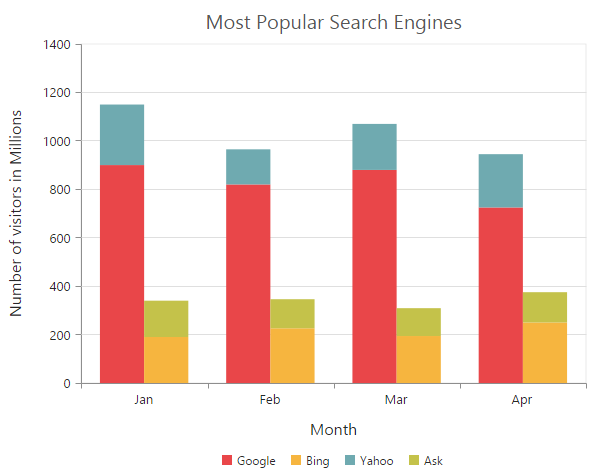

### Change a point color

To change the color of a stacking column, you can use the Fill property of the point. 



 @(Html.EJ().Chart("chartContainer")

      // ...
    
     .Series(sr =>
     {
        //change a point color of Stacking column
        sr.Points(pt=>{pt.Fill("skyblue").Add();})
            //...
             .Add();
     })
     
     //...
 )



## 100% Stacked Column Chart    

To render a 100% Stacked Column Chart, set the Type as **StackingColumn100** in the chart series. To change the StackingColumn100 color, you can use the Fill property of the series.



 @(Html.EJ().Chart("chartContainer")

      // ...
    
     .Series(sr =>
     {
         //Change type and color of the series
         sr.Type(SeriesType.StackingColumn100).Fill("#E94649")
            //...
             .Add();
     })
     
     //...
 )



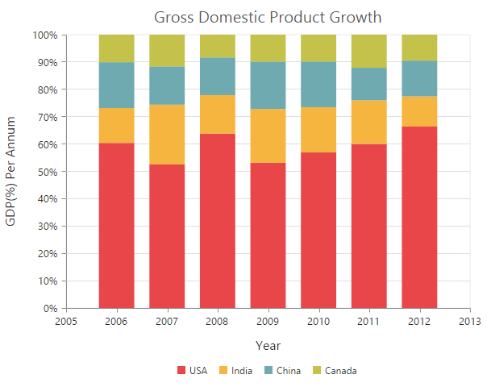

[Click](http://mvc.syncfusion.com/demos/web/chart/stackingcolumn100) here to view 100% Stacked Column Chart online demo.

### Group 100% stacked columns

By using the **StackingGroup** property, you can group the 100% stacking columns. Columns with same group name are stacked on top of each other. 



@(Html.EJ().Chart("chartContainer")

      // ...
    
     .Series(sr =>
     {
         // For grouping 100% stacked columns
         sr.StackingGroup("GroupOne")
            //...
             .Add();
          // For grouping 100% stacked columns
         sr.StackingGroup("GroupOne")
            //...
             .Add();
     })
     
     //...
 )



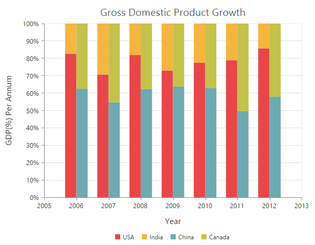

### Change a point color

To change the color of a 100% stacking column, you can use the Fill property of the point. 



  @(Html.EJ().Chart("chartContainer")

      // ...
    
     .Series(sr =>
     {
        //change a point color of 100% Stacking column
        sr.Points(pt=>{pt.Fill("skyblue").Add();})
            //...
             .Add();
     })
     
     //...
 )



## Bar Chart

To render a bar Chart, set the Type as **Bar** in the chart series. To change the bar color, you can use the Fill property of the series.



@(Html.EJ().Chart("chartContainer")

      // ...
    
     .Series(sr =>
     {
         //Change type and color of the series
         sr.Type(SeriesType.Bar).Fill("#E94649")
            //...
             .Add();
     })
     
     //...
 ) 



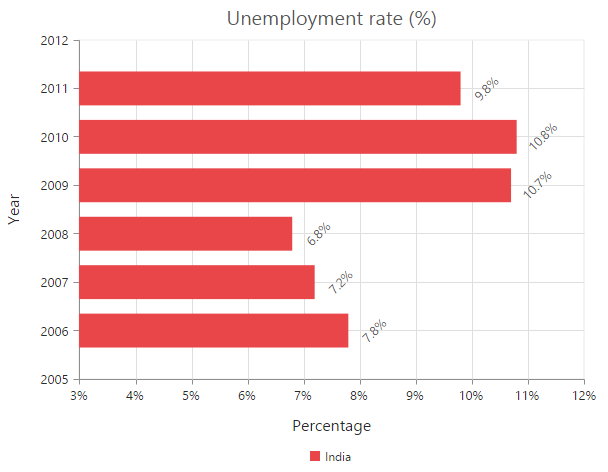

[Click](http://mvc.syncfusion.com/demos/web/chart/bar) here to view Bar Chart demo.

### Change the color of a bar

By using the Fill property of the point, you can change the specific point of the series. 



 @(Html.EJ().Chart("chartContainer")

      // ...
    
     .Series(sr =>
     {
        //change a point color of bar
        sr.Points(pt=>{pt.Fill("skyblue").Add();})
            //...
             .Add();
     })
     
     //...
 )



## Stacked Bar Chart

To render a Stacked Bar Chart, set the Type as **StackingBar** in the chart series. To change the StackingBar color, you can use the Fill property of the series.



@(Html.EJ().Chart("chartContainer")

      // ...
    
     .Series(sr =>
     {
         //Change type and color of the series
         sr.Type(SeriesType.StackingBar).Fill("#E94649")
            //...
             .Add();
     })
     
     //...
 )         



[Click](http://mvc.syncfusion.com/demos/web/chart/stackingbar) here to view Stacked Bar Chart online demo.

### Group stacked bars

You can use the **StackingGroup** property to group the stacking bars with the same group name. 



 @(Html.EJ().Chart("chartContainer")

      // ...
    
     .Series(sr =>
     {
         // For grouping stacking bar
         sr.StackingGroup("GroupOne")
            //...
             .Add();
          // For grouping stacking bar
         sr.StackingGroup("GroupOne")
            //...
             .Add();
     })
     
     //...
 )



### Change a point color

You can change the color of a stacking bar by using the Fill property of the point.



   @(Html.EJ().Chart("chartContainer")

      // ...
    
     .Series(sr =>
     {
        //change a point color of stacking bar
        sr.Points(pt=>{pt.Fill("skyblue").Add();})
            //...
             .Add();
     })
     
     //...
 )



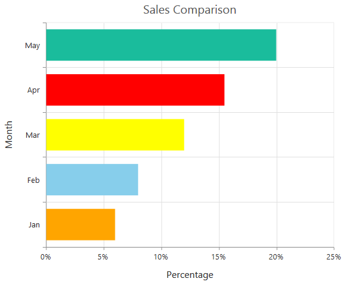

## 100% Stacked Bar Chart

To render a 100% Stacked Bar Chart, set the Type as **StackingBar100** in the chart series. To change the StackingBar100 color, you can use the Fill property of the series.



@(Html.EJ().Chart("chartContainer")

      // ...
    
     .Series(sr =>
     {
         //Change type and color of the series
         sr.Type(SeriesType.StackingBar100).Fill("#E94649")
            //...
             .Add();
     })
     
     //...
 )   



[Click](http://mvc.syncfusion.com/demos/web/chart/stackingbar100) here to view 100% Stacked Bar Chart online demo.

By using the StackingGroup property, you can group the 100% stacking bars with the same group name. 



 @(Html.EJ().Chart("chartContainer")

      // ...
    
     .Series(sr =>
     {
         // For grouping 100% stacking bar
         sr.StackingGroup("GroupOne")
            //...
             .Add();
          // For grouping 100% stacking bar
         sr.StackingGroup("GroupOne")
            //...
             .Add();
     })
     
     //...
 )



### Change a point color

To change the color of a 100% stacking bar, you can use the Fill property of the point. 



 @(Html.EJ().Chart("chartContainer")

      // ...
    
     .Series(sr =>
     {
        //change a point color of 100% stacking bar
        sr.Points(pt=>{pt.Fill("skyblue").Add();})
            //...
             .Add();
     })
     
     //...
 )



## Spline Chart

To render a Spline Chart, set the Type as **Spline** in the chart series. To change the Spline segment color, you can use the Fill property of the series.



@(Html.EJ().Chart("chartContainer")

      // ...
    
     .Series(sr =>
     {
         //Change type and color of the series
         sr.Type(SeriesType.Spline).Fill("#6ADCB0")
            //...
             .Add();
     })
     
     //...
 )



[Click](http://mvc.syncfusion.com/demos/web/chart/spline) here to view the Spline Chart online demo sample.

### Change the spline width

To change the spline segment width, you can use the Width property of the series.



@(Html.EJ().Chart("chartContainer")

      // ...
    
     .Series(sr =>
     {
         //Change the width of spline series
         sr.Width(3)
            //...
             .Add();
     })
     
     //...
 )



### Dashed lines

To render the spline series with dotted lines, you can use the DashArray option of the series.



@(Html.EJ().Chart("chartContainer")

      // ...
    
     .Series(sr =>
     {
         //Change dash array to display dotted or dashed splines
         sr.DashArray("5,5")
            //...
             .Add();
     })
     
     //...
 )



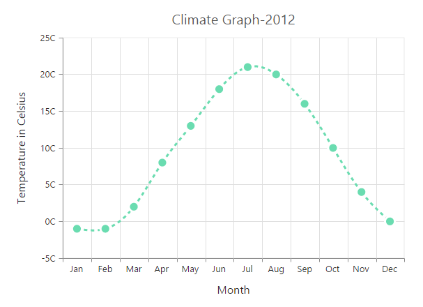

## Pie Chart

You can create a pie chart by setting the series Type as **Pie** in the chart series.



@(Html.EJ().Chart("chartContainer")

      // ...
    
     .Series(sr =>
     {
         //Set chart type to series
         sr.Type(SeriesType.Pie)
            //...
             .Add();
     })
     
     //...
 )



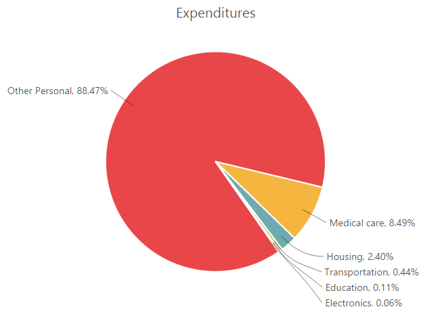

[Click](http://mvc.syncfusion.com/demos/web/chart/pie) here to view the Pie chart online demo sample.

### Change the pie size

You can use the **PieCoefficient** property to change the diameter of the Pie chart with respect to the plot area. It ranges from 0 to 1 and the default value is **0.8**.



@(Html.EJ().Chart("chartContainer")

      // ...
    
     .Series(sr =>
     {
         //Change pie chart coefficient value
         sr.PieCoefficient(0.4f)
            //...
             .Add();
     })
     
     //...
 )



### Explode a pie segment

You can explode a pie segment on the chart load by using the **ExplodeIndex** of the series.



@(Html.EJ().Chart("chartContainer")

      // ...
    
     .Series(sr =>
     {
         //Set point index value to explode the pie segment.
         sr.ExplodeIndex(1)
            //...
             .Add();
     })
     
     //...
 )



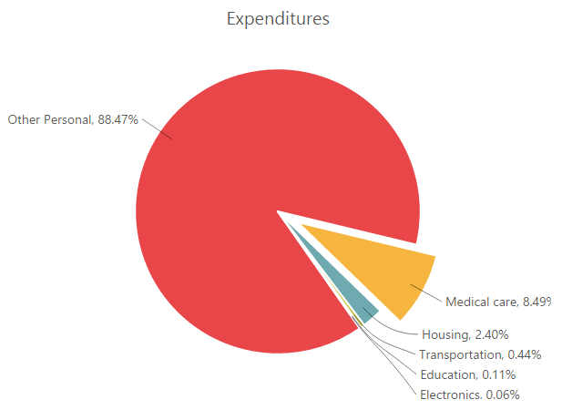

### Explode all the segments

To explode all the segments of the Pie chart, you can enable the **ExplodeAll** property.



@(Html.EJ().Chart("chartContainer")

      // ...
    
     .Series(sr =>
     {
         //Enable explodeAll property for pie chart. 
         sr.ExplodeAll(true)
            //...
             .Add();
     })
     
     //...
 )



### Explode a pie segment on mouse over

To explode a pie segment on a mouse over, you can enable the **Explode** property of the series.



@(Html.EJ().Chart("chartContainer")

      // ...
    
     .Series(sr =>
     {
         //Enable pie explode option on mouse over the chart 
         sr.Explode(true)
            //...
             .Add();
     })
     
     //...
 )



### Sector of Pie

EjChart allows you to render all the data points/segments in the semi-pie, quarter-pie or in any sector by using the **StartAngle** and **EndAngle** options.



@(Html.EJ().Chart("chartContainer")

      // ...
    
     .Series(sr =>
     {
         sr.Type(SeriesType.Pie)
         //Set startAngle and endAngle to draw the semi pie chart
         .StartAngle(-90).EndAngle(90)
            //...
             .Add();
     })
     
     //...
 )



[Click](http://mvc.syncfusion.com/demos/web/chart/semipie) here to view the Semi Pie Chart online demo sample.

## Doughnut Chart

To create a Doughnut chart, you can specify the series Type as **Doughnut** in the chart series.



@(Html.EJ().Chart("chartContainer")

      // ...
    
     .Series(sr =>
     {
         //Set chart type to series
         sr.Type(SeriesType.Doughnut)
            //...
             .Add();
     })
     
     //...
 )



[Click](http://mvc.syncfusion.com/demos/web/chart/doughnut) here to view the Doughnut Chart online demo sample.

### Change Doughnut inner radius

You can change the doughnut chart inner radius by using the **DoughnutCoefficient** with respect to the plot area. It ranges from 0 to 1 and the default value is **0.4**.



@(Html.EJ().Chart("chartContainer")

      // ...
    
     .Series(sr =>
     {
         //Change doughnut chart coefficient value
         sr.DoughnutCoefficient(0.6f)
            //...
             .Add();
     })
     
     //...
 )



### Change the doughnut size

You can use the **DoughnutSize** property to change the diameter of the Doughnut chart with respect to the plot area. It ranges from 0 to 1 and the default value is **0.8**.



@(Html.EJ().Chart("chartContainer")

      // ...
    
     .Series(sr =>
     {
         //Change doughnut chart coefficient value
         sr.DoughnutSize(0.4f)
            //...
             .Add();
     })
     
     //...
 )



### Explode a doughnut segment

To explode a specific doughnut segment, set the index to be exploded by using the **ExplodeIndex** option of the series.



@(Html.EJ().Chart("chartContainer")

      // ...
    
     .Series(sr =>
     {
         //Set point index value to explode the doughnut segment. 
         sr.ExplodeIndex(1)
            //...
             .Add();
     })
     
     //...
 )



### Explode all the segments

To explode all the segments, you can enable the **ExplodeAll** property of the series.



@(Html.EJ().Chart("chartContainer")

      // ...
    
     .Series(sr =>
     {
         //Enable explodeAll property of doughnut chart
         sr.ExplodeAll(true)
            //...
             .Add();
     })
     
     //...
 )



### Explode a doughnut segment on mouse over

To explode a doughnut segment on a mouse over, you can enable the **Explode** property of the series.



@(Html.EJ().Chart("chartContainer")

      // ...
    
     .Series(sr =>
     {
         //Enable doughnut explode option on mouse over the chart
         sr.Explode(true)
            //...
             .Add();
     })
     
     //...
 )



### Sector of Doughnut

EjChart allows you to render all the data points/segments in the semi-doughnut, quarter- doughnut or in any sector by using the **StartAngle** and **EndAngle** options.



@(Html.EJ().Chart("chartContainer")

      // ...
    
     .Series(sr =>
     {
         sr.Type(SeriesType.Doughnut)
             //Set startAngle and endAngle to draw the semi doughnut chart
             .StartAngle(-90).EndAngle(90)
            //...
             .Add();
     })
     
     //...
 )



[Click](http://mvc.syncfusion.com/demos/web/chart/semipie) here to view the Semi Doughnut Chart online demo sample.

## Multiple Pie Chart

EjChart provides support to render more than one series in pie and in doughnut chart. Radius of each series is calculated based on the radius of the previous series. And in addition legend is displayed according to the list of chart series.



@(Html.EJ().Chart("chartContainer")

       // ...    
       .Series(sr =>
       {
            //Adding multiple pie series
           sr.Type(SeriesType.Pie)
              //...
             .Add();
             //Adding multiple pie series
            sr.Type(SeriesType.Pie).Add();
        })
     
     //...
   )



**Multiple Pie** 

**Multiple Doughnut** 

[Click](http://mvc.syncfusion.com/demos/web/chart/multiplepie) here to view the Multiple Pie chart online demo sample.

### Start and End Angle Support

In the Multiple Pie chart, the start and end angle property is also supported.

**Sector of Multiple Pie**

**Sector of Multiple Doughnut**

## Pyramid Chart

To create a Pyramid chart, you can specify the series Type as **Pyramid** in the chart series.  



@(Html.EJ().Chart("chartContainer")

      // ...
    
     .Series(sr =>
     {
         //Set chart type to series
         sr.Type(SeriesType.Pyramid)
            //...
             .Add();
     })
     
     //...
 ) 



[Click](http://mvc.syncfusion.com/demos/web/chart/pyramid) here to view the Pyramid Chart online demo sample.

### Pyramid Mode

Pyramid mode has two types, *Linear* and *Surface* respectively. The default **PyramidMode** type is "Linear".



@(Html.EJ().Chart("chartContainer")

      // ...
    
     .Series(sr =>
     {
         //Change pyramid mode 
         sr.PyramidMode(PyramidMode.Surface)
            //...
             .Add();
     })
     
     //...
 ) 



### Gap between the segments

You can control the gap between the segments by using the **GapRatio** option of the series. Its ranges from 0 to 1.



@(Html.EJ().Chart("chartContainer")

      // ...
    
     .Series(sr =>
     {
         //Set gapRatio value to pyramid chart
         sr.GapRatio(0.1f)
            //...
             .Add();
     })
     
     //...
 ) 



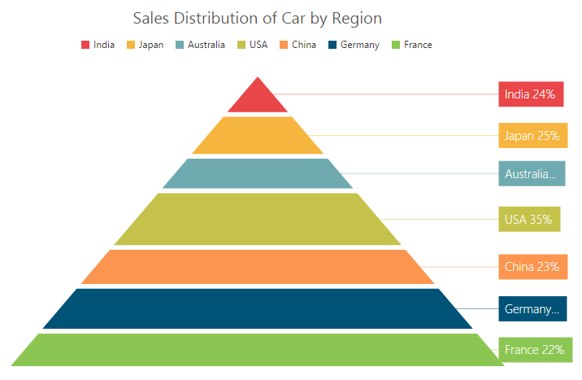

### Explode a pyramid segment

You can explode a pyramid segment on the chart load by using the **ExplodeIndex** of the series.



@(Html.EJ().Chart("chartContainer")

      // ...
    
     .Series(sr =>
     {
         //Set point index value to explode the pyramid segment. 
         sr.ExplodeIndex(4)
            //...
             .Add();
     })
     
     //...
 )



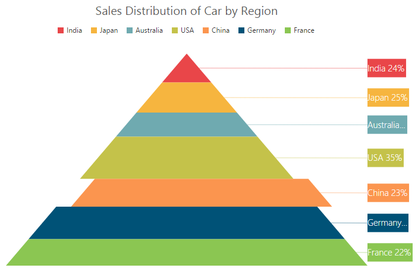

## Funnel Chart

You can create a funnel chart by setting the series Type as **Funnel** in the chart series.  



@(Html.EJ().Chart("chartContainer")

      // ...
    
     .Series(sr =>
     {
         //Set chart type to series
         sr.Type(SeriesType.Funnel)
            //...
             .Add();
     })
     
     //...
 )



[Click](http://mvc.syncfusion.com/demos/web/chart/funnel) here to view the Funnel Chart online demo sample.

### Change the funnel width and height

Funnel segments height and width is calculated from the chart size, by default. You can change this height and width directly without changing the chart size by using the **FunnelHeight** and **FunnelWidth** property of the series.



@(Html.EJ().Chart("chartContainer")

      // ...
    
     .Series(sr =>
     {
         //Change funnel height and width
         sr.FunnelHeight("22%")
             .FunnelWidth("25%")
            //...
             .Add();
     })
     
     //...
 )



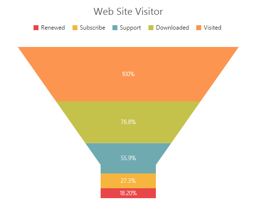

### Explode a funnel segment

You can explode a funnel segment on the chart load by using the **ExplodeIndex** of the series.



@(Html.EJ().Chart("chartContainer")

      // ...
    
     .Series(sr =>
     {
         //Set point index value to explode the funnel segment. 
         sr.ExplodeIndex(3)
            //...
             .Add();
     })
     
     //...
 )



## Bubble Chart

To create a Bubble chart, you can set the series Type as **Bubble** in the chart series. Bubble chart requires 3 fields (*X, Y and Size*) to plot a point. Here, **Size** is used to specify the size of each bubble segment. 



     // Create dataSource to bubble chart
            List<ChartData> data =new List<ChartData>();
            data.Add(new ChartData("Jan", 35, 1.34));
            data.Add(new ChartData("Feb", 28, 1.05));
            data.Add(new ChartData("Mar", 34, 0.45));
            data.Add(new ChartData("Apr", 32, 1.10));
            ViewBag.ChartData = data;



           


@(Html.EJ().Chart("chartContainer")

      // ...
    
     .Series(sr =>
     {
         //Set chart type to series
         sr.Type(SeriesType.Bubble)
             //Add datasource and set xName, yName and size to bubble chart
             .XName("Month")
             .XName("Sales")
             .Size("Profit")
             .DataSource(ViewBag.ChartData)
            //...
             .Add();
     })
     
     //...
 )



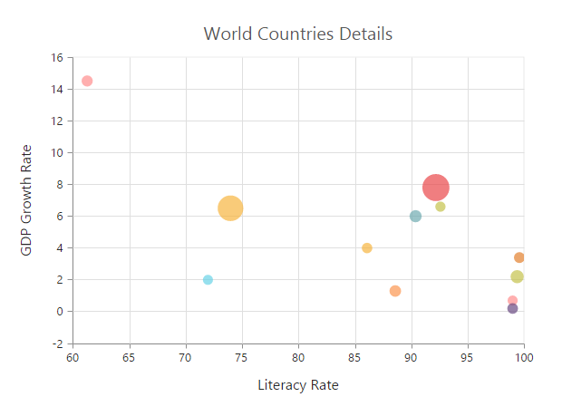

[Click](http://mvc.syncfusion.com/demos/web/chart/bubble) here to view the Bubble Chart online demo sample.

## Scatter

To create a Scatter chart, you can set the series Type as **Scatter** in the chart series. 



@(Html.EJ().Chart("chartContainer")

      // ...
    
     .Series(sr =>
     {
         //Set chart type to series
         sr.Type(SeriesType.Scatter)
            //...
             .Add();
     })
     
     //...
 )



[Click](http://mvc.syncfusion.com/demos/web/chart/scatter) here to view the Scatter Chart online demo sample.

### Customize the scatter chart

You can change the scatter size by using the **Size** property of the series marker. And you can change the scatter color by using the series Fill property. 



@(Html.EJ().Chart("chartContainer")

      // ...
    
     .Series(sr =>
     {
             sr.Marker(mr=>mr.Size(sz=>sz.Height(15).Width(15)))
             //Set fill color to scatter series
             .Fill("#41F282")
            //...
             .Add();
     })
     
     //...
 )



## HiLoOpenClose Chart 

To create a HiLoOpenClose chart, you can set the series Type as **HiloOpenClose** in the chart series. HiLoOpenClose chart requires 5 fields *(X, High, Low, Open and Close)* to plot a segment.  



        // Create dataSource to chart
            List<ChartData> data =new List<ChartData>();
            data.Add(new ChartData("Jan", 38, 10,38, 29));
            data.Add(new ChartData("Feb", 28, 15, 18, 27));
            data.Add(new ChartData("Mar", 54, 35, 38, 49));
            data.Add(new ChartData("Apr", 52, 21, 35, 29));
            ViewBag.ChartData = data;




 @(Html.EJ().Chart("chartContainer")

      // ...
    
     .Series(sr =>
     {
             //Set chart type to series
             sr.Type(SeriesType.HiloOpenClose)
                 //Add datasource and set xName, high and low to hiloopenclose chart
             .XName("Month")
             .High("High")
             .Low("Low")
             .Open("Open")
             .Close("Close")
             .DataSource(ViewBag.ChartData)
            //...
             .Add();
     })
     
     //...
 )



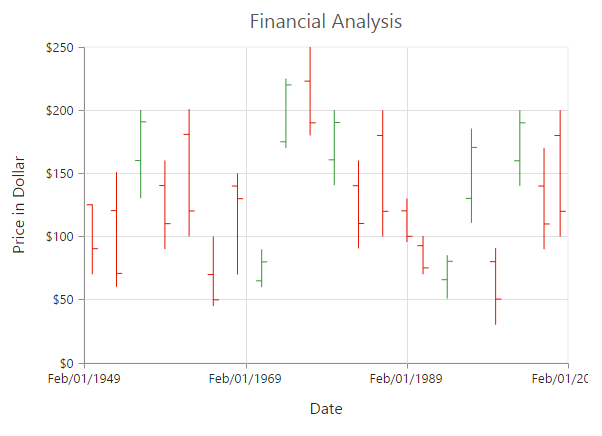

[Click](http://mvc.syncfusion.com/demos/web/chart/hiloopenclose) here to view the HiLoOpenClose Chart online demo sample.

### DrawMode

You can change the HiLoOpenClose chart **DrawMode** to *Open, Close* or *Both*. The default value of DrawMode is **Both**. 



@(Html.EJ().Chart("chartContainer")

      // ...
    
     .Series(sr =>
     {
         //Change the OHLC drawMode type
             sr.DrawMode(SeriesDrawMode.Open)
            //...
             .Add();
     })
     
     //...
 )



### Bull and Bear Color	

HiLoOpenClose chart **BullFillColor** is used to specify a fill color for the segments that indicates an increase in stock price in the measured time interval and **BearFillColor** is used to specify a fill color for the segments that indicates a decrease in the stock price in the measured time interval. 



@(Html.EJ().Chart("chartContainer")

      // ...
    
     .Series(sr =>
     {
         //Change bullFill and bearFill color of hiloopenclose chart
         sr.BearFillColor("#FF6600")
             .BullFillColor("#336600")
            //...
             .Add();
     })
     
     //...
 )



## Candle

You can create a Candle chart by specifying the series Type as **Candle** in the chart series. Candle chart requires 5 fields *(X, High, Low, Open and Close)* to plot a segment.



        // Create dataSource to chart
            List<ChartData> data =new List<ChartData>();
            data.Add(new ChartData("Jan", 38, 10,38, 29));
            data.Add(new ChartData("Feb", 28, 15, 18, 27));
            data.Add(new ChartData("Mar", 54, 35, 38, 49));
            data.Add(new ChartData("Apr", 52, 21, 35, 29));
            ViewBag.ChartData = data;





 @(Html.EJ().Chart("chartContainer")

      // ...
    
     .Series(sr =>
     {
             //Set chart type to series
             sr.Type(SeriesType.Candle)
                 //Add datasource and set xName, high and low to candle chart
             .XName("Month")
             .High("High")
             .Low("Low")
             .Open("Open")
             .Close("Close")
             .DataSource(ViewBag.ChartData)
            //...
             .Add();
     })
     
     //...
 )



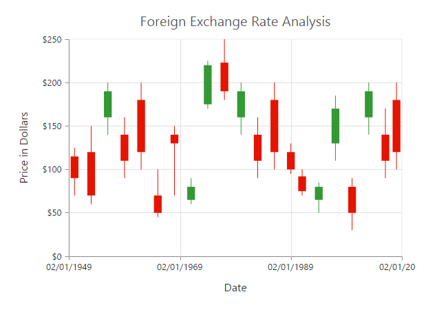

[Click](http://mvc.syncfusion.com/demos/web/chart/candle) here to view the Candle Chart online demo sample.

### Bull and Bear Color

Candle chart **BullFillColor** is used to specify a fill color for the segments that indicates an increase in the stock price in the measured time interval and **BearFillColor** is used to specify a fill color for the segments that indicates a decrease in the stock price in the measured time interval.



 @(Html.EJ().Chart("chartContainer")

      // ...
    
     .Series(sr =>
     {
         //Change bullFill and bearFill color of candle chart
         sr.BearFillColor("#FF6600")
             .BullFillColor("#336600")
            //...
             .Add();
     })
     
     //...
 )



## HiLo

HiLo chart is created by setting the series Type as **Hilo** in the chart series. HiLo chart requires 3 fields *(X, High and Low)* to plot a segment.  



     // Create dataSource to chart
            List<ChartData> data =new List<ChartData>();
            data.Add(new ChartData("Jan", 38, 10));
            data.Add(new ChartData("Feb", 28, 15));
            data.Add(new ChartData("Mar", 54, 35));
            data.Add(new ChartData("Apr", 52, 21));
            ViewBag.ChartData = data;
            



            

 
 @(Html.EJ().Chart("chartContainer")

      // ...
    
     .Series(sr =>
     {
         //Set chart type to series
         sr.Type(SeriesType.Hilo)
             //Add datasource and set xName, high and low to hilo chart
             .XName("Month")
             .High("High")
             .Low("Low")
            //...
             .Add();
     })
     
     //...
 ) 



[Click](http://mvc.syncfusion.com/demos/web/chart/hilo) here to view the HiLo Chart online demo sample.

## Polar

Polar chart is created by setting the series Type as **Polar** in the chart series. 



@(Html.EJ().Chart("chartContainer")

      // ...
    
     .Series(sr =>
     {
         //Set chart type to series
         sr.Type(SeriesType.Polar)
            //...
             .Add();
     })
     
     //...
 )



[Click](http://mvc.syncfusion.com/demos/web/chart/polar) here to view the Polar Chart online demo sample.

### DrawType

Polar **DrawType** property is used to change the series plotting type to *Line*, *Column* or *Area*. The default value of DrawType is **Line**.  



@(Html.EJ().Chart("chartContainer")

      // ...
    
     .Series(sr =>
     {
         //Change polar series drawType
         sr.DrawType(DrawType.Column)
            //...
             .Add();
     })
     
     //...
 ) 



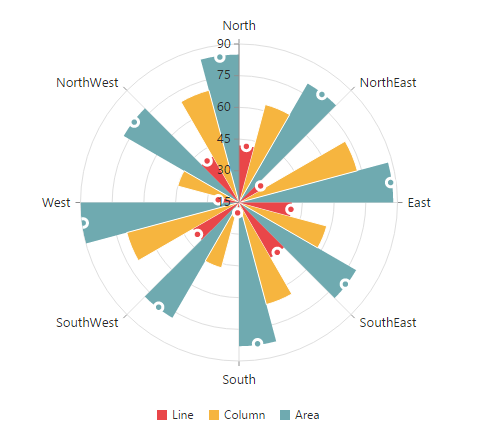

### Stack columns in Polar chart

By using the **IsStacking** property, you can specify whether the column has to be stacked when the DrawType is column. Its default value is **False**.



@(Html.EJ().Chart("chartContainer")

      // ...
    
     .Series(sr =>
     {
         //Enable isStacking property for stacked column polar chart
         sr.IsStacking(true)
            //...
             .Add();
     })
     
     //...
 ) 



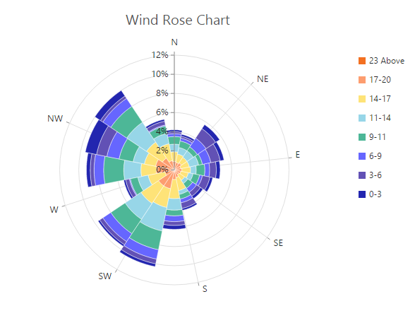

[Click](http://mvc.syncfusion.com/demos/web/chart/windrose) here to view the Polar Wind Rose Chart online demo sample.

## Radar Chart  

To create a Radar chart, you can specify the series Type as **Radar** in the chart series.



@(Html.EJ().Chart("chartContainer")

      // ...
    
     .Series(sr =>
     {
         //Set chart type to series
         sr.Type(SeriesType.Radar)
            //...
             .Add();
     })
     
     //...
 )



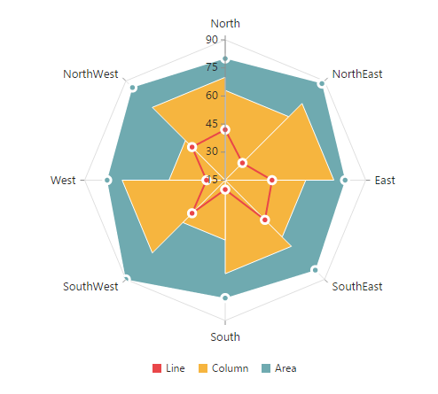

[Click](http://mvc.syncfusion.com/demos/web/chart/radar) here to view the Radar Chart online demo sample.

### DrawType

Radar **DrawType** property is used to change the series plotting type to *Line*, *Column* or *Area*. The default value of DrawType is **Line**.



@(Html.EJ().Chart("chartContainer")

      // ...
    
     .Series(sr =>
     {
         //Change radar series drawType
         sr.DrawType(DrawType.Column)
            //...
             .Add();
     })
     
     //...
 )  



### Stack columns in Radar chart

By using the **IsStacking** property, you can specify whether the column has to be stacked when the DrawType is set as Column. Its default value is set to *False*.



@(Html.EJ().Chart("chartContainer")

      // ...
    
     .Series(sr =>
     {
         //Enable isStacking property for stacked column radar chart
         sr.IsStacking(true)
            //...
             .Add();
     })
     
     //...
 )



## Waterfall Chart 

For rendering a Waterfall chart, set series *Type* as **Waterfall** in the chart series. To change the waterfall series segment color use *Fill* option of series and use *PositiveFill* property to differentiate the positive segments.

N> The inline property of the **Series.PositiveFill** has the first priority and override the **Series.Fill**.



@(Html.EJ().Chart("container")
       
        .Series(sr =>
            {
                //...
                //Change series type
                sr.Type(SeriesType.Waterfall)
                .Fill("#C64E4A").PositiveFill("#93C952").Add();
            })
       //...
  )
  


[Click](http://mvc.syncfusion.com/demos/web/chart/waterfall) here to view the Waterfall Chart online demo sample.

**ShowIntermediateSum**

To display the summary of values since the last intermediate point of the waterfall series, set **ShowIntermediateSum** property as true in the specific point.



   @(Html.EJ().Chart("container")
   
        //...
        .Series(sr =>
            {
                sr.Points(pt =>
                    {
                       //Enable showIntermediateSum in to a point.
                        pt.X("Intermediate sum").ShowIntermediateSum(true).Add();
                        //...
                        
                    }).Add();
            })
            
          //...
    )



**ShowTotalSum**

The sum of all previous point in the waterfall series is displayed on enabling the **ShowTotalSum** property for a specific point.



    @(Html.EJ().Chart("container")
         
         //...
        .Series(sr =>
            {
                sr.Points(pt =>
                    {
                       //Enable showTotalSum in to a point.
                        pt.X("Total sum").ShowTotalSum(true).Add();
                        //...
                        
                    }).Add();
            })
            
          //...
    )



### ConnectorLine

To customize the connector line color, width, opacity and dashArray of the waterfall series, you can use **ConnectorLine** option of series.



    @(Html.EJ().Chart("container")
        .Series(sr =>
            {
                sr .ConnectorLine(cl=>cl.Color("#333000")
                   .Width(1).Opacity(1).DashArray("2,3"))
                   .Add();
            })
            
          //...
    )



## ErrorBar Chart 

EjChart can generate Error bar for Cartesian type series *(Line, Column, Bar, Scatter, Area, Candle, HiLo, etc.)*. To render the Error bar for the series, set *Visibility* as *"visible"* to **ErrorBar** in the series.



@(Html.EJ().Chart("container")     
        
        //...       
        .Series(sr =>
               {
                  //To toggle the error bar visibility
                 sr.ErrorBar(er =>
                           er.Visible("visible")).Add();
                  
             })            
          //...          
     )



[Click](http://mvc.syncfusion.com/demos/web/chart/errorbar) here to view the ErrorBar Chart online demo sample.

### Changing Error Bar Type

You can change the error bar rendering type using **Type** *(like FixedValue, Percentage, StandardDeviation, StandardError and Custom)* option of errorBar. To change the error bar line length you can use **VerticalErrorValue** property.



   @(Html.EJ().Chart("container")     
        
        //...       
        .Series(sr =>
               {
                  //To change the error bar type
                 sr.ErrorBar(er =>
                    er.Type(ErrorBarType.FixedValue)
                    .VerticalErrorValue(3)).Add();
             })            
        //...          
     )



#### Customizing error bar type              

To customize the error bar type, set error bar Type as **Custom** and then change the horizontal/vertical positive and negative value of error bar.



  @(Html.EJ().Chart("container")     
  
        //...       
        .Series(sr =>
               {
                  //To change the error bar type. 
                 sr.ErrorBar(er =>
                           er.Type(ErrorBarType.Custom)
                              .VerticalPositiveErrorValue(5)
                              .HorizontalPositiveErrorValue(1)
                              .VerticalNegativeErrorValue(5)
                              .HorizontalNegativeErrorValue(1)).Add();
             })            
        //...          
    ) 



### Changing Error Bar Mode

Error bar mode is used to define whether the error bar line has to be drawn *Horizontally, Vertically* or in *Both* side.  To change the error bar mode use ErrorBar.Mode option.



   @(Html.EJ().Chart("container")     
        //...       
        .Series(sr =>
               {
                  //To change the error bar mode. 
                 sr.ErrorBar(er =>
                           er.Type(ErrorBarType.FixedValue)
                             .Mode(ErrorBarMode.Vertical)).Add();
             })            
        //...          
    )



### Changing Error Bar Direction

You can change the error bar direction to plus, minus or both side using ErrorBar.Directions option.



  @(Html.EJ().Chart("container")     
        //...       
        .Series(sr =>
               {
                  //To change the error bar direction 
                 sr.ErrorBar(er =>
                           er.Type(ErrorBarType.FixedValue)
                             .Mode(ErrorBarMode.Vertical)
                             .Direction(ErrorBarDirection.Minus)).Add();
             })            
        //...          
    )



### Customizing Error bar cap

To customize the errorBar cap visibility, length, width and fill color, you can use **Cap** option in the **Series.ErrorBar**.



 @(Html.EJ().Chart("container")     
 
        //...       
        .Series(sr =>
               {
               //To customize the error bar cap
                 sr.ErrorBar(er =>
                           er.Cap(cp=>
                                   cp.Visible(true)
                                    .Length((20),
                                    .Width(1),
                                    .Fill(“#000000”))).Add();
             })            
        //...          
   )



