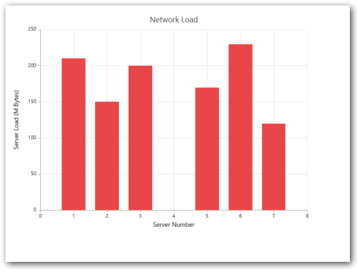

# Empty Points 

The Data points that uses the **null** or **undefined** as value are considered as empty points. Empty data points are ignored and not plotted in the Chart. When the data is provided by using the Points property, you can set the **IsEmpty** to true to specify that the particular point is an empty point.   



    @(Html.EJ().Chart("chartContainer")
	   // ...              
        . Series(sr =>{

             //Using empty points 
             sr.Points(pt => {
                 pt.X("0").Y(210).Add(); pt.X("1").Y(0).Add(); 
                pt.X("2").Y(150).Add(); pt.X("3").Y(180).IsEmpty(true).Add();
                pt.X("4").Y(170).Add(); pt.X("5").Y(200).Add();
                pt.X("6").Y(140).IsEmpty(true).Add();
                pt.X("7").Y(120).Add(); pt.X("8").Y(140).Add(); 
             }).Add();                     
             // ...
         })
     
       // ...
    )



[Click](http://mvc.syncfusion.com/demos/web/chart/emptypoints) here to view the online demo sample for empty points.

## EmptyPointSettings

You can customize the empty points visibility and change its **DisplayMode** *(gap, zero and average)* using *EmptyPointSettings* option.



     @(Html.EJ().Chart("chartContainer")
	   // ...              
        . Series(sr =>{

             //Using empty points 
             sr.Points(pt => {
                 pt.X("0").Y(210).Add(); pt.X("1").Y(0).Add(); 
                pt.X("2").Y(150).Add(); pt.X("3").Y(180).IsEmpty(true).Add();
                pt.X("4").Y(170).Add(); pt.X("5").Y(200).Add();
                pt.X("6").Y(140).IsEmpty(true).Add();
                pt.X("7").Y(120).Add(); pt.X("8").Y(140).Add(); 
             })// visible the EmptyPointSettings
                   .EmptyPointSettings(e => e.Visible(true)             
                             .DisplayMode(ChartEmptyPointMode.Average)
                ).Add();                     
             // ...
         })
     
       // ...
    )



If the *Visible* property of EmptyPointSettings is *false*, then the empty points has been dropped and chart will be rendered without empty points.

## Customizing Styles

Empty points color and border can be customized using **Style** property of EmptyPointSettings.



  @(Html.EJ().Chart("container")
	  // ...              
      . Series(sr =>{
             
             .EmptyPointSettings(e => e.Visible(true)
                   .Style(s => sl.Color("Pink")
                   .Border(b => b.Color("gray").Width(2))) 
               .Add();
             // ...
       })
   
      // ...
  )



