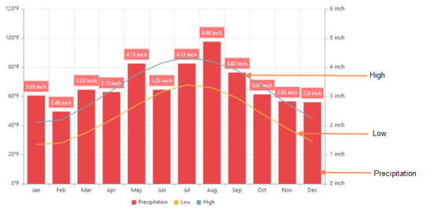
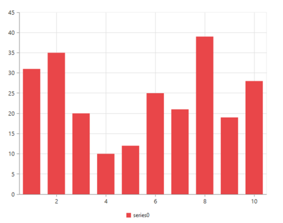
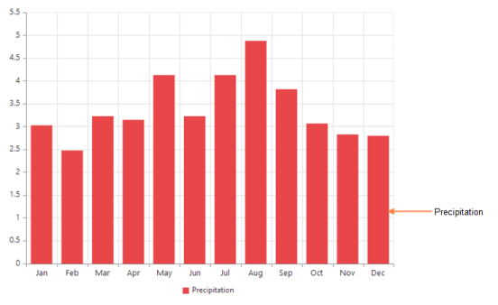

# Getting Started

This section explains briefly you on how to create a Chart in your application with ASP.NET MVC.

## Create your first Chart in ASP.NET MVC

This section encompasses how to configure the MVC Charts for your business needs. You can also pass the required data to default Chart and customize it according to your requirements. In this example, you can see how to display the average climate data for Washington, DC during the period 1961 -1990.

### Configure Chart

Getting started with your MVC Chart is very easy. You can start by creating a simple line Chart.

1. Create an MVC Project and add necessary Dll’s and Scripts by referring [MVC-Getting Started](http://help.syncfusion.com/ug/js/Documents/gettingstartedwithmv.htm) Documentation.
2. You can create a simple div tag.

3. You can add the following code in the index.cshtml file to create the Chart control in the View page. 


    
 

           @(Html.EJ().Chart("chartcontainer")

           ) 

    
 



The above code example renders a Chart with the default Columnseries type and some random values assigned to the column series. 

The following screenshot displays the Chart.

### Add a Chart series

By default, line series is used. To create a series, you need to add the following code example to the scripts. For example, the following steps illustrate how to add a column series to the Chart.

1. You need to add the name of the series displayed in the Chart legend.
2. Then, you need to specify the type of series you want to render using “type” property.
3. You can add x and y points to the series as in the following code example.


  @(Html.EJ().Chart("chartcontainer")

     .Series(sr =>

            {

                sr.Points(pt =>

                    {

                        pt.X("Jan").Y(3.03).Add();

                        pt.X("Feb").Y(2.48).Add();

                        pt.X("Mar").Y(3.23).Add();

                        pt.X("Apr").Y(3.15).Add();

                        pt.X("May").Y(4.13).Add();

                        pt.X("Jun").Y(3.23).Add();

                        pt.X("Jul").Y(4.13).Add();

                        pt.X("Aug").Y(4.88).Add();

                        pt.X("Sep").Y(3.82).Add();

                        pt.X("Oct").Y(3.07).Add();

                        pt.X("Nov").Y(2.83).Add();

                        pt.X("Dec").Y(2.8).Add();

                    }).Name("Precipitation").Type(SeriesType.Column).Add();

            })

        )


The following screenshot displays a Chart series:

### Add JSON data to the Chart

You can add JSON data to the Chart using the datasource property in Chart series.

In Controllers/HomeController.cs.



public ArrayList GetData()

        {

            ArrayList dataTable = new ArrayList();

            dataTable.Add(new ChartData("Jan", 42, 27, 3.03));

            dataTable.Add(new ChartData("Feb", 44, 28, 2.48));

            dataTable.Add(new ChartData("Mar", 53, 35, 3.23));

            dataTable.Add(new ChartData("Apr", 64, 44, 3.15));

            dataTable.Add(new ChartData("May", 75, 54, 4.13));

            dataTable.Add(new ChartData("Jun", 83, 63, 3.23));

            dataTable.Add(new ChartData("Jul", 87, 68, 4.13));

            dataTable.Add(new ChartData("Aug", 84, 66, 4.88));

            dataTable.Add(new ChartData("Sep", 78, 59, 3.82));

            dataTable.Add(new ChartData("Oct", 67, 48, 3.07));

            dataTable.Add(new ChartData("Nov", 55, 38, 2.83));

           }
		   