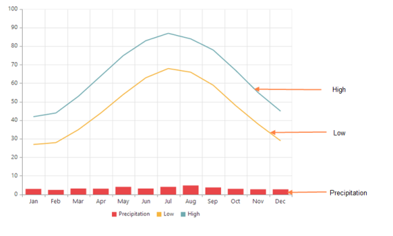
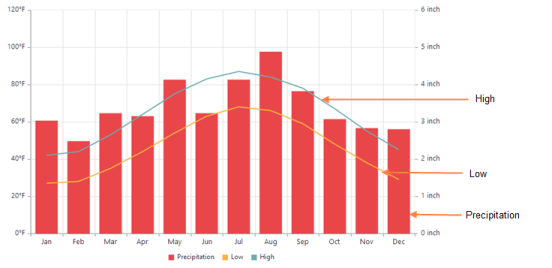
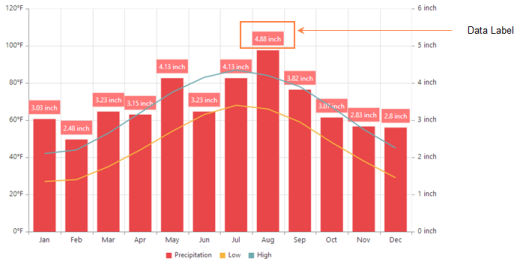
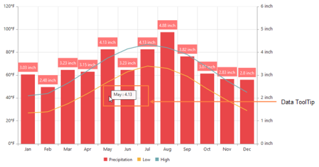

# Getting Started

This section explains you the steps required to populate the Chart with data, add data labels, tooltips and title to the Chart. This section covers only the minimal features that you need to know to get started with the Chart.

## Installation and Deployment

It describes you on how to configure the Syncfusion dependencies in your ASP.NET MVC application to create a Chart.

### Referencing Syncfusion Assemblies

The following assemblies need to be referenced in your application for using Essential Chart MVC

1. Syncfusion.EJ.dll
2. Syncfusion.EJ.MVC.dll

Follow the steps given below to deploy the application in the development server by referencing the assembly in **GAC**.

* Web.config file should be configured according to the referenced assemblies. 
* To deploy your application, you have to ensure that the above referenced assemblies (in your web.config files) are present in the GAC.

And, add Syncfusion namespace in the Web.config file of Views folder to generate Chart builder code in View page.

 

N> If you are referring Syncfusion dll's manually from bin folder to create MVC Chart, then remove Culture, Version and PublicKeyToken attributes used in all, and nodes.

###  Adding script reference

Add the below scripts references and Syncfusion **ScriptManager** to execute the script as mentioned in the following code snippet in layout page.



    <!--  jquery script  -->
    
    
    <!-- Essential JS UI widget -->
    
    
    <!--Add Syncfusion Script Manager -->
    @Html.EJ().ScriptManager()



N> If you are using the Essential Studio below 13.4.0.53 version, then you need to refer **jQuery.globalize.js** script file along with the above references to render the Chart control.

To render the MVC Chart in unobtrusive mode refer **ej.unobtrusive.js** script file. Otherwise set false to **UnobtrusiveJavaScriptEnabled** in Web.config file.

In the above code, ej.web.all.min.js script reference has been added for demonstration purpose. It is not recommended to use this for deployment purpose, as its file size is larger since it contains all the widgets. Instead, you can use [`CSG`](http://csg.syncfusion.com/) utility to generate a custom script file with the required widgets for deployment purpose.

## Initialize chart

Add the following code in the index.cshtml file to create the Chart control in View page.



    @(Html.EJ().Chart("chartContainer"))



Now, the Chart is rendered with some auto-generated random values and with default Column chart type.

Initialize the chart by using the ejChart method. The chart is rendered to the size of its container, by default. You can also customize the chart dimension either by setting the width and height of the container element as in the above code example or by using the **Size** option of the Chart. Refer to the [`Chart Dimensions`](chart-dimensions.html) to know more about setting the size of the chart.

## Populate chart with data

Now, let’s see how to plot data source to the Chart. First, let us generate a data source containing following fields in controller– Month and Sales.


    public class HomeController : Controller
    {
        public ActionResult Index()
        {
            //// Create dataSource to chart
            List<ChartData> data = new List<ChartData>();
            data.Add(new ChartData("Jan", 35));
            data.Add(new ChartData("Feb", 28));
            data.Add(new ChartData("Mar", 34));
            data.Add(new ChartData("Apr", 32));
            data.Add(new ChartData("May", 40));
            data.Add(new ChartData("Jun", 32));
            data.Add(new ChartData("Jul", 35));
            data.Add(new ChartData("Aug", 55));
            data.Add(new ChartData("Sep", 38));
            data.Add(new ChartData("Oct", 30));
            data.Add(new ChartData("Nov", 25));
            data.Add(new ChartData("Dec", 32));
            ///...
            ViewBag.ChartData = data;
            return View();
        }
     }          

    public class ChartData {
        public string Month;
        public double Sales;
        public ChartData(string month, double sales)
        {
            this.Month = month;
            this.Sales = sales;
        }
    }



Add a Series object to the chart using **Series** option and set the chart type as **Line** using **Type** option. 



           @using Syncfusion.JavaScript.DataVisualization
           

               @(Html.EJ().Chart("chartContainer")
                    .Series(sr =>
                         { 
                            //Change series type
                            sr.Type(SeriesType.Line).Add();                  
                         })
               )
          



You can also add multiple series objects based on your requirement. Refer [`Chart Types`](Chart-Types.html) and [`Chart Series`](Chart-Series.html) sections to know more about chart types, how to add multiple series and customize series appearance.

Next, map the Month and Sales values in the data source to the Line series by setting XName and YName with the field names respectively, and then set the actual data using DataSource option. Refer [`Data Binding`](working-with-data.html) section to know more about binding local and remote data to the chart.



     @(Html.EJ().Chart("chartContainer")
            .Series(sr =>
                {
                    sr.DataSource(ViewBag.ChartData)
                    .Type(SeriesType.Line)
                    .XName("Month").YName("Sales")
                    .Add();                  
                })
       )



Since the data is related to Sales, format the vertical axis labels by adding ‘$’ as a prefix and ‘K’ as a suffix to each label. This can be achieved by setting the “${value}K” to the **LabelFormat** option of the axis. Here, {value} acts as a placeholder for each axis label, “$” and “K” are the actual prefix and suffix added to each axis label. 

The following code example illustrates this,



     @(Html.EJ().Chart("chartContainer")

            //Customize the axis label format.
            .PrimaryYAxis(pry=>pry.LabelFormat("${value}K"))

            //...
     )



Refer [`Axis`](Axis.html) section to know more about axis types, adding multiple axes and other customization options.

## Add Data Labels

You can add data labels to improve the readability of the chart. This can be achieved by enabling the Visible option in the **DataLabel** option. Now, the data labels are rendered at the top of all the data points.

The following code example illustrates this,



     @(Html.EJ().Chart("chartContainer")
             .Series(sr =>
                { 
                     //Display data label in chart
                    .Marker(mr=>mr.DataLabel(label=>label.Visible(true)))
                    //...
                    .Add();                  
                })
                //...
     )



There are situations where the default label content is not sufficient to the user. In this case, you can use the **Template** option to format the label content with some additional information.

 

<!DOCTYPE html>
<html>
<body>
      

         
#point.x#:$#point.y#K

      

</body>
</html>



The above HTML template is used as a template for each data label. Here, “point.x” and “point.y” are the placeholder text used to display the corresponding data point’s x & y value.

The following code example shows how to set the id of the above template to Template option,



    @(Html.EJ().Chart("chartContainer")
             .Series(sr =>
                { 
                     //Display data label in chart
                   .Marker(mr=>mr.DataLabel(label=>label.Visible(true).
                        //Set the id of HTML template to the chart series
                        Template("dataLabelTemplate"))
                        )
                    //...
                    .Add();                  
                })
                //...
     )



Refer to the [`Data Markers`](Data-Markers.html) section to know more about the options available to customize it.

## Enable Legend

You can enable or disable the legend by using the Visible option in the **Legend**. It is enabled in the chart, by default.



    @(Html.EJ().Chart("chartContainer")
            .Series(sr =>
                {
                        //Add series name to display on the legend item
                        .Name("Sales")
                        .Add();                  
                })
                //Enable chart legend
                .Legend(legend=>legend.Visible(true))
                //...
     )



Refer to the [`Legend`](Legend.html) section to know more about how to position legend and customize its appearance.

## Enable Tooltip

The Tooltip is useful when you cannot display information by using the **DataLabels** due to the space constraints. You can enable tooltip by using the Visible option of the **Tooltip** in the specific series.

The following code example illustrates this,



    @(Html.EJ().Chart("chartContainer")
            .Series(sr =>
                {
                        //...
                        //Enable tooltip in chart area
                        .Tooltip(tooltip=>tooltip.Visible(true))
                    .Add();                  
                })
                //...
     )



Refer to the [`Tooltip`](user-interactions.html) section to know more about formatting tooltip contents and customizing its appearance.

## Add Chart Title

You need to add a title to the chart to provide quick information to the user about the data being plotted in the chart. You can add it by using the Text option of the **Title**.



    @(Html.EJ().Chart("chartContainer")

                // ...
                 //Add chart title
                .Title(title=>title.Text("Sales Analysis"))
                // ...
     )



Refer to the [`Chart Title`](chart-title.html) section to know more about aligning Title, customizing its appearance and adding SubTitle to the chart.
