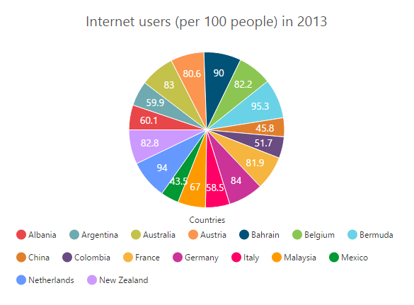
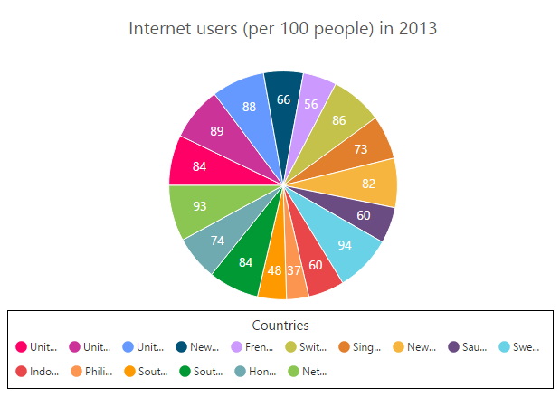
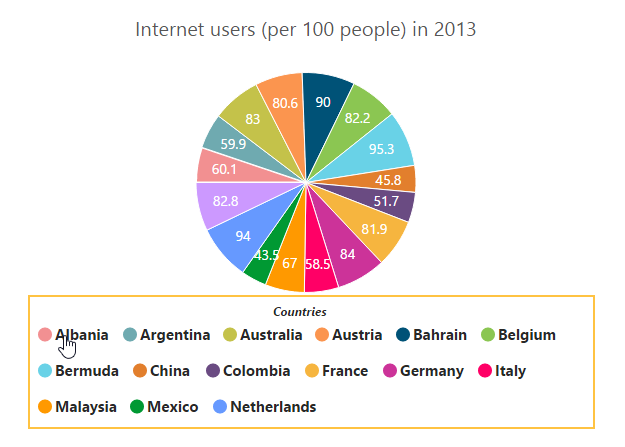

# Legend

The legend contains the list of Chart Series and Trendlines that appear in a chart. 

## Legend Visibility

By default, the legend is enabled in the chart. You can enable or disable it by using the *Visible* option of the **Legend**.



@(Html.EJ().Chart("chartContainer")

      // ...
    
    //Visible chart legend
    .Legend(lg=>lg.Visible(true))
     //...
 )



[Click](http://mvc.syncfusion.com/demos/web/chart/legendposition) here to view the online demo sample for legend customization.

## Legend title

To add the title to the legend, you have to specify the **Legend.Title.Text** option.



@(Html.EJ().Chart("chartContainer")

      // ...
    
    //Visible chart legend
    .Legend(legend=>legend.Title(title=>
        //Add title to the chart legend
        title.Text("Countries"))
    )
     //...
 )



## Position and Align the Legend

By using the **Position** option, you can position the legend at *Left*, *Right*, *Top* or *Bottom* of the chart. The legend is positioned at the **Bottom** of the chart, by default.



@(Html.EJ().Chart("chartContainer")

      // ...
    
    .Legend(lg=>lg.
        //...
        //Place the legend at top of the chart        
        Position(LegendPosition.Top)
    )
     //...
 )



**Legend Alignment**

You can align the legend to the *Center*, *Far* or *Near* based on its position by using the **Alignment** option.



@(Html.EJ().Chart("chartContainer")

      // ...
    
    .Legend(lg=>lg.
        //...
        //The below two settings will place the legend at the top-right corner of the chart.
        Position(LegendPosition.Top)
        .Alignment(Syncfusion.JavaScript.DataVisualization.TextAlignment.Far)
    )
     //...
 )



## Arrange legend items in the rows and columns

You can arrange the legend items horizontally and vertically by using the **RowCount** and **ColumnCount** options of the legend.

* When only the RowCount is specified, the legend items are arranged according to the RowCount and number of columns may vary based on the number of legend items.

* When only the ColumnCount is specified, the legend items are arranged according to the ColumnCount and number of rows may vary based on the number of legend items.

* When both the options are specified, then the one which has higher value is given preference. For example, when the RowCount is 4 and ColumnCount is 3, legend items are arranged in 4 rows.

* When both the options are specified and have the same value, the preference is given to the ColumnCount when it is positioned at the top/bottom position. The preference is given to the RowCount when it is positioned at the left/right position.
 



@(Html.EJ().Chart("chartContainer")

      // ...
    
    .Legend(lg=>lg
        //...
        //Arrange legend items in 4 rows and approximately 4 columns. Column couldn’t may vary based on number of items.
        .RowCount(4)
        .ColumnCount(4)
    )
     //...
 )



## Customization

### Legend shape

To change the legend icon shape, you have to specify the shape in the **Shape** property of the legend. When you want the legend icon to display the prototype of the series, you have to set the **SeriesType** as shape.



@(Html.EJ().Chart("chartContainer")

      // ...
    
    .Legend(lg=>lg
        //...
        //Change legend shape
        .Shape(ChartShape.SeriesType)
    )
     //...
 )



### Legend items size and border

You can change the size of the legend items by using the *ItemStyle.Width* and *ItemStyle.Height* options. To change the legend item border, use **Border** option of the legend ItemStyle.



@(Html.EJ().Chart("chartContainer")

      // ...
    
    .Legend(lg=>lg
        //...
        //Change legend items border, height and width
        .ItemStyle(item=>item.Width(13).Height(13).Border(br=>br.Width(1).Color("#FF0000")))
    )
     //...
 )



### Legend size

By default, legend takes 20% of the **Height** horizontally when it was placed on the top or bottom position and 20% of the **Width** vertically while placing on the left or right position of the chart. You can change this default legend size by using the **Size** option of the legend.  



@(Html.EJ().Chart("chartContainer")

      // ...
    
    .Legend(lg=>lg
        //...
        //Change legend size
        .Size(size=>size.Height("100").Width("550"))
    )
     //...
 )



### Legend Item Padding

You can control the spacing between the legend items by using the **ItemPadding** option of the legend.  The default value is 10. 



@(Html.EJ().Chart("chartContainer")

      // ...
    
    .Legend(lg=>lg
        //...
        //Add space between each legend item
        .ItemPadding(15)
    )
     //...
 )



### Legend border

You can customize the legend border by using the **Border** option in the legend. 



@(Html.EJ().Chart("chartContainer")

      // ...
    
    .Legend(lg=>lg
        //...
        //Set border color and width to legend
        .Border(br=>br.Color("#FFC342").Width(2))
    )
     //...
 )



### Scrollbar for legend

You can enable or disable the legend scrollbar by using the **EnableScrollbar** option of the legend. When you disable the scrollbar option, the legend does not consider the default size and chart draws in the remaining space. If you have specified the **size** to the legend with the scrollbar disabled, then the legends beyond this limit will get clipped.The default value of EnableScrollbar option is **true**.  



@(Html.EJ().Chart("chartContainer")

      // ...
    
    .Legend(lg=>lg
        //...
        //Enable scrollbar option in for legend
        .EnableScrollbar(true)
        .Size(size=>size.Width("430").Height("80"))
    )
     //...
 )



### Customize the legend text

To customize the legend item text and title you can use the **Legend.Font** and **Legend.Title** options. You can change the legend title alignment by using the TextAlignment option of the legend title.



@(Html.EJ().Chart("chartContainer")

      // ...
    
    .Legend(lg=>lg
        //...
        //Customize the legend item text
        .Font(font=>font.FontFamily("Segoe UI").FontStyle(ChartFontStyle.Normal)
            .FontWeight(ChartFontWeight.Bold).Size("15px"))
        .Title(title=>title
            .TextAlignment(Syncfusion.JavaScript.DataVisualization.TextAlignment.Center)
            //Customize the legend title text
            .Font(font=>font.FontFamily("Segoe UI").FontStyle(ChartFontStyle.Italic)
                .FontWeight(ChartFontWeight.Bold).Size("12px"))
        )
    )
     //...
 )



### LegendItems Text Overflow

**Trim**

You can trim the legend item text when its width exceeds the **Legend.TextWidth**, by specifying *TextOverflow* as **Trim**. The original text will be displayed on mouse hover.



      @(Html.EJ().Chart("container") 
         // ... 

         //trim the legend text  
         .Legend(lg=>lg.Visible(true).TextOverflow(TextOverflow.Trim)
                 .TextWidth(34))
         // ... 

       )



**Wrap**

By specifying *TextOverflow* as **Wrap**, you can wrap the legend text by word.

**WrapAndTrim**

You can wrap and trim the legend text by specifying *TextOverflow* as **WrapAndTrim**. The original text will be displayed on mouse hover.

## Handle the legend item clicked

You can get the legend item details such as *Index*, *Bounds*, *Shape* and *Series* by subscribing the **LegendItemClick** event on the chart. When the legend item is clicked, it triggers the event and returns the Legend information. 



 @(Html.EJ().Chart("chartContainer")

      // ...
    
    .Legend(lg=>lg
       .Visible(true)
        //...       
    )
     //Subscribe the legend item click event
     .LegendItemClick("onLegendClicked")
 )
        
     function onLegendClicked(sender) {
        //Get legend item details on legend item click.
        var legendItem = sender.data;
      }



## Series selection on legend item click

You can select a specific series or point while clicking on the corresponding legend item through disabling the **ToggleSeriesVisibility** option of the legend. The default value of toggleSeriesVisibility option is **true**. To customize the series selection refer to the series Selection.



@(Html.EJ().Chart("chartContainer")

      // ...
    
    .Legend(lg=>lg
       //Disable series collapsing on legend item clicked
       .ToggleSeriesVisibility(false)
        //...       
    )
     //...
 )
      



## Collapsing legend item

You can collapse the specific series/point legend item displaying in the chart, by setting the **VisibleOnLegend** as *Hidden* in the point or series.



     @(Html.EJ().Chart("chartContainer")
	   // ...              
        . Series(sr =>{

             //Initializing Series
             sr.Points(pt => {
                 pt.X("Albania").Y(60.1).Add();
                 //...
                 //Collapse the point's legend item in the legend collection
                 pt.X("New Zealand").Y(82.8).VisibleOnLegend(VisibleOnLegend.Hidden).Add(); 
             })// visible the EmptyPointSettings
             .EmptyPointSettings(e => e.Visible(true)).Add();                     
             // ...
         })
     .Legend(lg=>lg.Visible(true))
       // ...
    )
      


