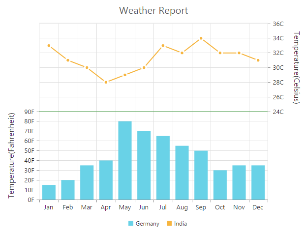
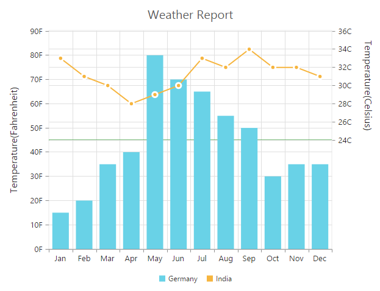

# Multiple panes

Chart area can be divided into multiple panes using the **RowDefinitions** and **ColumnDefinitions** properties.

### Row Definitions

To split the chart area vertically into a number of rows, use RowDefinitions of the chart. 

* You can allocate space for each row by using the **Unit** option that determines whether the chart area should be split by *percentage* or *pixels* for the given **RowHeight** value of the RowDefinitions.
 
* To associate a vertical axis to a row, specify the RowDefinitions **Index** value to the RowIndex property of the chart axis.

* To customize each row’s horizontal line, use LineColor and LineWidth property.



@(Html.EJ().Chart("chartContainer")

      // ...
      //  Splitting chart area into multiple rows
      .RowDefinitions(rd =>
      {
          rd
              //  Split first row of the chart area
              .Unit("percentage").LineColor("Gray").LineWidth(0).RowHeight(50).Add();
          //  Split second row of the chart area
          rd.Unit("percentage").LineColor("green").LineWidth(0).RowHeight(50).Add();
      })
      .Axes(ax =>
      {
          //Create secondary axis and bind it to second row of chart area
          ax.Name("yAxis1")
          .RowIndex(1).Add();
      })
      .Series(sr =>
      {
          sr
              //Binding vertical axis name
              .YAxisName("yAxis1").Add();
      })
        //...
 )



[Click](http://mvc.syncfusion.com/demos/web/chart/multipleaxes) here to view the online demo sample for multiple panes.

**Row Span**

For spanning the vertical axis along multiple panes vertically, you can use **RowSpan** property of axis. 



 @(Html.EJ().Chart("chartContainer")

      // ...
        //  Splitting chart area into multiple rows
      .RowDefinitions(rd =>
      {
         //...
      })
      .Axes(ax =>
      {
         //..
      })
      .PrimaryYAxis(pry=>pry
          //  Span the PrimaryYAxis  
          .RowSpan(2)
          )
      .Series(sr =>
      {
         //...
      })
        //...
 )



## Column Definitions

To split the chart area horizontally into a number of columns, use ColumnDefinitions of the chart.

* You can allocate space for each column by using the **Unit** option that determines whether the chart area should be split by *percentage* or *pixels* for the given **ColumnWidth** value of the ColumnDefinitions.
 
* To associate a horizontal axis to a column, specify the ColumnDefinitions **Index** value to the **ColumnIndex** property of the chart axis.
 


 
@(Html.EJ().Chart("chartContainer")

      // ...
        //  Splitting chart area into multiple columns
      .ColumnDefinitions(cd =>
      {
          cd
              //  Split first column of the chart area
              .Unit("percentage").ColumnWidth(50).Add();
          //  Split second column of the chart area
          cd.Unit("percentage").ColumnWidth(50).Add();
      })
      
      .Axes(ax =>
      {
          //Create secondary axis and bind it to second row of chart area
          ax.Name("xAxis1")
          .ColumnIndex(1).Add();
      })
      .Series(sr =>
      {
          sr
              //Binding horizontal axis name
              .XAxisName("xAxis1").Add();
      })
        //...
 )



**Column Span**

For spanning the horizontal axis along multiple panes horizontally, you can use **ColumnSpan** property of axis. 



 
@(Html.EJ().Chart("chartContainer")

      // ...
      //  Splitting chart area into multiple columns
      .ColumnDefinitions(cd =>
      {
        //...
      })
      .PrimaryXAxis(prx=>prx
          //  Span the PrimaryXAxis    
          .Name("xAxis1").ColumnSpan(2)
          )
      .Axes(ax =>
      {
          //...
      })
      .Series(sr =>
      {
         //...
      })
        //...
 )



