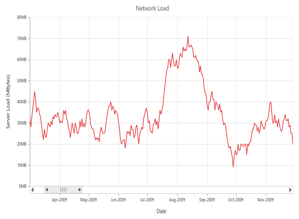

# Performance 

* When there are large number of points to load, you can enable canvas rendering mode in chart. Canvas rendering is faster than SVG because it does not involve manipulating DOM elements as much as SVG rendering.   



 @(Html.EJ().Chart("chartContainer")

      // ...
      //Enable Canvas rendering mode
      .EnableCanvasRendering(true)
      //...
 )



[Click](http://mvc.syncfusion.com/demos/web/chart/performance) here to view the online demo sample that shows Chart performance with 100,000 data points.

* Instead of enabling data markers and labels when there are large number of data points, you can use **Trackball** and **Tooltip** to view point information.

## Lazy Loading

Lazy loading feature provides an effective way for loading data on demand by scrolling and viewing a smaller range of data from a larger collection.



@(Html.EJ().Chart("chartContainer")
                // Enable to zoom and scrollbar option
        .PrimaryXAxis(axis => axis.ScrollbarSettings(scroll => scroll.Visible(“true”)
                  .CanResize(“true”)
                  .Range(range => range.Min("2009/1/1").Max("2014/1/1"))))
               //  ..
)



