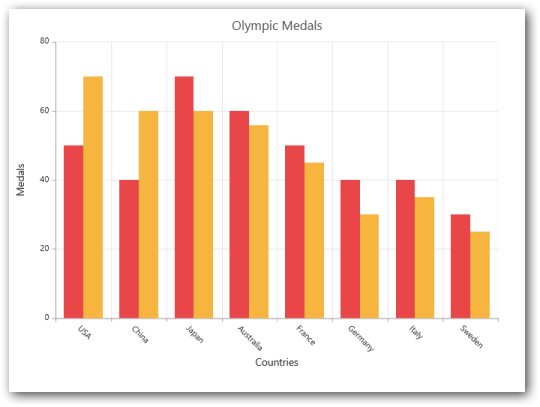
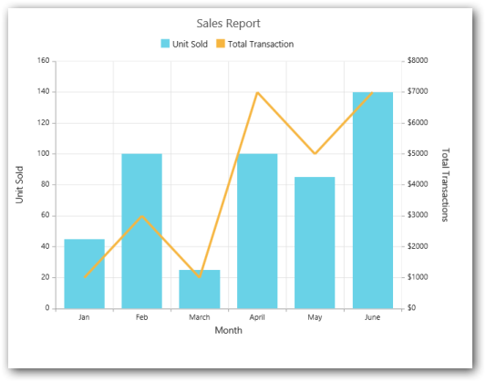
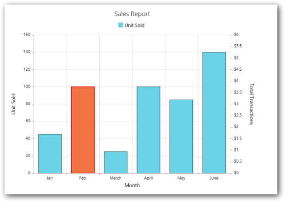
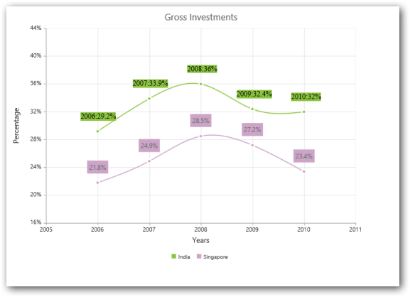
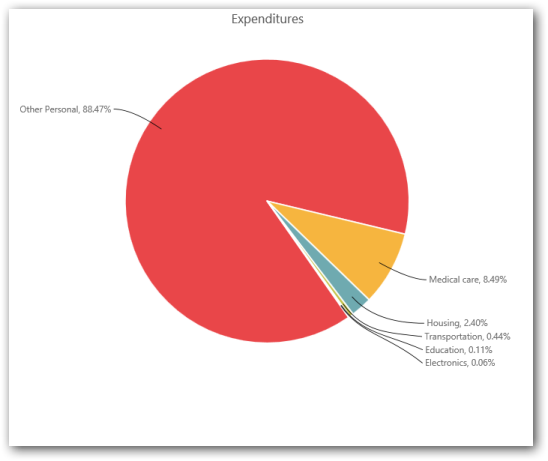
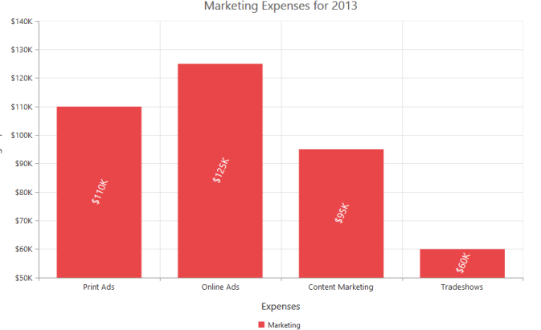

# Series

The Series property provides access to a collection of all series that are defined explicitly within a Chart control. Each series is assigned with series type and name. It contains collection of data point and each point contains x value and y value(s).

## Multiple Series

You can plot multiple series on the same Chart. Series are defined by adding them to the "Series" collection and rendering order of each series can be controlled using the ZOrder properties of the series. Series with 0 as ZOrder renders first. 



@ (Html.EJ().Chart("chartcontainer")

	.Series(ser = >

{

	ser.Name("Gold").Type(SeriesType.Column).Points(po = >

	{

		po.X("USA").Y(50).Add();

		po.X("China").Y(40).Add();

		po.X("Japan").Y(70).Add();

		po.X("Australia").Y(60).Add();

		po.X("France").Y(50).Add();

		po.X("Germany").Y(40).Add();

		po.X("Italy").Y(40).Add();

		po.X("Sweden").Y(30).Add();

	}).Add();

	ser.Name("Silver").Type(SeriesType.Column).Points(po = >

	{

		po.X("USA").Y(70).Add();

		po.X("China").Y(60).Add();

		po.X("Japan").Y(40).Add();

		po.X("Australia").Y(36).Add();

		po.X("France").Y(25).Add();

		po.X("Germany").Y(30).Add();

		po.X("Italy").Y(35).Add();

		po.X("Sweden").Y(25).Add();

	}).Add();

})

// ...

)



Chart with Multiple Series
{:.caption}

### CommonSeriesOptions

You can specify the properties common to all series of the Chart in CommonSeriesOptions. 



@ (Html.EJ().Chart("chartcontainer")

	.CommonSeriesOptions(cr = > cr.Type(SeriesType.Column))

	.Series(ser = >

{

	ser.Name("Gold").Points(po = >

	{

		po.X("USA").Y(50).Add();

		po.X("China").Y(40).Add();

		po.X("Japan").Y(70).Add();

		po.X("Australia").Y(60).Add();

		po.X("France").Y(50).Add();

		po.X("Germany").Y(40).Add();

		po.X("Italy").Y(40).Add();

		po.X("Sweden").Y(30).Add();

	}).Add();

	ser.Name("Silver").Points(po = >

	{

		po.X("USA").Y(70).Add();

		po.X("China").Y(60).Add();

		po.X("Japan").Y(40).Add();

		po.X("Australia").Y(36).Add();

		po.X("France").Y(25).Add();

		po.X("Germany").Y(30).Add();

		po.X("Italy").Y(35).Add();

		po.X("Sweden").Y(25).Add();

	}).Add();

})

// ...

)



Chart with CommonSeriesOptions
{:.caption}

## Combination Series

A combination Chart combines two or more Charts types in single Charts. For example, column series with line/spline series. There are some limitations in the combination series.

1. You cannot combine Column and Bar series

2. Pie, Doughnut Series cannot be used with other series types.



@ (Html.EJ().Chart("chartcontainer")

	.PrimaryYAxis(yaxis = > yaxis.Title(tit = > tit.Text("Unit Sold")))

	.Axes(ax = >

{

	ax.MajorGridLines(mr = > mr.Visible(false)).Orientation(Orientation.Vertical)

		.OpposedPosition(true).AxisLine(al = > al.Visible(false))

		.RangePadding(ChartRangePadding.Normal).Name("yAxis")

		.LabelFormat("${value}").Title(tl = > tl.Text("Total Transactions")).Add();

})

	.Series(ser = >

{

	ser.Name("Unit Sold").Type(SeriesType.Column).Fill("#69D2E7").Points(po = >

	{

		po.X("Jan").Y(45).Add();

		po.X("Feb").Y(100).Add();

		po.X("Mar").Y(25).Add();

		po.X("Apr").Y(100).Add();

		po.X("May").Y(85).Add();

		po.X("June").Y(140).Add();

	}).Add();

	ser.Name("Total Transactions").Type(SeriesType.Line).EnableAnimation(true)

		.YAxisName("yAxis").Width(4).Points(po = >

	{

		po.X("Jan").Y(1000).Add();

		po.X("Feb").Y(3000).Add();

		po.X("Mar").Y(1000).Add();

		po.X("Apr").Y(7000).Add();

		po.X("May").Y(5000).Add();

		po.X("June").Y(7000).Add();

	}).Add();

})

// ...

)



Combination Chart
{:.caption}

## Customize Series

You can customize the Chart series using fill, border width and border color. You can customize the series color using ‘Fill’ property of series, the stroke-width of the line, spline series using ‘Width’ property of series, the border color and width of the column/bar using ‘Border’ property of series and rect in the column/bar Chart using the ‘Fill’ and ‘Border’ property of each point.


@(Html.EJ().Chart("chartcontainer")

  .Series(ser=>

   {

     ser.Name("Unit Sold").Fill("#69D2E7").Type(SeriesType.Column)

        .Border(br=>br.Width(1).Color("black")).Points(po =>

         {

            po.X("Jan").Y(45).Add();                         

            po.X("Feb").Y(100).Fill("#F07542")

              .Border(br=>br.Color("red").Width(2)).Add();

            po.X("Mar").Y(25).Add();

            po.X("Apr").Y(100).Add();

            po.X("May").Y(85).Add();

            po.X("June").Y(140).Add();

          }).Add();  

    })

        // ...

    )



Customized Chart
{:.caption}

## Data Labels

Data labels refer to the y values of data points that appear on each point. You can also display category names or custom text in data label by applying template for the DataLabel. HorizontalTextAlignment and VerticalTextAlignment in dataLabel is used to align the label. 


     
#point.x#:#point.y#%

 

@(Html.EJ().Chart("chartcontainer")

  .Series(ser=>

    {

      ser.Name("India").Fill("#8CC640").Points(po =>

       {

         po.X(2006).Y(29.2).Add();

         po.X(2007).Y(33.9).Add();

         po.X(2008).Y(36).Add();

         po.X(2009).Y(32.4).Add();

          po.X(2010).Y(32).Add();                  

        }).Marker(mr=>mr.DataLabel(dl=>dl.Visible(true).Template("template"))).Add();

        ser.Name("Singapore").Fill("#CBA4C7").Points(po =>

         {

           po.X(2006).Y(29.2).Add();

           po.X(2007).Y(33.9).Add();

           po.X(2008).Y(36).Add();

           po.X(2009).Y(32.4).Add();

           po.X(2010).Y(32).Add();

          }).Marker(mr => mr.DataLabel(dl => dl.Visible(true)

                    .Shape(ChartShape.Rectangle))).Add();  

      })

               // ...

               )



Chart with Data Labels
{:.caption}

### ConnectorLine:

ConnectorLine in data Label is used to customize the line that connects the outside labels of the pie series in terms of color, height, width and type of line. 


@(Html.EJ().Chart("chartcontainer")

   .Series(sr =>

    {

      sr.Points(pt =>

        {

          pt.X("Other Personal").Y(94658).Text("Other Personal 88.47%").Add();

          pt.X("Medicl care").Y(9090).Text("Medical care, 8.49%").Add();

          pt.X("Housing").Y(20).Text("Housing, 2.40%").Add();                                                 

          pt.X("Transportation").Y(15).Text("Transportation, 0.44%").Add();                                                

          pt.X("Education").Y(23).Text("Education, 0.11%").Add();                                               

          pt.X("Electronics").Y(17).Text("Electronics, 0.06%").Add();

        }).Marker(mr => { mr.DataLabel(db => { db.Visible(true).Shape(ChartShape.None) 

            .ConnectorLine(cl => cl.Type(ConnectorType.Bezier)

            .Color("black").Width(1)).Font(fn => { fn.Size("14px"); }); }); }).Add();

    })

      // ...

   )	



Chart with ConnectorLine
{:.caption}

### Data labels Rotation

_Data labels_ refer to the y values of data points, which appear on each point. You can rotate data labels with positive and negative angles using Angle property.

Rotated Data Labels
{:.caption}



  @(Html.EJ().Chart("container") 

     .Series(sr =>

     {

       sr.Points(pt =>

          {

           pt.X("Print Ads").Y(110).Add();

           pt.X("Online Ads").Y(125).Add();

           pt.X("Content Marketing").Y(95)..Add();

           pt.X("Tradeshows").Y(60).Add();

         }).Name("Marketing").Type(SeriesType.Column).EnableAnimation(true).Marker(mr=>mr.DataLabel(dt=>dt.Visible(true).Angle(90).TextPosition(TextPosition.Middle).Font(fn=>fn.Color("white").Size("16px")))).Add();

                    })

//.......

  )   


