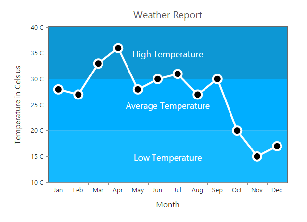
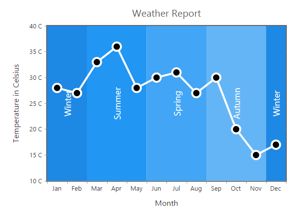
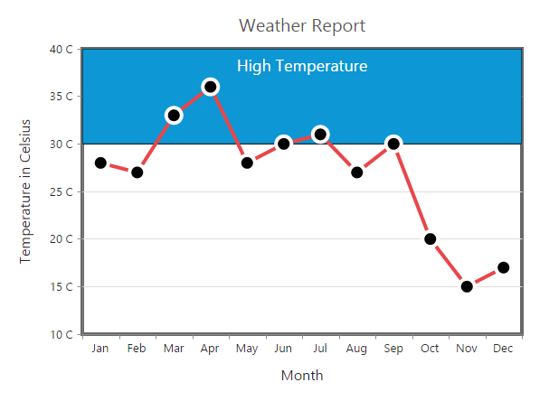
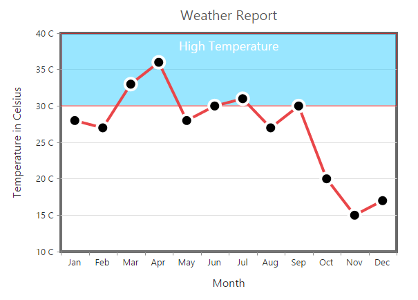
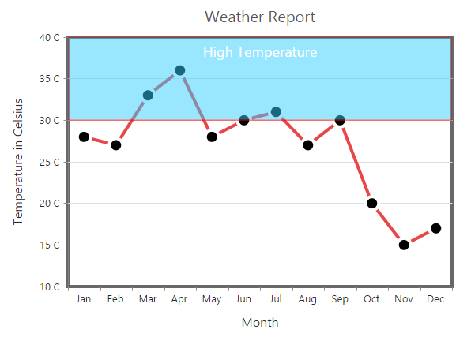

# Striplines

EjChart supports horizontal and vertical striplines. 

## Horizontal Stripline

You can create horizontal stripline by adding the **Stripline** in the *vertical axis* and set **Visible** option to *true*. Striplines are rendered in the specified **Start** to **End** range and you can add more than one stripline for an axis.



@(Html.EJ().Chart("chartContainer")

      // ...
        //Initializing Primary Y Axis
      .PrimaryYAxis(axis => axis.StripLine(line =>
      {
          //Enable Stripline
          line.Visible(true)
          .Start(30).End(40).Add();
      }))
        //...
 )



[Click](http://mvc.syncfusion.com/demos/web/chart/stripline) here to view the Striplines online demo sample.

## Vertical Stripline

You can create vertical stripline by adding the Stripline in the *horizontal axis* and set Visible option to *true*.  



@(Html.EJ().Chart("chartContainer")

      // ...
        //Initializing Primary X Axis
      .PrimaryXAxis(axis => axis.StripLine(line =>
      {
          //Create vertical Stripline using horizontal Axis
          line.Visible(true)
          .Start(3).End(7).Add();
      }))
        //...
 )



## Customize the Text

To customize the stripLine text, use the **Text** and **Font** options. 



@(Html.EJ().Chart("chartContainer")

      // ...
        //Initializing Primary Y Axis
      .PrimaryYAxis(axis => axis.StripLine(line =>
      {
          //Customize the stripLine text and font styles
          line.Text("High Temperature")
          .Font(font=>font.Size("18px").Color("white")).Add();
      }))
        //...
 )



**Text Alignment**

Stripline text can be aligned by using the **TextAlignment** property.  



@(Html.EJ().Chart("chartContainer")

      // ...
        //Initializing Primary Y Axis
      .PrimaryYAxis(axis => axis.StripLine(line =>
      {
          //Set stripLine text alignment to top position
          line.TextAlignment(StriplineTextAlignment.MiddleTop)
          .Add();
      }))
        //...
 )



## Customize the Stripline

To customize the stripLine styles, use the *Color, Opacity, BorderWidth and BorderColor* properties. 



@(Html.EJ().Chart("chartContainer")

      // ...
        //Initializing Primary Y Axis
      .PrimaryYAxis(axis => axis.StripLine(line =>
      {
          //Customize the StripLine rectangle
          line.Color("#33CCFF").BorderWidth(2).Opacity(0.5).BorderColor("red")
          .Add();
      }))
        //...
 )



## Change the Z-order of the stripline

Stripline **ZIndex** property is used to display the stripLine either behind or over the series.  



@(Html.EJ().Chart("chartContainer")

      // ...
        //Initializing Primary Y Axis
      .PrimaryYAxis(axis => axis.StripLine(line =>
      {
          //Change stripLine ZIndex
          line.ZIndex(ChartZIndex.Over)
          .Add();
      }))
        //...
 )



