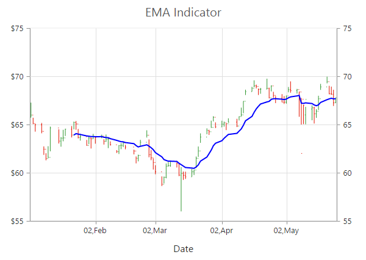

# Technical Indicators

Technical indicators are the base of technical analysis, used to determine the future of financial, stock or economic trends. Indicators serve three broad functions: to alert, to confirm and to predict actions. Future price levels can be predicted easily with the help of given data and it also supports you to enter or exit a trade and enables to make a profit.

The following are the Technical indicators supported by Essential Chart.

## Accumulation Distribution Indicator

Accumulation distribution indicator is one of the technical indicator supported by Essential Chart. The indicator rendered is called signal line. Essential Chart also provides options to customize the width and color of the signal line. 



 @(Html.EJ().Chart("chartcontainer")

	                // ... 

  .Axes(ax=>         

       {ax.Name("indicator").Orientation("vertical").OpposedPosition(true)

      .Add();})

// ...

.Indicators(ind=>

          {

              ind.SeriesName("indicator")

             .Type(ChartIndicatorType.Accumulationdistribution)

             .YAxisName("indicator")

          })



The following screenshot displays Accumulation Distribution indicator.

Accumulation Distribution indicator
{:.caption}

## Average True Range Indicator

Average true range Indicator is one of the technical indicator supported by Essential Chart. The indicator rendered is called as signal line. You can also customize the width and color of the signal line. 



@(Html.EJ().Chart("chartcontainer")

	                // ... 

  .Axes(ax=>         

   {ax.Name("indicator").Orientation("vertical").OpposedPosition(true)

      .Add();})

// ...

    .Indicators(ind=>

          {

              ind.SeriesName("indicator").Period(14)

.Type(ChartIndicatorType.Atr)

                 .YAxisName("indicator")

              })



The following screenshot displays the Average true range indicator.

Average true range indicator
{:.caption}

## Bollinger Band Indicator

Bollinger Band Indicator is one of the technical indicator supported by Essential Chart. It contains three lines namely upper band, lower band and signal line. Upper band, lower band are calculated based on the standard deviations value. Signal band is calculated based on the simple moving average. You can also customize the width and color of the upper band, lower band and signal line. The default value of period is 14.The default value of standardDeviations is 2.



@(Html.EJ().Chart("chartcontainer")

	                // ... 

  .Axes(ax=>         

   {ax.Name("indicator").Orientation("vertical").OpposedPosition(true)

      .Add();

})

// ...

 .Indicators(ind=>

{

              ind.SeriesName("indicator").Period(4)

              .StandardDeviations(2)

.Type(ChartIndicatorType.Bollingerband)

              .YAxisName("indicator")

 })



The following screenshot displays the Bollinger Band indicator.

Bollinger Band indicator
{:.caption}

## Exponential Moving Average Indicator

Exponential Moving Average Indicator is one of the technical indicator supported by Essential Chart. The indicator renders a line called signal line. You can also customize properties such as width, color etc., of the signal line.



@(Html.EJ().Chart("chartcontainer")

       .Axes(ax=>         

          {  ax.Name("indicator")

               .Orientation("vertical")

               .OpposedPosition(true)

               .Add();

          })

    .Indicators(ind=>

          {

              ind.SeriesName("indicator")

                 .Period(14)

.Type(ChartIndicatorType.Ema)

                 .YAxisName("indicator")

           })



The following screenshot displays the Exponential Moving Average Indicator

Exponential Moving Average Indicator
{:.caption}

## Momentum Technical Indicator

Momentum is one of the technical indicator supported by Essential Chart. The indicator renders two lines namely upper band and signal line. Upper band always render at value 100 and signal band is calculated based on the momentum formula. Essential Chart also provide options to customize the width and color of the upper band and signal line. You can also change the value for period. The default value of period is 14. 



@(Html.EJ().Chart("chartcontainer")

	                // ... 

  .Axes(ax=>         

   {ax.Name("indicator").Orientation("vertical").OpposedPosition(true)

      .Add();})

// ...

    .Indicators(ind=>

          {

              ind.SeriesName("indicator").Period(4)

.Type(ChartIndicatorType.Momentum)

                 .YAxisName("indicator")

              })


The following screenshot displays the momentum technical indicator.

Momentum technical indicator
{:.caption}

## Moving Average Convergence Divergence Indicator

MACD is one of the technical indicator supported by Essential Chart. It contains three lines namely Macd line, Signal line and Histogram column series that is used to differentiate macd and signal line. And also enumeration property: MacdType,Line, Histogram and Both. By default, line series contain macd and signal line. Enumeration type both contain line and histogram series. Macd and signal line is calculated based on the ShortPeriod,LongPeriod and Trigger value with indicator formula and histogram displays the difference between them. Essential Chart also provides options to customize the width and color of the macd and signal line and histogram with tooltip and animation options. The value for short, long period and trigger value can also be changed.



@(Html.EJ().Chart("chartcontainer")

	                // ... 

  .Axes(ax=>         

   {ax.Name("yAxis1").Orientation("vertical").OpposedPosition(true)

      .Add();})

// ...

    .Indicators(ind=>

            ind.Type(ChartIndicatorType.Macd).SeriesName("Hilo").YAxisName("yAxis1")

                .ShortPeriod(12).LongPeriod(26).Trigger(9)

                .Fill("darkblue").Width(1)

                .MacdLine(ml=>ml.Fill("green").Width(1))

                .MacdType(MacdType.Both)                           

                .Histogram(hs=>hs.Fill("red").Opacity(1)

                .Border(br=>br.Color("red").Width(1))).Add())

)



The following screenshot displays the MACD technical indicator

MACD Indicator
{:.caption}

## Relative Strength Index Indicator

RSI is one of the technical indicator supported by Essential Chart. It contains three lines namely upper band, lower band and signal line. Upper and lower band always render at value 70 and 30 respectively and signal band is calculated based on the RSI formula. You can also customize the width and color of the upper band, lower band and signal line with tooltip and animation options. 



@(Html.EJ().Chart("chartcontainer")

	                // ... 

  .Axes(ax=>         

   {ax.Name("yAxis1").Orientation("vertical").OpposedPosition(true)

      .Add();})

// ...

    .Indicators(ind=>ind.Type(ChartIndicatorType.Rsi)

                .SeriesName("Hilo").Period(14).YAxisName("yAxis1")

                .Fill("darkblue").Width(1)

                .Tooltip(tl=>tl.Visible(true))

                .UpperLine(ul=>ul.Fill("green").Width(1))

                .LowerLine(ll=>ll.Fill("red").Width(1))

                .Add())

)


The following screenshot displays the RSI technical indicator

RSI technical indicator
{:.caption}

## Simple Moving Average Indicator

Simple Moving Average Indicator is one of the technical indicators supported by Essential Chart. The indicator rendered is called as signal line. Signal line is calculated based on the simple moving average. You can also customize the Period, width and color of the signal line. The default value of period is 14.



@(Html.EJ().Chart("chartcontainer")

	                // ... 

  .Axes(ax=>         

   { 

     ax.Name("indicator")

         .Orientation("vertical")

         .OpposedPosition(true)

         .Add();})

// ...

 .Indicators(ind=>

    {

      ind.SeriesName("indicator").Period(4)

         .StandardDeviations(2)

         .Type(ChartIndicatorType.Bollingerband)                     

         .YAxisName("indicator")

     })



The following screenshot displays the Simple Moving Average Indicator.

Simple Moving Average Indicator
{:.caption}

## Stochastic Technical Indicator

Stochastic technical indicator is one of the most common indicators used in technical analysis. The indicators render four lines namely upper line, lower line, stochastic line and signal line. Upper line always render at value 80 and lower line is render at value 20. Stochastic and Signal Lines are calculated based on stochastic formulas. You can also customize the width and color of the all lines. 

Stochastic technical indicator
{:.caption}



   @(Html.EJ().Chart("chartcontainer")

         // ... 

           .Axes(ax=>         

        {

         ax.Name("indicator")

         .Orientation("vertical")

         .OpposedPosition(true)

         .Add();

        })

// ...

    .Indicators(ind=>

        {

         ind.SeriesName("indicator")

         .Period(14)

         .KPeriod(3)

         .DPeriod(3)

         .Type(ChartIndicatorType.Stochastic)

         .YAxisName("indicator")

        })

                  // ...



## Triangular Moving Average Indicator

Triangular Moving Average Indicator is one of the technical indicator supported by Essential Chart. The indicator rendered is called as signal line. You can also customize the width and color of the signal line. 



@(Html.EJ().Chart("chartcontainer")

	                // ... 

  .Axes(ax=>         

   {ax.Name("indicator").Orientation("vertical").OpposedPosition(true)

      .Add();

})

// ...

.Indicators(ind=>

{

              ind.SeriesName("indicator").Period(14)

              .Type(ChartIndicatorType.TMA)

              .YAxisName("indicator")

 })



The following screenshot displays the Triangular Moving Average indicator.

Triangular Moving Average Indicator
{:.caption}

