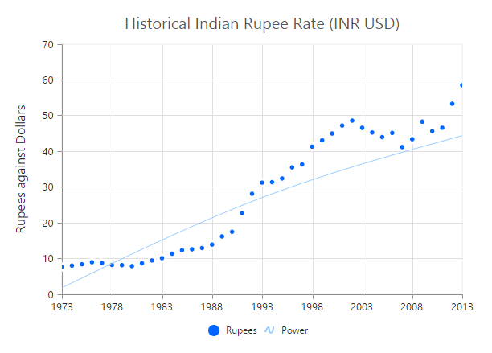
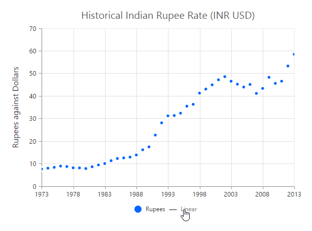

# Trendlines

EjChart can generate Trendlines for Cartesian type series *(Line, Column, Scatter, Area, Candle, HiLo etc.)* except Bar type series. You can add more than one trendline object to the **Trendlines** option.



    @(Html.EJ().Chart("chartContainer")
            //...

        .Series(sr =>
        {
            sr
                .Trendlines(trendline =>
                {
                    trendline
                        //Enable Trendline to chart series
                        .Visibility("visible").Add();
                }).Add();
        })
         //...
     )



[Click](http://mvc.syncfusion.com/demos/web/chart/trendlines) here to view the Trendlines online demo sample.

## Customize the trendline styles

A trendline can be customized by using the properties such as *Fill*, *Width*, *DashArray* and *Opacity*. The default type of Trendline is **Linear**.



    @(Html.EJ().Chart("chartContainer")
            //...

        .Series(sr =>
        {
            sr
                .Trendlines(trendline =>
                {
                    trendline
                        //Customize the Trendline styles
                        .Fill("#99CCFF").Width(3).Opacity(1).DashArray("2,3").Add();
                }).Add();
        })
         //...
     )



## Types of Trendline

EjChart supports the following type of Trendlines.

* Linear
* Exponential
* Logarithmic
* Power 
* Polynomial
* MovingAverage

### Linear

To render Linear Trendline, you have to set the **Type** as *Linear*. 



    @(Html.EJ().Chart("chartContainer")
            //...

        .Series(sr =>
        {
            sr
                .Trendlines(trendline =>
                {
                    trendline
                        //Change Trendline type
                        .Type(TrendlineType.Linear).Add();
                }).Add();
        })
         //...
     )



### Exponential

Exponential Trendline can be rendered by setting the *Type* as Exponential. 



    @(Html.EJ().Chart("chartContainer")
            //...

        .Series(sr =>
        {
            sr
                .Trendlines(trendline =>
                {
                    trendline
                        //Change Trendline type
                        .Type(TrendlineType.Exponential).Add();
                }).Add();
        })
         //...
     )



### Logarithmic

Logarithmic Trendline can be rendered by setting the *Type* as Logarithmic.  



    @(Html.EJ().Chart("chartContainer")
            //...

        .Series(sr =>
        {
            sr
                .Trendlines(trendline =>
                {
                    trendline
                        //Change Trendline type
                        .Type(TrendlineType.Logarithmic).Add();
                }).Add();
        })
         //...
     )



### Power

Power Trendline can be rendered by setting the *Type* of the trendline as Power. 



    @(Html.EJ().Chart("chartContainer")
            //...

        .Series(sr =>
        {
            sr
                .Trendlines(trendline =>
                {
                    trendline
                        //Change Trendline type
                        .Type(TrendlineType.Power).Add();
                }).Add();
        })
         //...
     )



### Polynomial

Polynomial Trendline can be rendered by setting the trendline *Type* as Polynomial.  You can change the polynomial order by using the **PolynomialOrder** of the trendlines. It ranges from 2 to 6.



    @(Html.EJ().Chart("chartContainer")
            //...

        .Series(sr =>
        {
            sr
                .Trendlines(trendline =>
                {
                    trendline
                        //Change Trendline type
                        .Type(TrendlineType.Polynomial).Add();
                }).Add();
        })
         //...
     )



### MovingAverage

MovingAverage Trendline can be rendered by setting the Type of the trendline as **MovingAverage**. 



    @(Html.EJ().Chart("chartContainer")
            //...

        .Series(sr =>
        {
            sr
                .Trendlines(trendline =>
                {
                    trendline
                        //Change Trendline type
                        .Type(TrendlineType.MovingAverage).Add();
                }).Add();
        })
         //...
     )



## Forecasting

**Trendline forecasting** is the prediction of future/past situations.  **Forecasting** can be classified into two types as follows.

  * Forward Forecasting
  * Backward Forecasting

### Forward Forecasting

The value set for **ForwardForecast** is used to determine the distance moving towards the future trend.



    @(Html.EJ().Chart("chartContainer")
            //...

        .Series(sr =>
        {
            sr
                .Trendlines(trendline =>
                {
                    trendline
                        //Set forward forecasting value
                        .ForwardForecast(5).Add();
                }).Add();
        })
         //...
     )



### Backward Forecasting

The value set for the **BackwardForecast** is used to determine the past trends.



    @(Html.EJ().Chart("chartContainer")
            //...

        .Series(sr =>
        {
            sr
                .Trendlines(trendline =>
                {
                    trendline
                        //Set backward forecasting value
                        .BackwardForecast(5).Add();
                }).Add();
        })
         //...
     )



## Trendlines Legend

To display the legend item for trendline, use the **Name** property. You can interact with the trendline legends similar to the series legends *(show/hide trendlines on legend click)*.  



    @(Html.EJ().Chart("chartContainer")
            //...

        .Series(sr =>
        {
            sr
                .Trendlines(trendline =>
                {
                    trendline
                        //Set Trendline name to display in the legend
                        .Name("Linear").Add();
                }).Add();
        })
         //...
     )



