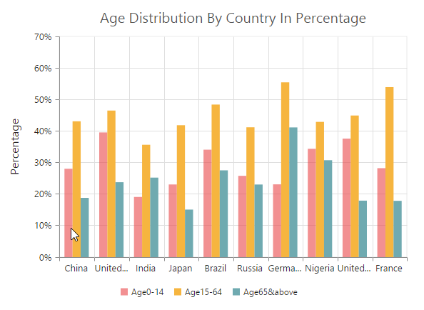
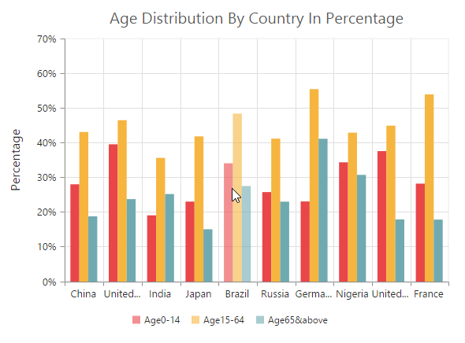

# User Interactions

## Tooltip

### Enable tooltip for data point

Tooltip for the data points can be enabled by using the *Visible* option of the **Tooltip** in the series.



@(Html.EJ().Chart("chartContainer")
          //...
          .Series(ser =>
                      {
                         ser.Tooltip(tooltip=>tooltip
                             //Enable tooltip for the series
                             .Visible(true)
                             ).Add();
                      })

           //...
 )



### Format the tooltip 

Tooltip displays data specified by the **Format** option of the tooltip. The default value of the format option is * **#point.x# : #point.y#** *. Here, * **#point.x#** * is the placeholder for x value of the point and * **#point.y#** * is the placeholder for y value of the point.

You can also use * **#series.<optionname>#** * as placeholder to display the value of an option in corresponding series and use * **#point.<optionname>#** * as place holder to display the value of an option in the corresponding point.



  @(Html.EJ().Chart("chartContainer")
          //...
          .Series(ser =>
                      {
                         ser.Tooltip(tooltip=>tooltip
                             //Displaying tooltip in a format
                             .Format("#series.name#   #point.x# : #point.y#  (g/kWh)")
                             ).Add();
                      })

           //...
 )



### Tooltip Template

HTML elements can be displayed in the tooltip by using the **Template** option of the tooltip. The template option takes the value of the id attribute of the HTML element. You can use the * **#point.x#** * and * **#point.y#** * as place holders in the HTML element to display the x and y values of the corresponding data point. 

You can also use * **#series.<optionname>#** * as place holder to display the value of an option in corresponding series of the tooltip and use * **#point.<optionname>#** * as place holder to display the value of an option in the corresponding point for which the tooltip is displayed.
  



    <!-- Create Tooltip template here -->
    

              
 
 
  

        

            

               <label id="efpercentage">&nbsp;#point.y#% </label>
               <label id="ef">Efficiency </label>
            

        

    

    @(Html.EJ().Chart("chartContainer")
          //...
          .Series(ser =>
                      {
                         ser.Tooltip(tooltip=>tooltip
                             //Set template id to tooltip template
                             .Template("Tooltip")
                             ).Add();
                      })

           //...
    )



[Click](http://mvc.syncfusion.com/demos/web/chart/default) here to view the Tooltip template online demo sample.

#### Tooltip template animation

You can enable animation by setting the *EnableAnimation* to true. Tooltip animates when the mouse moves from one data point to another point. The Duration property in tooltip specifies the time taken to animate the tooltip. the duration is set to **"500ms"**, by default.

N> Tooltip is animated only if the template is specified for tooltip.



    @(Html.EJ().Chart("chartContainer")
          //...
          .Series(ser =>
                      {
                         ser.Tooltip(tooltip=>tooltip
                             //Enable tooltip template animation and set duration time
                             .EnableAnimation(true).Duration("1000ms")
                             ).Add();
                      })

           //...
    )



### Customize the appearance of tooltip   

The *Fill* and *Border* options are used to customize the background color and border of the tooltip respectively. The *Font* option in the tooltip is used to customize the font of the tooltip text.



     @(Html.EJ().Chart("chartContainer")
          //...
          .Series(ser =>
                      {
                         ser.Tooltip(tooltip=>tooltip
                             //Change tooltip color and border
                             .Fill("#FF9933")
                             .Border(br => br.Color("#993300").Width(1))
                             // ...
                             ).Add();
                      })

           //...
     )



#### Tooltip with rounded corners

The options *RX* and *RY* are used to customize the corner radius of the tooltip rectangle.



     @(Html.EJ().Chart("chartContainer")
          //...
          .Series(ser =>
                      {
                         ser.Tooltip(tooltip=>tooltip
                             //Customize the corner radius of the tooltip rectangle.
                             .RX(50).RY(50)
                             // ...
                             ).Add();
                      })

           //...
     )



## Zooming and Panning

### Enable Zooming

There are two ways you can zoom the chart,

* When the **Zooming.Enable** option is set to true, you can zoom the chart by using the rubber band selection.

* When the **Zooming.EnableMouseWheel** option is set to true, you can zoom the chart on mouse wheel scrolling.

* When **Zooming.EnablePinching** option is set to *true*, you can zoom the chart through pinch gesture.

N> Pinch zooming is supported only in browsers that support multi-touch gestures. Currently IE10, IE11, Chrome and Opera browsers support multi-touch in desktop devices.



     @(Html.EJ().Chart("chartContainer")
          //...
       .Zooming(zoom=>zoom
           //Enable zooming in chart
           .Enable(true)
           )

           //...
     )



After zooming the chart, a zooming toolbar will appear with options to *zoom*, *pan* and *reset*. Selecting the Pan option will allow to pan the chart and selecting the Reset option will reset the zoomed chart.

[Click](http://mvc.syncfusion.com/demos/web/chart/zoomingandpanning) here to view the Zooming and Panning online demo sample.

### Types of zooming

The *Type* option in zooming specifies whether the chart is allowed to scale along the horizontal axis(X) or vertical axis(Y) or along both axis(X,Y). The default value of the Type is **"X,Y"** (both axis).



     @(Html.EJ().Chart("chartContainer")
          //...
       .Zooming(zoom=>zoom
           .Enable(true)
           //Enable horizontal zooming
           .Type("x")
           )

           //...
     )



### Customizing zooming toolbar

The user can choose the items displayed in the zooming toolbar by specifying the property **ToolBarItems**.



     @(Html.EJ().Chart("container")       
        //Customizing zooming toolbar
        .Zooming(
             zoom => zoom.Enable(true).ToolbarItems (new List<string>() 
                    {"reset”, “zoomIn", "zoomOut"})
                 )            
        //...          
     )



### Enable ScrollBar

EjChart provides scrollbar support to view the other portions of chart area which is not shown in the view port when zoomed, by setting true to **EnableScrollbar** option in **Zooming**.  



     @(Html.EJ().Chart("container")       
        //Customizing zooming toolbar
        .Zooming(
             zoom => zoom.Enable(true)
                 .EnableScrollbar(true)
                 )            
        //...          
     )



## Crosshair

Crosshair is used to view the value of an axis at mouse position or touch contact point. 

### Enable Crosshair and Crosshair label

Crosshair can be enabled by using the **Visible** option in the Crosshair. Crosshair label for an axis can be enabled by using the Visible option of CrosshairLabel in the corresponding axis.



     @(Html.EJ().Chart("chartContainer")
          //...
          
          .PrimaryXAxis(axis=>axis.CrosshairLabel(label=>label
              //Enable crosshairLabel to X-Axis
              .Visible(true))
              )
          .PrimaryYAxis(axis=>axis.CrosshairLabel(label=>label
              //Enable crosshairLabel to Y-Axis
              .Visible(true))
              )
          //Initializing Crosshair
          .Crosshair(crosshair=>crosshair.Visible(true))
          //...
     )



[Click](http://mvc.syncfusion.com/demos/web/chart/crosshair) here to view the Crosshair online demo sample.

### Customize the Crosshair line and Crosshair label

The *Fill* and *Border* options of the **CrosshairLabel** is used to customize the background color and border of the crosshair label respectively. Color and width of the crosshair line can be customized by using the **Line** option in the Crosshair.



     @(Html.EJ().Chart("chartContainer")
          //...
          
          .PrimaryYAxis(axis=>axis.CrosshairLabel(label=>label
              //Customizing the crosshair label background color and border
              .Fill("red").Border(br=>br.Color("green").Width(2))
              ))
              
          //Initializing Crosshair
          .Crosshair(crosshair=>crosshair
              .Visible(true)
              //Customizing the crosshair line
              .Line(line=>line.Color("grey").Width(2))
              )
          //...
     )



## Trackball

Trackball is used to track a data point close to the mouse position or touch contact point. Trackball marker indicates the closest point and trackball tooltip displays the information about the point.

### Enable Trackball

Trackball can be enabled by setting the *Visible* option of the crosshair to *true* and then set the **Type** as *Trackball*. The default value of type is *Crosshair*.



     @(Html.EJ().Chart("chartContainer")
          //...
         
          //Initializing Crosshair
          .Crosshair(crosshair=>crosshair
              .Visible(true)
              //Change crosshair type to trackball
              .Type(CrosshairType.Trackball)
              )
          //...
     )



[Click](http://mvc.syncfusion.com/demos/web/chart/trackball) here to view the Trackball online demo sample.

#### Customize trackball marker and trackball line

Shape and size of the trackball marker can be customized by using the *Shape* and *Size* options of the Crosshair marker. Color and width of the trackball line can be customized by using the *Line* option in the crosshair.



     @(Html.EJ().Chart("chartContainer")
          //...
         
          //Initializing Crosshair
          .Crosshair(crosshair=>crosshair
              .Visible(true)
              //Customize the trackball line color and width
              .Line(line=>line.Color("#800000").Width(2))
              //Customize the trackball marker shape size and visibility
              .Marker(mr=>mr
                  //Enable/disable trackball marker
                  .Visible(true).Shape(ChartShape.Pentagon).Size(size=>size.Width(9).Height(9))
              )
          //...
        )
     )



### Format Trackball tooltip

X and Y values displayed in the trackball tooltip are formatted based on its axis *LabelFormat*.  



     @(Html.EJ().Chart("chartContainer")
          //...
          
          //Add format to crosshair label
         .PrimaryXAxis(axis=>axis.LabelFormat("MMM, yyyy"))
         .PrimaryYAxis(axis=>axis.LabelFormat("{value}K"))
         
          //Initializing Crosshair
          .Crosshair(crosshair=>crosshair
              .Visible(true)
              //...
          )
     )



You can able to show the trackball tooltip in two modes, using trackballTooltipSettings.

                1.	Grouping.
                2.	Float. 



@(Html.EJ().Chart("chartContainer")
   //  ..
               .Crosshair(crosshair => crosshair.Visible(true).type(CrosshairType.Trackball)
                   .TrackballTooltipSettings(trackball => trackball.Rx(“3”)
                   .Ry(“3”).Fill(“whitesmoke”).Mode(TrackballDisplayMode.Grouping)
                   .Border(br => br.Width(“1”).Color(“grey”)))
  //  ..
)



#### Trackball tooltip template:
Trackball tooltip template is used to display the tooltip in customized template format. You can define the desired template in css style. You can enable the **toolTipTemplate**  by using the following code snippet.



@(Html.EJ().Chart("chartContainer")
   //  ..
                .Crosshair(cr => cr.Visible(true).Type(CrosshairType.Trackball)
                .TrackballTooltipSettings(tl=>tl.Mode(TrackballDisplayMode.Float)))
  //  ..
)



## Highlight

EjChart provides highlighting support for the series and data points on mouse hover. To enable the highlighting option, set the *Enable* property to *true* in the **HighlightSettings** of the series.

N> When hovering mouse on the data points, the corresponding series legend also will be highlighted.



    @(Html.EJ().Chart("chartContainer")
            //...

          // enable the highlight settings
          .Series(sr =>
          {
              sr
                  .HighlightSettings(highlight => highlight
                      // enable the highlight settings
                      .Enable(true)).Add();
          })
     )



[Click](http://mvc.syncfusion.com/demos/web/chart/selection) here to view the highlight and selections online demo sample.

### Highlight Mode

You can set three different highlight mode for the highlighting data point and series by using the **Mode** property of the *HighlightSettings*.

* Series
* Points
* Cluster

**Series mode**

To highlight all the data points of the specified series, you can set the **Series** value to the *Mode* option in the HighlightSettings. 



    @(Html.EJ().Chart("chartContainer")
            //...

          // enable the highlight settings
          .Series(sr =>
          {
              sr
                  .HighlightSettings(highlight => highlight
                      //Change highlight mode
                      .Mode(ChartMode.Series)
                      ).Add();
          })
     )



**Point mode**

To highlight a single point, you can set the **Point** value to the *Mode* option.



    @(Html.EJ().Chart("chartContainer")
            //...

          // enable the highlight settings
          .Series(sr =>
          {
              sr
                  .HighlightSettings(highlight => highlight
                      //Change highlight mode
                      .Mode(ChartMode.Point)
                      ).Add();
          })
     )



**Cluster mode**

To highlight the points that corresponds to the same index in all the series, set the **Cluster** value to the *Mode* option.



    @(Html.EJ().Chart("chartContainer")
            //...

          // enable the highlight settings
          .Series(sr =>
          {
              sr
                  .HighlightSettings(highlight => highlight
                      //Change highlight mode
                      .Mode(ChartMode.Cluster)
                      ).Add();
          })
     )



### Customize the highlight styles

To customize the highlighted series, use the *Color*, *Border* and *Opacity* options in the HighlightSettings.



    @(Html.EJ().Chart("chartContainer")
            //...

          // enable the highlight settings
          .Series(sr =>
          {
              sr
                  .HighlightSettings(highlight => highlight
                        //Customizing styles
                        .Border(br=>br.Color("red").Width(1.5))
                        .Opacity(0.5).Color("green")
                      ).Add();
          })
     )



### Patterns to highlight

EjChart provides pattern support for highlighting the data by setting the value to the **Pattern** property of the HighlightSettings. The different types of highlight patterns are as follows.

1.	Chessboard
2.	Crosshatch
3.	Dots
4.	Pacman
5.	Grid
6.	Turquoise
7.	Star
8.	Triangle
9.	Circle
10.	Tile
11.	HorizontalDash
12.	VerticalDash
13.	Rectangle
14.	Box
15.	VerticalStripe
16.	HorizontalStripe
17.	Bubble
18.	DiagonalBackward
19.	DiagonalForward 



    @(Html.EJ().Chart("chartContainer")
          //...

          // enable the highlight settings
          .Series(sr =>
          {
              sr
                  .HighlightSettings(highlight => highlight
                       .Pattern(ChartPattern.Chessboard)
                      ).Add();
          })
     )



#### Custom pattern

To create a custom pattern for the highlighting data points, set the pattern type as **Custom** and add the custom pattern *Id* in the **CustomPattern** option of the HighlightSettings.



            <svg>
                <pattern id="dots_a" patternUnits="userSpaceOnUse" width="6" height="6">
                    <rect x="0" y="0" width="6" height="6" transform="translate(0,0)" fill="black" opacity="1"></rect>
                    <path d='M 3 -3 L -3 3 M 0 6 L 6 0 M 9 3 L 3 9'stroke-width="1" stroke="white"></path>
                </pattern>
            </svg>

    @(Html.EJ().Chart("chartContainer")
          //...

          // enable the highlight settings
          .Series(sr =>
          {
              sr
                  .HighlightSettings(highlight => highlight
                      //Add custom pattern for highlighting data
                      .Pattern(ChartPattern.Custom)
                      .CustomPattern("dots_a")
                      //...
                  .Enable(true)
                 ).Add();
          })
     )



## Selection

EjChart provides selection support for the series and data points on mouse click. To enable the selection option, set the *Enable* property to *true* in the SelectionSettings* of the series.

N> When mouse is clicked on the data points, the corresponding series legend also will be selected.



    @(Html.EJ().Chart("chartContainer")
          //...

          // enable the selection settings
          .Series(sr =>
          {
              sr
                  .SelectionSettings(ss => ss
                  // enable the selection settings
                  .Enable(true)
                 ).Add();
          })
     )



[Click](http://mvc.syncfusion.com/demos/web/chart/selection) here to view the highlight and selections online demo sample.

### Selection Mode

You can set four different selection mode for highlighting the data point and series by using the **Mode** property of the SelectionSettings.

* Series
* Points
* Cluster
* Range

**Series mode**

To select all the data points of the specified series, you can set the **Series** value to the *Mode* option in the SelectionSettings.



    @(Html.EJ().Chart("chartContainer")
          //...

          // enable the selection settings
          .Series(sr =>
          {
              sr
                  .SelectionSettings(ss => ss
                      //Change selection mode
                      .Mode(ChartMode.Series)
                      .Pattern(ChartPattern.Chessboard)
                  .Enable(true)
                 ).Add();
          })
     )



**Point mode**

To highlight a single point, you can set the **Point** value to the *Mode* option. 



    @(Html.EJ().Chart("chartContainer")
          //...

          // enable the selection settings
          .Series(sr =>
          {
              sr
                  .SelectionSettings(ss => ss
                      //Change selection mode
                      .Mode(ChartMode.Point)
                      //...
                  .Enable(true)
                 ).Add();
          })
     )



**Cluster mode**

To select the points that corresponds to the same index in all the series, set the **Cluster** value to the *Mode* option.



    @(Html.EJ().Chart("chartContainer")
          //...

          // enable the selection settings
          .Series(sr =>
          {
              sr
                  .SelectionSettings(ss => ss
                      //Change selection mode
                      .Mode(ChartMode.Cluster)
                      //...
                  .Enable(true)
                 ).Add();
          })
     )



**Range mode**

To fetch the selected area data points value, you can set the selectionSettings Mode as **Range** in the chart series. The selection rectangle can be drawn as horizontally, vertically or in both direction by using **RangeType** property and the selected data’s are returned as an array collection in the **RangeSelected** event.  



   @(Html.EJ().Chart("chartContainer")
          //...

          // enable the selection settings
          .Series(sr =>
          {
              sr
                  .SelectionSettings(ss => ss
                      //Change selection mode
                      .Mode(ChartMode.Range)
                      .RangeType(MultiSelectType.XY)
                      //...
                  .Enable(true)
                 ).Add();
          })
          //Subscribe the rangeSelected event. 
          .RangeSelected("rangeSelection")
     )
     
 
 
   

         //event to fetch the selected data point values
         rangeSelection:function (sender){
            var selectedData = sender.data.selectedDataCollection;
            //...
         }



[Click](http://mvc.syncfusion.com/demos/web/chart/multipleselection) here to view the Multiple data selection online demo sample.

### Selection Type

You can set two different selection type for selecting the data point and series on mouse click by using the **Type** property of the SelectionSettings. 

* Single 
* Multiple 

**Single Type**

To select a data point or a series on mouse click based on the **SelectionSettings.Mode**, set **SelectionSettings.Type** as **Single** in the series.



  @(Html.EJ().Chart("container")     
         
        //...      
        .CommonSeriesOptions(

          cm => cm.SelectionSettings(
              selection => selection.Enable(true)                   
                  //Selection mode is series or point ,cluster 
                  .Mode(ChartMode.Series)
                  //Selection type is single
                   .Type(ChartSelectionType.Single))
                  )            
        //...          
  )



**Multiple Type**

For selecting multiple data points or series on mouse click, set **SelectionSettings.Type** as **Multiple** in the series.



  @(Html.EJ().Chart("container")     
         
       //...       
        .CommonSeriesOptions(

          cm => cm.SelectionSettings(

               selection => selection.Enable(true)                   
                  //Selection mode is series or point, cluster
                  .Mode(ChartMode.Series)
                  //Selection type is multiple
                  .Type(ChartSelectionType.Multiple))
            )            
        //...          
  )



### Customizing selection styles

To customize the selection styles, use the *Color*, *Border* and *Opacity* options in the SelectionSettings.



    @(Html.EJ().Chart("chartContainer")
          //...

          // enable the selection settings
          .Series(sr =>
          {
              sr
                  .SelectionSettings(ss => ss
                      //Customizing selection rectangle styles
                      .Border(br=>br.Width(1.5).Color("red"))
                      .Opacity(0.5).Color("red")
                  .Enable(true)
                 ).Add();
          })
     )



### Patterns for selection

EjChart provides pattern support for the data selection by setting the value to the **Pattern** property of the SelectionSettings. The different types of selection patterns are as follows.

1.	Chessboard
2.	Crosshatch
3.	Dots
4.	Pacman
5.	Grid
6.	Turquoise
7.	Star
8.	Triangle
9.	Circle
10.	Tile
11.	HorizontalDash
12.	VerticalDash
13.	Rectangle
14.	Box
15.	VerticalStripe
16.	HorizontalStripe
17.	Bubble
18.	DiagonalBackward
19.	DiagonalForward 



    @(Html.EJ().Chart("chartContainer")
          //...

          // enable the selection settings
          .Series(sr =>
          {
              sr
                  .SelectionSettings(ss => ss
                      //Change selection pattern
                      .Pattern(ChartPattern.DiagonalForward)
                  .Enable(true)
                 ).Add();
          })
     )



#### Custom pattern

To create a custom pattern for selecting the data points, set the *Pattern* type as **Custom** and add the custom pattern *id* in the **CustomPattern** option of the SelectionSettings.



    

            <svg>
                <pattern id="dots_a" patternUnits="userSpaceOnUse" width="6" height="6">
                    <rect x="0" y="0" width="6" height="6" transform="translate(0,0)" fill="black" opacity="1"></rect>
                    <path d='M 3 -3 L -3 3 M 0 6 L 6 0 M 9 3 L 3 9'stroke-width="1" stroke="white"></path>
                </pattern>
            </svg>
            

    @(Html.EJ().Chart("chartContainer")
          //...

          // enable the selection settings
          .Series(sr =>
          {
              sr
                  .SelectionSettings(ss => ss
                      //Add custom pattern for selection data
                      .Pattern(ChartPattern.Custom)
                      .CustomPattern("dots_a")
                  .Enable(true)
                 ).Add();
          })
     )



### Handling Series Selection

To get the series information when selecting the specific series, subscribe to the **SeriesRegionClick** event and set the **SelectionSettings.Mode** as *Series*.



    @(Html.EJ().Chart("chartContainer")
          //...

          // enable the selection settings
          .Series(sr =>
          {
              sr
                  .SelectionSettings(ss => ss
                      //Change selection mode
                      .Mode(ChartMode.Series)
                      //...
                  .Enable(true)
                 ).Add();
          })
          //Subscribe series selection event
          .SeriesRegionClick("seriesSelection")
     )





        function seriesSelection(sender) {
            //Get Series information on series selection
            var seriesData = sender.series;
        }



### Selection on Load

We can able to select the point/series programmatically on chart load, by setting series and point index in the selectedDataPointIndexes property.



  @(Html.EJ().Chart("chartContainer") 
                           //.... . . 
              .SelectedDataPointIndexes(sr => {
                  //Adding Selected Data point indexes 
                       sr.SeriesIndex(“0”).PointIndex(“2”)
                       sr.SeriesIndex(“1”).PointIndex(“4”)
                                 //.... . . 
               }).Add(); 
                           //.... . . 
     }) 
)



## Data Editing

EjChart provides support to change the location of the rendered points. This can be done by dragging the point and dropping it on another location in chart. To enable the data editing, set the **enable** property to true in the *dragSettings* of the series.



@(Html.EJ().Chart("container")
          .CommonSeriesOptions(options => options.DragSettings(drag => drag.Enable(true)))
    )



[Click](http://mvc.syncfusion.com/demos/web/chart/dragdrop) here to view the data editing online demo sample.

### Customize Dragging direction

To drag the point along x and y axes, you can specify **type** as xy in *dragSettings*. And to drag along x axis alone, specify the type as x and to drag along y axis, specify type as y.



@(Html.EJ().Chart("container")
          .CommonSeriesOptions(options => options.DragSettings(drag => drag.Type(DragType.Y)))
    )



