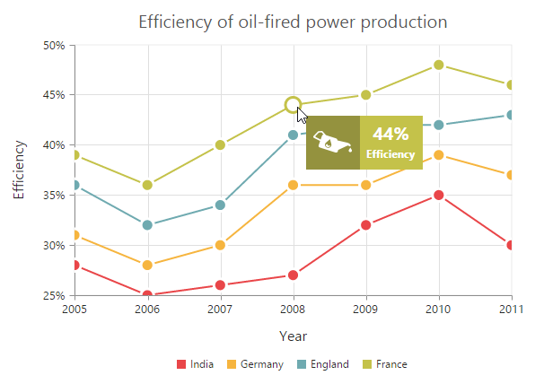
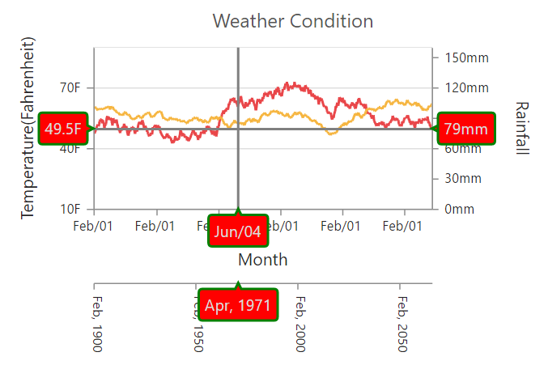

# User Interactions

When you deal with a large amount of data, you require interactions like Tooltip, Crosshair etc that allows you to track data changes and provide interaction capabilities.  

## ToolTip

Essential Chart provides you an option Tooltip to display a pop up with the point values, on mouse move over the appropriate point. Essential Chart also allows you to customize its border color, border width, opacity, fill color, animation, duration, rx, ry, font size, font family, font style, font color, font weight, etc. You can change the Tooltip properties for each series in Chart to change its appearance. When you require the same Tooltip for all the series in Chart, you can specify the Tooltip in commonSeriesOptions. You can also modify the default template for the Tooltip using Template property.

### Tooltip visibility: 

By default the visibility of tooltip is set to false, but you can change the visibility. When format or template is not specified for tooltip, then it displays the x and y values of the point. 

[MVC]

@(Html.EJ().Chart("chartcontainer")

    .CommonSeriesOptions(cm=>cm.Tooltip(tl=>tl.Visible(true)))

   // ...

  )



### Tooltip format: 

Essential Chart provides you support to change the format of the text displayed in the tooltip that allows you to use the data point information in desired format.

For single y value, Chart like line series, you can form a format as follows.

format: " #point.x##series.name#  #point.y#%"

For multiple y values, in financial series, you can form a format as follows.

format: " #point.x# #series.name# #point.high# #point.low# #point.open# #point.close# %"



[MVC]

@(Html.EJ().Chart("chartcontainer")

    .CommonSeriesOptions(cm=>cm.Tooltip(tl=>tl.Visible(true).Format("In #point.x# #series.name# produced #point.y#%")))

   // ...

  )



### Customize the tooltip border: 

Essential Chart provides you options to customize the border of the tooltip. You can change the width and color of the border. By default the border width is set to 1.


[MVC]

@(Html.EJ().Chart("chartcontainer")               

   .CommonSeriesOptions(cm=>cm.Tooltip(tl=>tl.Visible(true)

      .Border(br=>br.Width(1).Color("#000000"))))

     // ...

    )



### Changing the tooltip fill color: 

You can modify the fill color of tooltip. By default the tooltip renders with the appropriate series color as background color.



[MVC]

@(Html.EJ().Chart("chartcontainer")

   .CommonSeriesOptions(cm=>cm.Tooltip(tl=>tl.Visible(true).Fill("#000000")))

 // ...

   )



### Customize the tooltip font: 

Essential Chart provides you support to customize the text display in the tooltip. You can change font family, font color, font style, font weight. By default “Segoe UI” font family is set to tooltip text.



[MVC]

@(Html.EJ().Chart("chartcontainer")

     .CommonSeriesOptions(cm=>cm.Tooltip(tl=>tl.Visible(true)

       .Font(fn=>fn.FontFamily("Algerian").FontWeight(ChartFontWeight.Lighter)

       .FontStyle(ChartFontStyle.Italic).Size("14px").Color("#000000"))))

   // ...

     )



### Tooltip Animation

Essential Chart provides you animation support for tooltip template. You can enable this by setting “EnableAnimation” to true. The “Duration” property in tooltip specificies the time taken to animate the tooltip, by default the duration is set to “500ms”.

[MVC]

@(Html.EJ().Chart("chartcontainer")                   

    .CommonSeriesOptions(cm=>cm.Tooltip(tl=>tl.Visible(true).Template("Tooltip")

        .EnableAnimation(true).Duration("600ms")))

// ...

     )


### Understanding the RX and RY in tooltip:

Essential Chart has RX and RY property in tooltip to customize the corners radius of the tooltip.



[MVC]

@(Html.EJ().Chart("chartcontainer")

     .CommonSeriesOptions(cm=>cm.Tooltip(tl=>tl.Visible(true).RX(50).RY(50)))

// ...

     )



## Zooming and Panning

Essential Chart provides you an option to zoom the Chart. Using this option you can clearly view the points and data in Chart. Zooming is done by dragging the mouse on the Chart or by scrolling the mouse wheel. During runtime, you can simply select the range you want to zoom with the mouse and the Chart zooms-in accordingly.

### Enable zooming: 

By default zooming is not enabled. You can enable it using the “Enable” option in “Zooming” property.

[MVC]

@(Html.EJ().Chart("chartcontainer")

    // ...

  .Zooming(zm=>zm.Enable(true))

    // ...

  )



### Before zooming:

### Selection for zooming:

### After zooming:

### Programmatic Zooming

Programmatically the Chart can be zoomed using ZoomPosition and ZoomFactor properties.Both the properties are usually between 0 and 1. When you set the ZoomFactor to 1, the Chart isn't zoomed. When you set it to 0.5, the Chart is double its usual size. The ZoomPosition is used to set the starting position of the zoomed axis. For example, when both the properties are set to 0.5 for horizontal axis then the Chart is zoomed to double its size and the view port of the horizontal axis start from half of the axis. 

### Enable zoom via mouse wheel: 

Essential Chart provides you support to zoom the Chart by scrolling the mouse wheel. By default it is not enabled, you can enable it with the EnableMouseWheel property in zooming.



[MVC]

@(Html.EJ().Chart("chartcontainer")

             // ...

      .Zooming(zm=>zm.Enable(true).EnableMouseWheel(true))

             // ...

     )


### Types of zooming: 

Essential Chart supports three types of zooming. You can zoom only the x axis or can zoom only the y axis or can zoom both x and y axis respectively. This is achieved using Type property in zooming.



[MVC]

@(Html.EJ().Chart("chartcontainer")

                 // ...

        .Zooming(zm=>zm.Enable(true).EnableMouseWheel(true).Type("y"))

                 // ...

        )



## Crosshair and Trackball

To enable tracking of data points in a Chart, you can use Crosshair and Trackball.

### Crosshair:

In order to view the value at mouse position or touch contact point, you can use the Crosshair property. You can customize the appearance further using the Crosshair.Line properties. 

To display the label containing the relevant data point value information, enable the CrosshairLabel.Visible property in the corresponding axis of the Chart. For example, to display the x-axis label you can set the Visible property in CrosshairLabel of the PrimaryAxis to true. You can customize labels and tooltip rect using Font, Fill and Border properties in CrosshairLabel.

The following code example illustrates you on how to enable the Crosshair. 

[MVC]

@(Html.EJ().Chart("chartcontainer")

// ...

    .PrimaryXAxis(pr=>pr.CrosshairLabel(cr=>cr.Visible(true)))

    .PrimaryYAxis(pr=>pr.CrosshairLabel(cr=>cr.Visible(true)))	                  

    .Crosshair(ch=>ch.Visible(true).Type(CrosshairType.Crosshair)

       .Line(ln=>ln.Width(2).Color("black")))

// ...

     )



### Trackball:

In order to track a data point closer to the mouse position or touch contact point, you can use Trackball. You can customize the track ball appearance using the Marker and Line property in the crosshair. To display a label containing the relevant data point value information, you can enable the CrosshairLabel.Visible property in the corresponding axis of the Chart. For example, to display the x-axis label, set the Visible property of CrosshairLabel inthe PrimaryAxis to true. 

[MVC]

@(Html.EJ().Chart("chartcontainer")

	                // ...        

  .PrimaryXAxis(pr=>pr.CrosshairLabel(cr=>cr.Visible(true).Fill("#E94649")))	                  

  .Crosshair(ch=>ch.Visible(true).Type(CrosshairType.Trackball)

     .Line(ln=>ln.Width(2).Color("blue")))

// ...

  )



## Drill Down

Drill Down allows you to view the data’s in depth, for example yearly data to quarterly, quarterly to monthly or from categorical data to individual item. The drill down support is achieved using the client-side PointRegionClick event. On clicking points in Chart series, PointRegionClick event gets triggered, using this event you can refresh your Chart by assigning new data to the Chart series through set model. In the following example a pie Chart with two points are used, when you click on the pie slice, PointRegionClick event gets triggered. Using this event and set model option, the Chart is refreshed with new data based on the point index.



[MVC]

@(Html.EJ().Chart("chartcontainer")

    .Series(ser=> 

    {

      ser.Points(po =>

       {                                                                                   

        po.X("SUV").Y(25).Text("25%").Add();                                                                                 

        po.X("Car").Y(37).Text("37%").Add();                                                                              

       }).Name("Market").Add(); 

    })

     .PointRegionClick("onClick")   

    // ...         

  ) 




[JS]



Details about the first segment/slice in pie Chart:

