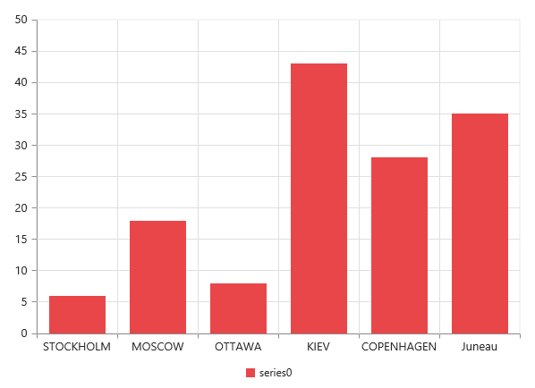

# Working with Data

## Local Data

There are two ways to provide local data to chart.

1. You can bind the data to the chart by using the **DataSource** property of the series and then you need to map the X and Y value with the *XName* and *YName* properties respectively.

N> For the **OHLC** type series, you have to map four dataSource fields *High, Low, Open* and *Close* to bind the data source and for the **bubble** series you have to map the *Size* field along with the *XName* and *YName*. 



   
  @(Html.EJ().Chart("chartContainer")      
     
      .Series(sr =>
      {
          //Add series
          sr.Type(SeriesType.Line).Add();
      })
      .Load("onchartload")
      //...
 )
 




var chartData = [
          { month: 'Jan', sales: 35 }, { month: 'Feb', sales: 28 },  { month: 'Mar', sales: 34 },
          { month: 'Apr', sales: 32 },{ month: 'May', sales: 40 },{ month: 'Jun', sales: 32 },
          { month: 'Jul', sales: 35 },  { month: 'Aug', sales: 55 }, { month: 'Sep', sales: 38 },
          { month: 'Oct', sales: 30 }, { month: 'Nov', sales: 25 }, { month: 'Dec', sales: 32 }];
          
    function onchartload(sender) {
        var data = GetData();
        sender.model.series[0].dataSource = chartData;
        sender.model.series[0].xName = "month";
        sender.model.series[0].yName = "sales";
    }
   


[Click](http://mvc.syncfusion.com/demos/web/chart/localdata) here to view the local data binding online demo sample.

2.You can also plot data to chart using **Points** option in the series. Using this property you can customize each and every point in the data.



@(Html.EJ().Chart("chartContainer")

      // ...
      //Initializing Series
      .Series(sr =>
      {
          sr
              //Adding data points using x and y field of points
            .Points(pts =>
            {
                pts.X("John").Y(10000).Add();
                pts.X("Jake").Y(12000).Add();
                pts.X("Petter").Y(18000).Add();
                pts.X("James").Y(11000).Add();
                pts.X("Mary").Y(9700).Add();
            }).Add();
      })
        
        //...
 )



## Remote Data

You can bind the remote data to the chart by using the **DataSource** and you can use the **Query** property of the series to filter the data from the dataSource.



       @(Html.EJ().Chart("chartContainer")
          //...
          .Series(ser =>
                      {
                          ser.DataSource(service => service.URL("http://mvc.syncfusion.com/Services/Northwnd.svc/"));
                          ser.XName("ShipCity");
                          ser.YName("Freight");
                          ser.Query("ej.Query().from('Orders').take(10)").Add();
                      })

           //...
          )



[Click](http://mvc.syncfusion.com/demos/web/chart/remotedata) here to view the remote data binding online demo sample.	

## AngularJS Data Binding

Typically, you will assign data directly to chart using **dataSource** property of the series. In AngularJS, you need to bind the variable, which contains data in the AngularJS scope object, to the dataSource property as illustrated in the following code example,

I> Essential JS includes AngularJS directives for all controls in the **ej.widget.angular.min.js** script file. 

N> All the properties in EjChart supports one way AngularJS binding except inner array properties like **series.points[]**, **series.trendlines[]**. [Click](http://help.syncfusion.com/js/angularjs) here to know more about Essential AngularJS and the properties which support two way AngularJS binding in chart.  



<html ng-app="syncApp">
<head>
    
    
    
	
</head>
<body ng-controller="Chart">    
  
				           
    <e-series>              
      <e-series e-name="John" e-dataSource=dataSource e-xName="Day" e-yName="John">					 
	  </e-series>
    <e-series e-name="Hendry"  e-dataSource=dataSource e-xName="Day" e-yName="Hendry">					   
	  </e-series>
    </e-series>
 
            
</body>
</html>





       //Data source for chart.
        var obj = [
                { "Day": 1, "John": 57, "Hendry": 43 },
                { "Day": 2, "John": 73, "Hendry": 27 },
                { "Day": 3, "John": 49, "Hendry": 51 },
                { "Day": 4, "John": 63, "Hendry": 37 },
                { "Day": 5, "John": 44, "Hendry": 56 },
                { "Day": 6, "John": 49, "Hendry": 51 },
                { "Day": 7, "John": 61, "Hendry": 39 },
                { "Day": 8, "John": 35, "Hendry": 65 },
                { "Day": 9, "John": 45, "Hendry": 55 },
                { "Day": 10, "John": 37, "Hendry": 63 }
        ];
        
        
        angular.module('syncApp', ['ejangular'])
            .controller('Chart', function ($scope) {
                //Assigning data to the dataSource variable in the $scope object.
                $scope.dataSource = obj;
            });



[Click](http://ngjq.syncfusion.com/#/chart/line) here to view the AngularJS data binding online demo sample.	